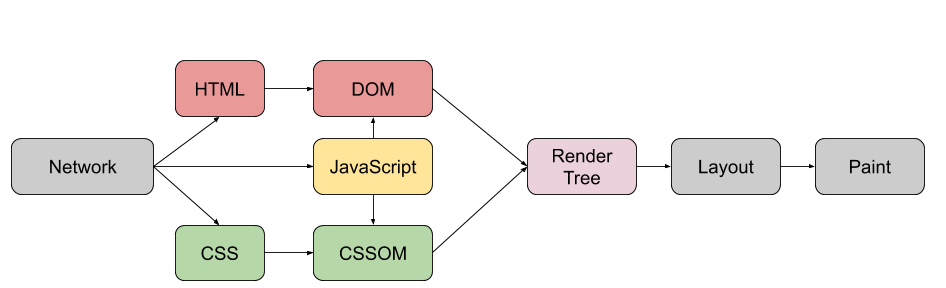

# ._.) 브라우저는 어떻게 작동할까?
### 브라우저 주소창에 `tthinks.tistory.com`을 입력했을 때, 어떤 과정을 거쳐 블로그가 보이게 될까? 간단하게 알아보자
 

## 🖥 Browser?
* 브라우저의 주요 기능: 사용자가 참조하고 싶은 웹페이지를 서버에 요청하고, 서버의 응답을 받아 화면에 띄우는 것
* 예: 크롬, 사파리, 인터넷 익스플로러, 파이어폭스, 웨일 등 인터넷 프로그램
* 서버의 응답은 ___URI(Uniform Resource Identifier)___ 이라는 주소를 통해 요청한다.

### _🖐🏻 잠깐! 여기서 URI란? - URI(Uniform Resource Identifier)_
* 인터넷 자원을 나타내는 고유 식별자
* URI 에 "I" 가 Identifier인 것은 인터넷에 있는 자료의 ID를 뜻한다.
* URI의 존재는 인터넷에서 요구되는 기본 조건으로서 인터넷 프로토콜에 항상 붙어다닌다.
  

## 🖥 브라우저의 기본 구조

### __1. 사용자 인터페이스__
검생창, 새로고침, 뒤로가기/앞으로가기 버튼 등 사용자가 접근할 수 있는 영역이다.

### __2. 브라우저 엔진__
  사용자 인터페이스와 렌더링 엔진 사이의 동작을 제어한다.

### __3. 렌더링 엔진__
브라우저의 핵심이다. 요청한 콘텐츠를 화면에 표시한다. HTML과 CSS등을 해석해서 표시하는 엔진이다.

### __4. 통신__
HTTP 요청 같은 네트워크 호출에 사용된다. 브라우저마다 독립적인 인터페이스다.

### __5. UI 백엔드__
기본적인 위젯을 그린다. OS 사용자 인터페이스 체계를 사용한다.

### __6. 자바스크립트 해석기__
이름 그대로 자바스크립트 코드를 해석하고 실행한다.

### __7. 자료 저장소__
이름 그대로 자료를 저장하는 계층이다. Local Storage, Indexed DB, 쿠키 등 브라우저 메모리를 활용하여 저장하는 영역이다.
  

## 🖥 렌더링 엔진
렌더링 엔진은 ___요청 받은 내용을 브라우저 화면에 표시___ 한다. HTML 및 XML 문서와 이미지를 표시할 수 있다. 플러그인이나 브라우저 확장 기능을 이용해 PDF와 같은 다른 유형도 표시할 수 있다.

파이어폭스와 크롬, 사파리는 두 종류의 렌더링 엔진으로 제작되었다. 파이어폭스는 모질라에서 직접 만든 `Gecko` 엔진을 사용하고 사파리와 크롬은 `Webkit` 엔진을 사용한다.
  

### ._.) 렌더링 동작 과정을 살펴봅시다

 

1. __DOM 트리 생성 :__ 브라우저는 서버로부터 HTML 문서를 모두 전달받는다. 렌더링 엔진은 전달받은 HTML 문서를 파싱해서 `DOM` __트리를 구축__ 한다. 그리고 __외부 CSS 파일과 스타일 요소도 파싱__ 한다.
2. __렌더 트리 생성 :__ `DOM(Document Object Model)` 트리와 스타일 정보를 합쳐서 렌더 트리를 만든다.
3. __렌더 트리 배치(Layout) :__ 뷰포트 내에 생성된 render tree의 각 노드들의 정확한 위치와 크기를 결정한다.
4. __렌더 트리 그리기(Paint) :__ 마지막으로 구성한 레이아웃을 실제로 화면에 픽셀로 그리는 과정이다.
 

  

위 사진은 `webkit`의 동작 방식이다.
  

### _🖐🏻 잠깐! 여기서 렌더 트리란? - 렌더 트리 (Render Tree)_
* DOM + CSSOM = 렌더트리
* DOM트리는 콘텐츠 설명, CSSOM트리는 스타일 규칙을 설명한다.
* 각 요소의 레이아웃 계산하는데 사용된다.
* 픽셀을 화면에 렌더링하는 페인트 프로세스에 대한 입력으로 처리된다.
   

***
## 참고
* [햣 블로그 - 브라우저(Browser)의 작동원리](https://woong-jae.com/web/210821-how-does-browser-work)
* [grape - URI, URL이란?](https://grape-blog.tistory.com/10)
* [kim-baek 개발자 이야기 - 브라우저와 동작 원리(렌더트리)](https://baek-kim-dev.site/140)
* [컴퓨터 공부하는 블로그 - 렌더 트리(Render Tree)](https://sgcomputer.tistory.com/172)
* [black_moja - 렌더링을 간단하게 알아보자](https://velog.io/@limlim980625/browser-rendering)
* [iris.dew - 브라우저 동작 원리](https://irisdew.github.io/development/%EB%B8%8C%EB%9D%BC%EC%9A%B0%EC%A0%80-%EB%8F%99%EC%9E%91-%EC%9B%90%EB%A6%AC/)
