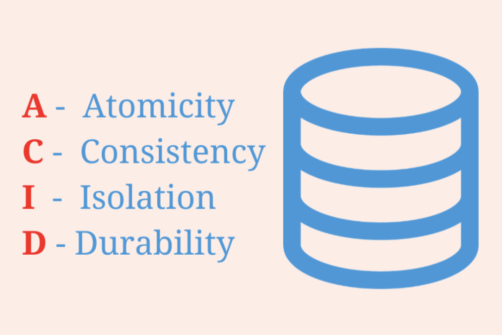

# ._.) 데이터베이스에서 ACID란 무엇일까?
### ACID(원자성, 일관성, 고립성, 지속성)
 

## 🖥 ACID란?
*  데이터베이스 **트랜잭션**이 안전하게 수행된다는 것을 보장하기 위한 성질을 가리키는 약어

* 여기서 트랜잭션이란 여러 개의 작업을 하나로 묶은 실행 유닛을 말한다.

* 데이터베이스 트랜잭션은 ACID라는 특성을 가지고 있다.

    1. 원자성(Atomicity)
    2. 일관성(Consistency)
    3. 고립성(Isolation)
    4. 지속성(Durablility)

ACID는 주식거래, 금융업에서 중점적으로 사용된다.

=> 주식거래, 금융업에서는 관계형 데이터베이스를 이용한다.
관계형 데이터베이스를 사용하면 데이터베이스와 상호 작용하는 방식을 정확하게 규정할 수 있기 때문에,

데이터베이스에서 데이터를 처리할 때 발생할 수 있는 예외적인 상황을 줄이고, 데이터베이스의 무결성을 보호할 수 있다.

  

## 🖥 트랜젝션이란?

트랜젝션이 왜 필요할까요?
예를 들면, A 은행 → B은행으로 돈을 보내기 위하여 출금하고 송금한다고 가정합니다. A은행에서 돈을 출금하고나서 B은행으로 송금하려고 하는데 갑자기 시스템이 멈추면 어떻게 될까요? 돈은 출금되었지만, 송금되지 않고 증발하게 되는 끔찍한 상황이 발생합니다.

트랜젝션은 이런 상황이 일어나지 않도록 보장해줍니다.

대부분의 데이터베이스는 송금이 되다가 마는 상황이 발생하지 않도록 여러가지 방법을 제공하지만, 공통적으로 제공하는 가장 기본적인 방법은 Transaction을 통하여 데이터의 유효성을 보장하는 것입니다.

***데이터베이스 트랜잭션은 ACID라는 특성을 가지고 있다.***

  

### 📌 원자성(Atomicity)
* 원자성이란 트랜잭션이 안전성 보장을 위해 가져야 할 성질 중의 하나이다.

* 원자성이란 시스템에서 한 트랜잭션의 연산들이 모두 성공하거나, 반대로 전부 실패되는 성질을 말한다.

* 원자성은 작업이 모두 반영되거나 모두 반영되지 않음으로서 결과를 예측할 수 있어야 한다.

 

### 📌 일관성(Consistency)
* 일관성은 데이터베이스의 상태가 일관되어야 한다는 성질이다.

* 일관성은 하나의 트랜잭션 이전과 이후, 데이터베이스의 상태는 이전과 같이 유효해야 한다.

* 다시 말해, 트랜잭션이 일어난 이후의 데이터베이스는 데이터베이스의 제약이나 규칙을 만족해야 한다는 뜻이다.

 

### 📌 고립성(Isolation)
* 격리성은 모든 트랜잭션은 다른 트랜잭션으로부터 독립되어야 한다는 뜻이다.

* 실제로 동시에 여러 개의 트랜잭션들이 수행될 때, 각 트랜젝션은 고립(격리)되어 있어 연속으로 실행된 것과 동일한 결과를 나타낸다.

 

### 📌 지속성(Durablility)
* 지속성은 하나의 트랜잭션이 성공적으로 수행되었다면, 해당 트랜잭션에 대한 로그가 남아야하는 성질을 말한다.

* 만약 런타임 오류나 시스템 오류가 발생하더라도, 해당 기록은 영구적이어야 한다는 뜻이다.
<!--   

## 🖥 -->

   
*** 

## 참고
* [데이터베이스 트랜젝션 ACID란?](https://covenant.tistory.com/85)
* [[데이터베이스] 트랜잭션의 ACID 성질](https://hanamon.kr/데이터베이스-트랜잭션의-acid-성질/)
* [데이터베이스에서 ACID란?](https://continuetochallenge.tistory.com/127)
* [[DB] Transaction 과 ACID란?](https://chrisjune-13837.medium.com/db-transaction-과-acid란-45a785403f9e)