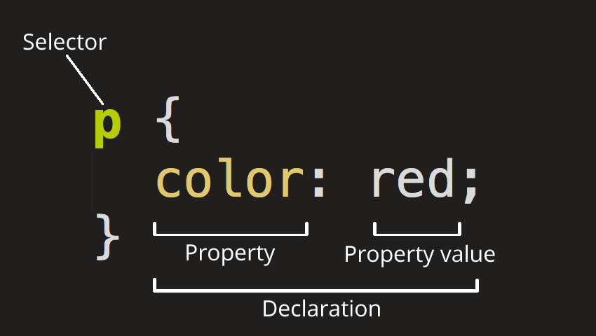
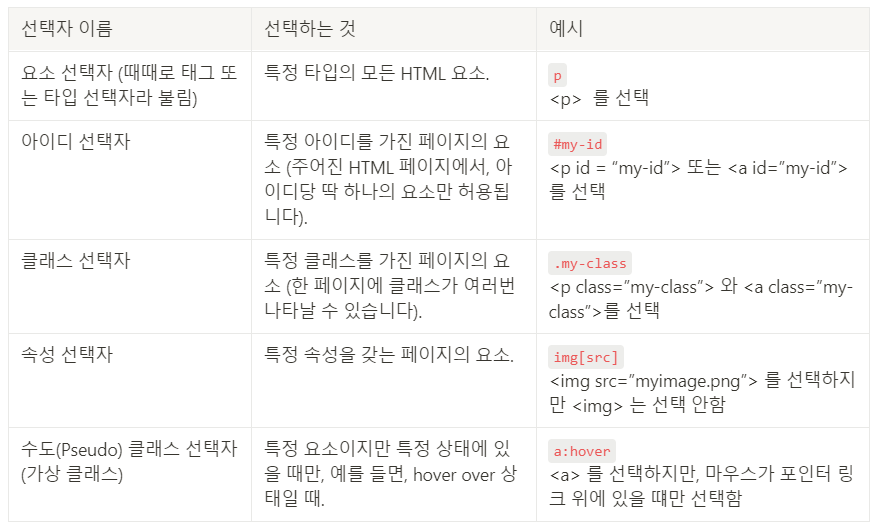

# ._.) CSS란 무엇일까?
### CSS는 프로그래밍 언어도, 마크업 언어도 아닌 Style sheet 언어이다.
<br/>

## 🖥 CSS?
* 웹페이지를 꾸미려고 작성하는 코드

* Cascading Style Sheets의 약자

* HTML 문서에 있는 어떤 요소들에 선택적으로 스타일을 적용할 수 있다.

* `.css` 파일에 코드를 작성하고, HTML에서 `<link>` 태그를 이용해 연결시키면 작성한 CSS 코드가 HTML 문서의 스타일링에 적용된다.
<br/>

  ### _🖐🏻 잠깐! 여기서 Cascading이란? - CSS(Cascading Style Sheets)_
  * Cascading : '위에서 아래로 흐르는', '상속 또는 종속하는' 이라는 의미이다.
  
  * CSS 가 Cascading하다는 것은 코드의 순서가 위에서 아래로 진행된다는 것을 뜻한다.
  
  * 따라서, 중복된 요소에 스타일을 적용할 때 나중에 작성한 것이 적용되어 표시된다.
<br/>

### ._.) CSS를 굳이 쓰는 이유가 뭐야
* CSS는 웹 페이지의 스타일을 별도의 파일로 저장할 수 있게 해줌 -> 유지보수 편리

* 웹 사이트의 스타일을 일관성 있게 유지할 수 있게 해줌
<br/><br/>

## 🖥 CSS ruleset

<p align="center">

</p>

전체 구조는 ‘rule set’이라 불린다. (줄여서 ‘rule’ 이라고도 한다.)

  * 각각의 rule set은 중괄호로 {} 감싸져야 한다.
  * 각각의 선언 안에 속성과 속성 값을 구분하기 위해 콜론 : 을 사용한다.
  * 각각의 rule set 안에 선언간 구분을 위하 세미콜론 ;을 사용한다.
  
  
### __1. 선택자 (Selector)__
  rule set의 맨 앞에 있는 HTML 요소 이름

  즉, 꾸밀 요소를 지정하는 것이다.

### __2. 선언 (Declaration)__
  `color: red;` 와 같은 단일 규칙. 꾸미기 원하는 요소의 속성을 명시한다.

### __3. 속성 (Property)__
  주어진 HTML 요소를 꾸밀 수 있는 방법

### __4. 속성 값 (Property value)__
  속성에 부여할 수 있는 수많은 옵션 중 어떠한 값을 적용할 지 지정한다.
<br/><br/>

### ._.) 귀찮으니까 여러 요소 한꺼번에 적용해보자
```css
p,li,h1 {
  color: red;
}  
```
위 예시 처럼 여러 요소를 선택하기 위해선 콤마 `,` 로 구분한다.
<br/><br/>


## 🖥 선택자(Selector)의 종류
<p align="center">

</p>
<br/><br/><br/>

***
## 참고
* [brogod.log - CSS_기초 배우기](https://velog.io/@m-vault/CSS%EA%B8%B0%EC%B4%88-%EB%B0%B0%EC%9A%B0%EA%B8%B0)
* [TCP school.com - CSS 기초](http://www.tcpschool.com/css/css_intro_basic)
