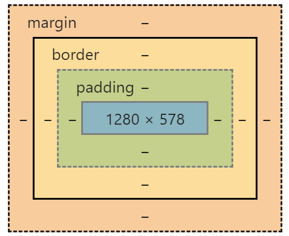
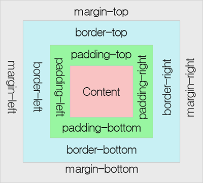

# ._.) 박스 모델에 대해서 알아보자!
### CSS가 표시하는 모든 것은 박스로 이루어져있다. 
### 따라서 CSS Box Model를 이해하는 것은 매우 중요
 

## 🖥 Box Model?
* 모든 Html 엘리먼트는 Box이다.
* 그리고 모든 Box 3개의 층으로 이루어져있다.
* margin, border, padding 그리고 content

  

## 🖥 박스 모델의 구성요소
* 1. margin
  * 가장 외곽의 층
  * 주변에 위치한 다른 엘리먼트와의 상하좌우 간격을 두기 위해서 쓰인다.
* 2. border
  * 경계선을 그리는 층
  * 두께 뿐만 아니라 색상과 모양까지 지정할 수 있음 
* 3. padding
  * 컨텐츠와 경계선 사이의 간격을 지정하기 위해서 쓰임

### _🖐🏻 잠깐! 여기서 컨텐츠란? - content_
  * 박스에서 가장 중간에 있는 영역
  * `width`(너비)와 `height`(높이)를 지정해줄 수 있음
  
  

  
  

