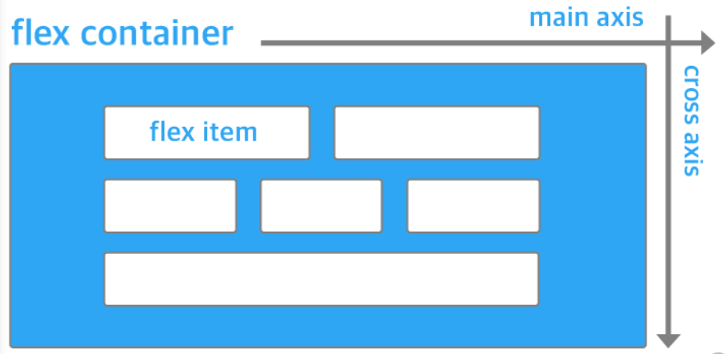
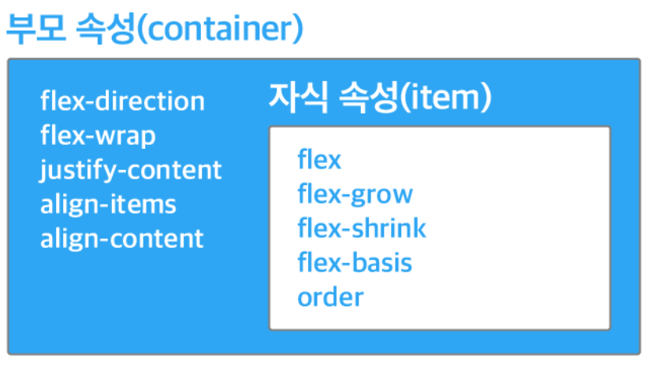
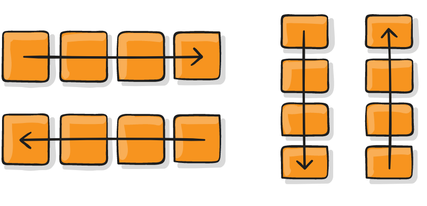
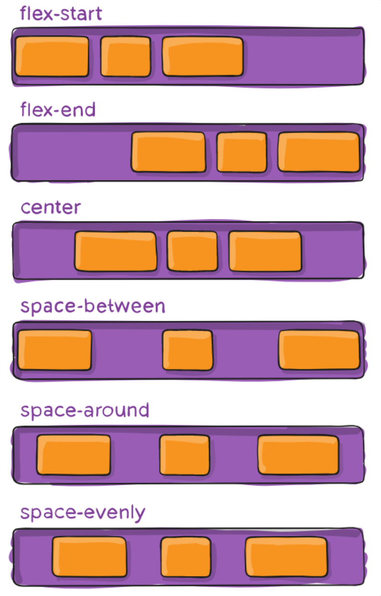
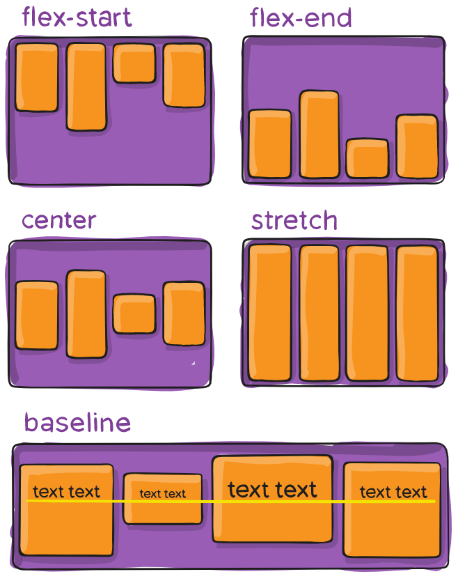
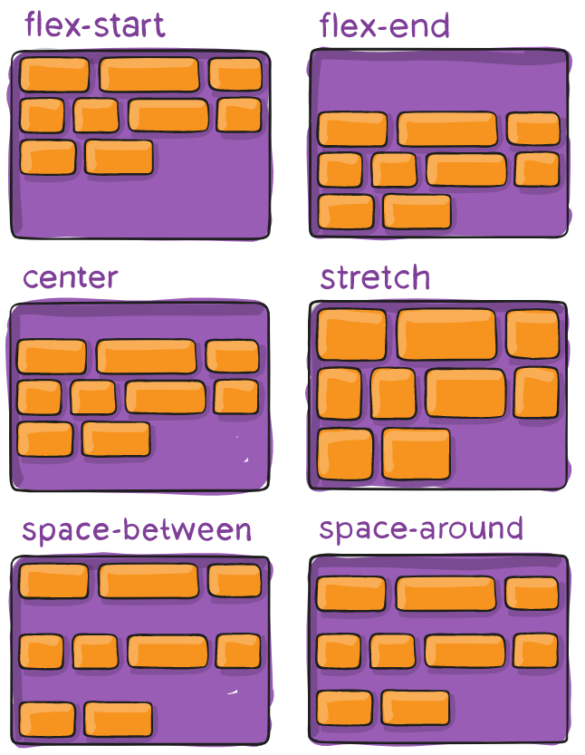
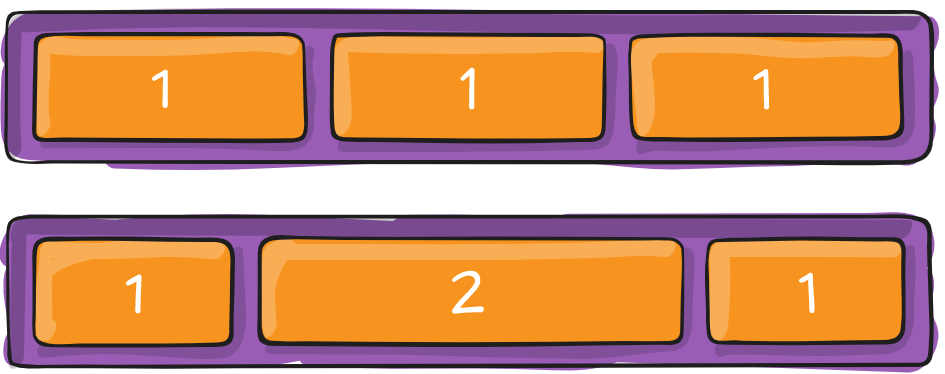

# ._.) Flex Box에 대해서 알아보자!
###  Flexible Box라고도 부르는 Flex Box는 레이아웃 배치를 위해 태어났다.
<br/>

## 🖥 flexbox의 이점
* display와 position 만으로 레이아웃 짜기에는 어려움과 한계가 있음

* 이런 어려움을 극복하기 위해 flexbox 개념이 도입됨

* flexbox를 이용하면 특별한 계산 없이 쉽게 정렬할 수 있고, 레이아웃을 편리하게 구성할 수 있다.
<br/><br/>

## 🖥 flexbox의 구성
<p align="center">

</p>

* flexbox는 flex container(부모 요소)와 flex item(자식 요소)로 구성된다.

* flexbox 사용법: 부모 요소에 `display:flex` 추가하기.

*  flex 속성을 추가한 요소가 `flex container`가 되고, 그 자식 요소들이 `flex item`이 된다. 

```
.flex_container { 
  display: flex;
}
```
<br/><br/>

## 🖥 부모 요소와 자식 요소의 속성
flex container와 item에서 쓸 수 있는 속성의 종류는 다르다.

<p align="center">

</p>

* flex box는 가로 혹은 세로의 정해둔 방향으로 프로퍼티를 정렬한다.

* 이를 통해 다양한 레이아웃을 만들 수 있다.

* 자세한 속성의 역할들은 다음과 같다.
<br/>

## ⌨️ 부모요소(flex Container) 속성
### flex-direction
: flex container 안의 item들의 방향을 정함

<p align="center">

</p>

* `row(default)` : 왼쪽에서 오른쪽으로 정렬 →

* `row-reverse` : 오른쪽에서 왼쪽으로 정렬 ←

* `column` : 위쪽에서 아래쪽으로 정렬 ↓

* `column-reverse` : 아래쪽에서 위쪽으로 정렬 ↑

```
.container {
  flex-direction: row | row-reverse | column | column-reverse; /* default row */
}
```

### flex-wrap
: flex item이 flex container를 벗어났을 때 줄을 바꾸는 속성

* `nowrap(default)`: 모든 itme을 한 줄에 정렬

* `wrap`: item이 container를 벗어날 경우 여러 줄에 걸쳐 정렬

* `wrap-reverse`: item이 container를 벗어날 경우 여러 줄에 걸쳐 반대로 정렬

```
.container {
  flex-wrap: nowrap | wrap | wrap-reverse; /* default nowrap */
}
```

### justify-content
: flex-direction으로 정해진 방향을 기준으로 수평으로 item을 정렬하는 방법을 정함

<p align="center">

</p>

* `flex-start(default)`: item을 왼쪽을 시작점으로 정렬

* `flex-end`: item을 오른쪽을 시작점으로 정렬

* `center`: item을 가운데를 기준으로 정렬

* `space-between`: 첫 번째 item은 시작점에, 마지막 item은 끝점에 붙고 나머지 item 사이의 공간은 균등하게 분배

* `space-around`: 모든 item 사이에 균등한 공간 분배그림에서 볼 수 있듯이, 첫 번째 item과 시작점 사이에는 space가 1칸이고, 첫 번째 item과 두 번째 item 사이에는 space가 2칸이어서 space가 달라 보입니다. 

* `space-evenly`: 모든 item 사이에 균등한 공간 분배

```
.container {
  justify-content: flex-start | flex-end | center | space-between | space-around | space-evenly; /* default flex-start */
}
```

### align-items
: flex-direction으로 정해진 방향을 기준으로 수직으로 item을 정렬하는 방법을 정함

<p align="center">

</p>

* `lex-start`: item을 위쪽을 시작점으로 정렬
* `flex-end`: item을 아래쪽을 시작점으로 정렬
* `center`: item을 가운데를 기준으로 정렬
* `stretch(default)`: item을 늘려서 세로 크기에 맞춤
* `baseline`: baseline(그림 참조)에 맞춰 item 정렬

```
.container {
  align-items: stretch | flex-start | flex-end | center | baseline; /* default stretch */
}
```

### align-content
: flex-direction으로 정해진 방향을 기준으로 수직으로 여러 줄인 item을 정렬하는 방법을 정함

<p align="center">

</p>

justify-content와 기능이 유사하다.

```
.container {
  align-content: flex-start | flex-end | center | space-between | space-around | space-evenly | stretch | start | end | baseline; /* default stretch */
}
```
<br/><br/>

## ⌨️ 자식요소(flex item) 속성
### flex-grow
: flex item의 확장과 관련된 속성, default 0

<p align="center">

</p>

해당 flex item이 flex container 내부에서 얼마큼의 공간을 차지해야 하는지 비율을 나타낸다.
모든 item의 flex-grow 속성이 1로 되어 있다면, container의 공간은 모든 item에 똑같이 분배된다.
위의 그림의 두 번째 예시와 같이 flex-grow를 지정하면 flex-grow 값이 2인 item이 다른 item보다 공간을 2배 더 차지한다.
값에는 음수를 사용할 수 없다. 

```
.item {
  flex-grow: 4; /* default 0 */
}
```
 
### flex-shrink
: flex item의 축소와 관련된 속성, default 1
 
flex item이 얼마나 공간을 적게 차지하고 싶은지를 나타낼 때 사용한다.
flex-grow의 반대 개념이라고 볼 수 있습니다. 마찬가지로 음수는 사용할 수 없다.

```
.item {
  flex-shrink: 3; /* default 1 */
}
```
 
 
### flex-basis
: flex item의 기본 크기를 결정함, defaul auto
 
남은 공간이 분배되기 전에 item의 기본 사이즈를 정한다.
길이(%, rem, px) 또는 키워드(auto, content)로 설정이 가능하다.

```
.item {
  flex-basis:  | auto; /* default auto */
}
```
 
 
### flex
: flex-grow, flex-shrink, flex-basis의 축약형
 
flex-grow, flex-shrink, flex-basis를 한 번에 설정할 수 있는 속성이다. 

```
.item {
  flex: none | [ <'flex-grow'> <'flex-shrink'>? || <'flex-basis'> ]
}
```
<br/><br/><br/>

***
## 참고
* [Live passionate - [CSS] flexbox 기본 개념](https://mjmjmj98.tistory.com/126)
* [1분코딩 - 이번에야말로 CSS Flex를 익혀보자](https://studiomeal.com/archives/197)
* [NAVER D2 - flexbox로 만들 수 있는 10가지 레이아웃](https://d2.naver.com/helloworld/8540176)
* [HEROPY Tech - CSS Flex(Flexible Box) 완벽 가이드](https://heropy.blog/2018/11/24/css-flexible-box/)
* [MDN - flexbox](https://developer.mozilla.org/ko/docs/Web/CSS/CSS_Flexible_Box_Layout/Basic_Concepts_of_Flexbox)
