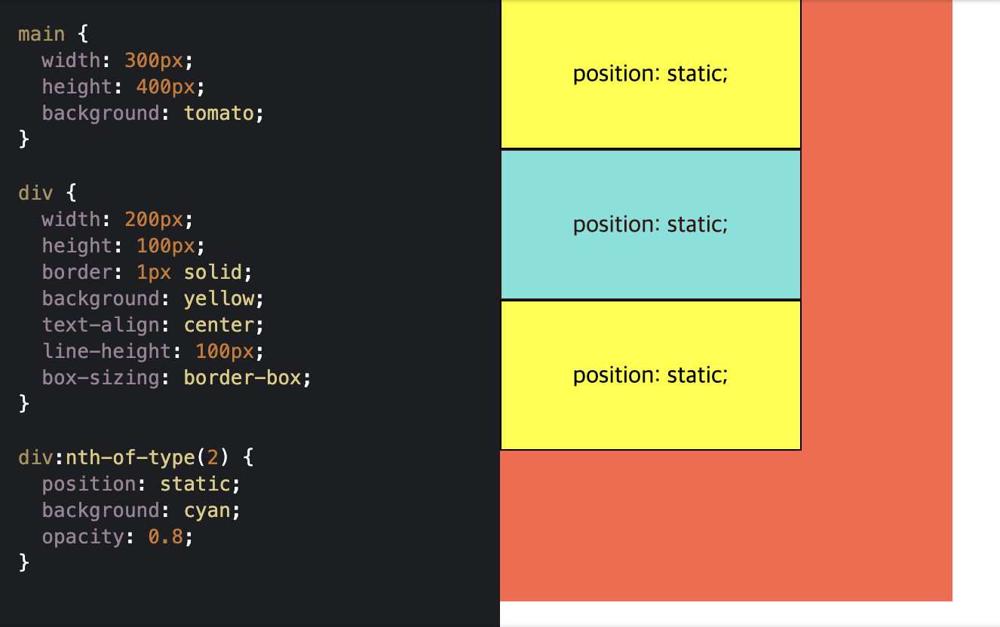
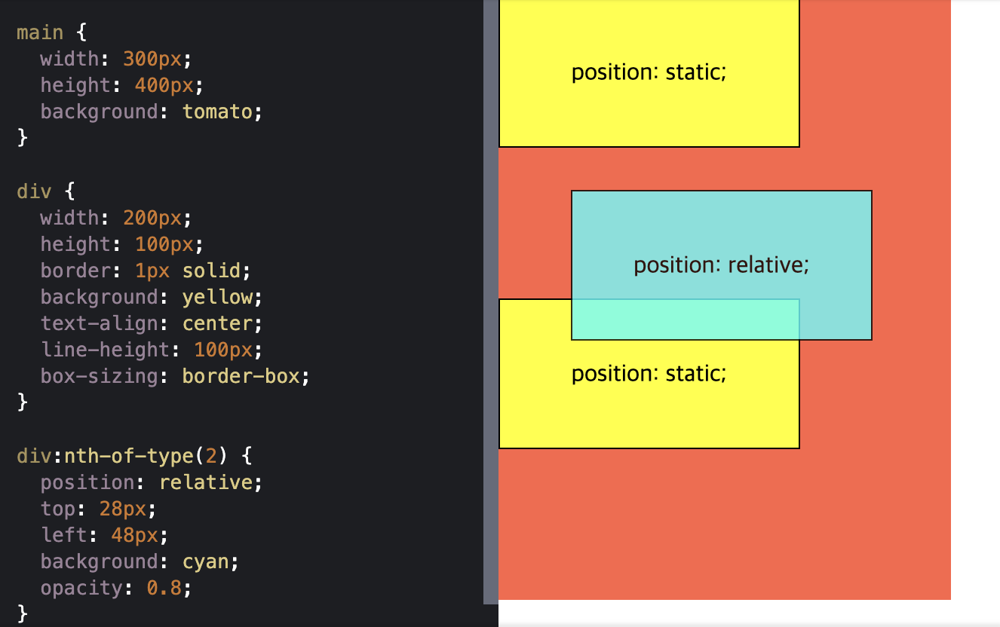
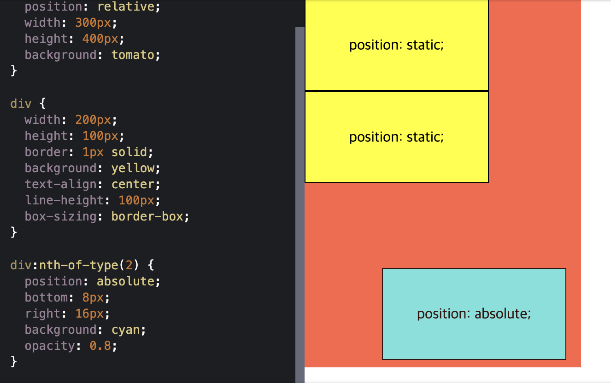
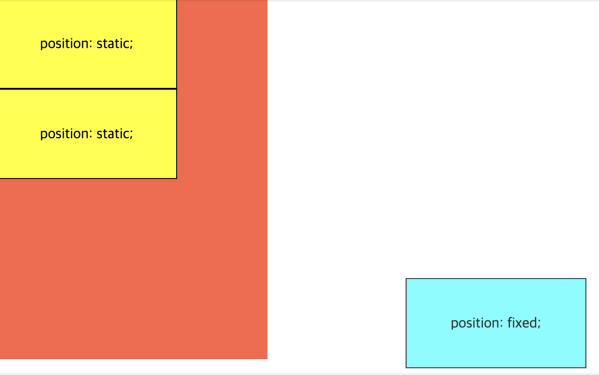
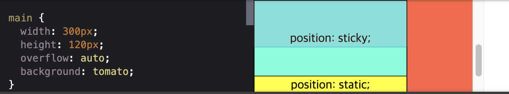

# ._.) position으로 요소를 배치해보자
### 뭐 쓸 말이 없네
<br/>

## 🖥 position 속성
* HTML 문서에서 요소가 배치되는 방식을 결정짓는 속성

* `top`, `left`, `bottom`, `right` 속성과 함께 사용된다
<br/><br/>

## (1) position : static
* HTML 문서 상에서 원래 있어야하는 위치에 배치된다

* position 속성을 별도로 지정해주지 않으면 기본값인 static이 적용된다

* 예를 들어, 다음과 같이 `<main>` 요소 아래에 3개의 `<div>` 요소가 있다면 맨 위에 첫 번째 요소, 중간에 두 번째 요소, 제일 아래에 세 번째 요소가 나란히 순서대로 배치된다

```
<main>
  <div>첫 번째 요소</div>
  <div>두 번째 요소</div>
  <div>세 번째 요소</div>
</main>
```

<p align="center">

</p>
<br/><br/>

## (2) position : relative
* 요소를 원래 위치에서 벗어나도록 배치한다

* 요소를 원래 위치를 기준으로 상대적(relative)으로 배치

* top, bottom, left, right의 네 속성이 있다

* 요소가 원래 위치에 있을 때의 상하좌우로 부터 얼마나 떨어지게 할지를 지정

* 예를 들어, 두 번째 <div> 요소의 position 속성을 relative로 변경하고, 요소의 원래 위치로 부터 위에서 28px, 왼쪽에서 48px 떨어지도록 top과 left 속성을 설정하면 아래처럼 된다

<p align="center">

</p>
<br/><br/>
  
## (3) position : absolute
* absolute는 position 속성값 중 가장 난해하고 주의가 필요한 속성값이다.
* 아마도 absolute라는 영단어의 의미 때문일텐데 relative 속성의 정반대 개념이라고 많이 오해를 합니다.
* 오히려 absolute 속성값은 relative 속성값과 함께 사용되는 경우가 많은 데 말입니다.
* position 속성을 absolute로 지정하면 사실 전혀 절대적(absolute)으로 요소를 배치해주지 않습니다.
* 오히려 배치 기준이 상황에 따라 굉장히 달라질 수 있는데요.
* 흥미롭게도 position 속성이 absolute일 때 해당 요소는 배치 기준을 자신이 아닌 상위 요소에서 찾습니다.
* DOM 트리를 따라 올라가다가 position 속성이 static이 아닌 첫 번째 상위 요소가 해당 요소의 배치 기준으로 설정되는데요.
* 만약에 해당 요소 상위에 position 속성이 static이 아닌 요소가 없다면,
* DOM 트리에 최상위에 있는 <body> 요소가 배치 기준이 됩니다.

알고리즘이 상당히 복잡하게 느껴지죠? 하지만 실제로 absolute 속성값을 사용할 때 이러한 복잡한 특성을 활용하는 경우는 드뭅니다.
대부분의 경우, 부모 요소(가장 가까운 상위 요소)를 기준으로 top, left, bottom, right 속성을 적용해야하기 때문입니다.
따라서 어떤 요소의 display 속성을 absolute로 설정하면, 부모 요소의 display 속성을 relative로 지정해주는 것이 관례입니다.

예제 CSS 코드에서 두 번째 <div> 요소의 부모인 <main> 요소의 position 속성을 relative로 변경해보겠습니다.

```
main {
  position: relative;
  width: 300px;
  height: 400px;
  background: tomato;
}
```
그 다음 두 번째 <div> 요소의 position 속성을 absolute로 변경하고, 부모 요소를 기준으로 하단에서 8px, 우측에서 16x 떨어지도록 bottom과 right 속성을 설정해주겠습니다.

```
div:nth-of-type(2) {
  position: absolute;
  bottom: 8px;
  right: 16px;
  background: cyan;
  opacity: 0.8;
}
```
이제 두 번째 요소가 <main> 요소의 우측 하단에 배치된 것을 확인할 수 있습니다.
  
<p align="center">

</p>
<br/>
여기서 꼭 짚고 넘어가야하는 부분이 있는데요. 바로 position: absolute인 요소는 HTML 문서 상에서 독립되어 앞뒤에 나온 요소와 더 이상 상호작용을 하지 않게 된다는 것입니다.
따라서 위에서 보이는 것처럼, 첫 번째 요소 아래에 바로 세 번째 요소가 배치되었습니다.
<br/><br/>
  
## (4) position : fixed
* 요소를 항상 같은 위치에 고정하기
  
화면을 위아래로 스크롤하더라도 브라우저 화면의 특정 부분에 고정되어 움직이지 않는 UI를 가끔 볼 수 있다
position 속성을 fixed로 지정하면 이렇게 요소를 항상 고정된(fixed) 위치에 배치할 수 있다

### ._.) 어떻게 하는거야
이게 가능한 이유는 fixed 속성값의 배치 기준이 자신이나 부모 요소가 아닌 뷰포트(viewport), 즉 브라우저 전체화면이기 때문이다.
  
`top`, `left`, `bottom`, `right` 속성은 각각 브라우저 상단, 좌측, 하단, 우측으로 부터 해당 요소가 얼마나 떨어져있는지를 결정한다.

* 두번째 <div> 요소의 position 속성을 absolute로 변경하고, 뷰포트 기준으로 하단에서 8px, 우측에서 16x 떨어지도록 bottom과 right 속성을 설정해보자

```
div:nth-of-type(2) {
  position: fixed;
  bottom: 8px;
  right: 16px;
  background: cyan;
  opacity: 0.8;
}
```
이제 두번째 요소가 부모인 <main> 요소를 벗어나 브라우저 전체화면 기준으로 우측 하단에 배치되는 것을 볼 수 있다.
<p align="center">

</p>
<br/>
position: fixed인 요소도 position: absolute인 요소와 마찬가지로 HTML 문서 상에서 독립되어 앞뒤에 나온 요소와 더 이상 상호작용을 하지 않는다.
<br/><br/>
  
## (4) position : sticky
* sticky 속성은 CSS에서 비교적 최근에 추가됨
* (특이하게도) 요소가 스크롤링될 때 효과가 나타난다
* 백문이불여일견, 예제로 go
  먼저, `<div>` 요소의 부모인 `<main>` 요소의 높이를 줄이고 스크롤링이 가능해지도록 `height`외 `overflow` 속성을 조정해줍니다.

```
main {
  width: 300px;
  height: 120px;
  overflow: auto;
  background: tomato;
}
```
그 다음, 두번째 `<div>` 요소의 `position` 속성을 `sticky`로 변경하고, `top` 속성을 0으로 설정한다
  
```
div:nth-of-type(2) {
  position: sticky;
  top: 0;
  background: cyan;
  opacity: 0.8;
}
```

이제 스크롤바를 아래로 내려서 화면을 위로 올려보면, 두 번째 요소가 화면 상단에 끈적하게(sticky) 붙어서 움직이지 않는 것을 알 수 있다.
반면에 position: static인 세 번째 요소는 이에 구애받지 않고 화면에 따라 올라가는 것을 볼 수 있다.
<p align="center">

</p>
<br/><br/><br/>

***
## 참고
* [DaleSeo - CSS의 position 속성으로 요소 배치하기](https://www.daleseo.com/css-position/)
  
