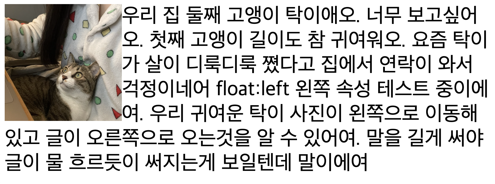
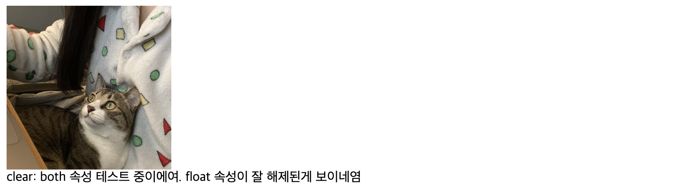
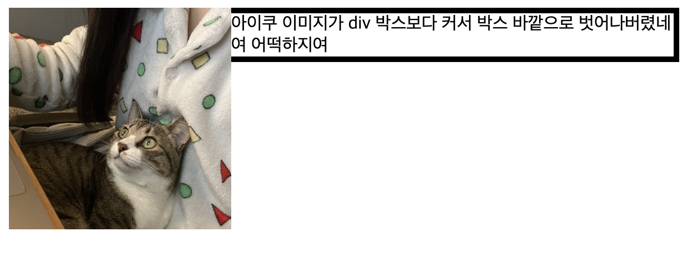
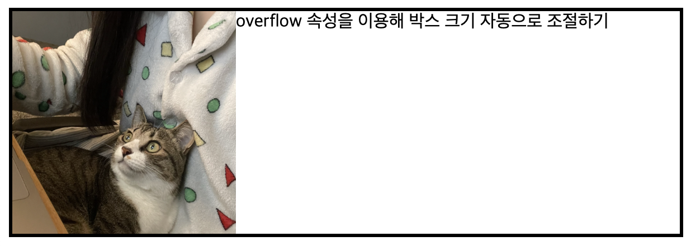

# ._.) float을 알아보자
### float은 ___'띄우다, 부유하다'___ 라는 의미로, 
### 레이아웃을 설계하는 과정에서 자주 사용된다
<br/>

## 🖥 float 이란?
* 복잡한 형태의 레이아웃을 구성하는데 필요한 핵심 속성

* 특정 요소를 떠있게, 흐르도록, 부유하게 하도록 하는 속성

* 박스를 왼쪽(left) 또는 오른쪽(right)으로 "부유"시키는 레이아웃 기법
<br/><br/>

## 🖥 float 의 속성값(value)
* `none` : 기본 속성, 요소를 띄우지 않는다

* `left` : 요소를 왼쪽으로 띄운다

* `right` : 요소를 오른쪽으로 띄운다

* `inherit` : 부모의 속성을 상속 받는다
<br/><br/>

  ## ._.) float을 한 번 써보자
  > #### < float 적용 전 >

  ```
    
    <div>우리 집 둘째 고앵이 탁이애오. 너무 보고싶어오. 첫째 고앵이 길이도 참 귀여워오. 요즘 탁이가 살이 디룩디룩 쪘다고 집에서 연락이 와서 걱정이네어</div>
  ```

  <p align="center">
    
  </p>
  <br/>

  > #### < float 적용 후 >
  ```
    
    <div style="font-size: 35px;">우리 집 둘째 고앵이 탁이애오. 너무 보고싶어오. 첫째 고앵이 길이도 참 귀여워오. 요즘 탁이가 살이 디룩디룩 쪘다고 집에서 연락이 와서 걱정이네어 float:left   왼쪽 속성 테스트 중이에여. 우리 귀여운 탁이 사진이 왼쪽으로 이동해있고 글이 오른쪽으로 오는것을 알 수 있어여. 말을 길게 써야 글이 물 흐르듯이 써지는게 보일텐데 말이에여 </div>
  ```

  <p align="center">
    
  </p>
<br/><br/>

## 🖥 clear 속성과 속성값(value)
#### clear는 float을 해제하기 위한 속성이다

* `none`: 아무런 해제를 하지 않는다

* `left`: float:left를 해제한다

* `right`: float:right를 해제한다

* `both`: 모든 float(left,right)를 해제한다

* `inherit`: 부모의 속성을 상속 받는다

  <p align="center">
    
  </p>
<br/><br/>

## ._.) 이미지가 박스보다 크면 어떡하지?
  아래처럼 이미지의 크기가 너무 커서, 이미지를 담고 있는 요소의 영역을 벗어나는 경우가 있다.
  <p align="center">
    
  </p>
  <br/>
  이런 문제를 해결하기 위해 있는게 clearfix 핵이다.
<br/><br/>

## 🖥 clearfix 핵 사용법
아주 간단하다. 부모 요소에 `overflow: auto;` css 코드 한 줄만 추가하면 된다.

```
.tagi {
    overflow: auto;
}

<div class="tagi" style="border: 3px solid;">
    
    overflow 속성을 이용해 박스 크기 자동으로 조절하기
</div> 
```

<p align="center">
  
</p>
<br/><br/>

> ### 주의사항
> __float 속성을 사용할 요소는 position 속성의 absolute 값과 양립할 수 없다__

<br/><br/><br/>

***
## 참고
* [내일의 나는 오늘의 내가 만든다. - CSS float란?](https://velog.io/@shin6403/CSS-float%EB%9E%80)
* [guitarlove00.log - [TIL]position, display, float 속성 정리](https://velog.io/@guitarlove00/position-display-float-%EC%86%8D%EC%84%B1-%EC%A0%95%EB%A6%AC)
* [초보개발자의 성장블로그 - CSS29 float속성, clear속성, overflow속성](https://hs0955.tistory.com/276)
