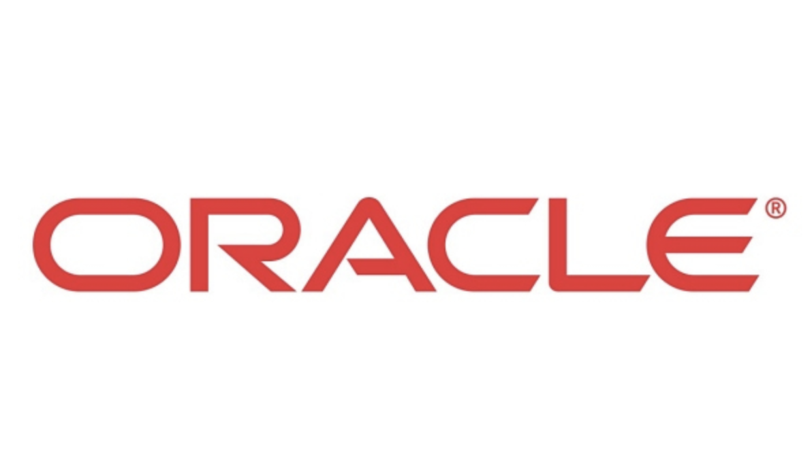

# ._.) 오라클(Oracle)에 대해 알아보자.
###

 

## 🖥 오라클(Oracle)이란?

* 미국 오라클(Oracle) 사의 관계형 데이터베이스 관리 시스템(RDBMS)

* 현재 유닉스 체제에서 가장 많이 사용되는 DBMS

* 검색이나 업데이트용 언어로는 국제표준화기구의 표준 구조화 조회 언어와 PL/SQL을 지원한다.

* 대표적인 기업용 데이터베이스이며, 윈도우즈, 유닉스, 솔라리스 등 기업체에서 사용하는 대부분의 서버군에 설치할 수 있다.

  

## 🖥 오라클 장점

### 📎 관리시스템

* Multiple databases 튜닝 가능하다.

* 다수의 사용자가 동시에 접근이 가능하다.

### 📎 변화관리

* 변경 plan을 작성하고 실제 구현하기 전에 변경 사항의 효과를 볼 수 있다.

* 생산 시스템을 방해하지 않는다.

### 📎 경고

* 오류가 발생하면 설정되어 있는 계정 및 이메일로 연락이 온다.

* 경고는 에정된 가종 정지 시간 동안 차단 될 수 있다.

### 📎 분산처리

* DBMS 실행 컴퓨터 / 서버 역할 컴퓨터 / DB 응용 프로그램 실행 컴퓨터 

* 다르게 분산처리한다.

### 📎 용량&처리

* 다른 데이터베이스보다 고성능의 트랜잭션을 처리한다.

* Cost 비용을 최소화 하기 위해 테이블과 인덱스를 분석한다.

  

## 🖥 오라클 특징

### 1. 서버/클라이언트의 환경을 제공 

* 로컬(Local)환경과 원격(Remote)환경에서 사용 할 수 있도록 `Database Server`와 `Client Application Program`으로 분리되어 있다.

    * `Database Server`: 데이터베이스의 서버 역할 담당

    * `Client Application Program`: 데이터의 해석과 표시 담당

### 2. 대규모 데이터베이스와 영역 관리

* 오라클은 테라바이트 크기의 데이터를 저장할 수 있는 대규모 데이터베이스를 지원

* 고가의 하드웨어 장치를 효율적으로 활용할 수 있도록 영역 사용을 완벽하게 제어

### 3. 동시 다중 접속을 지원

* 여러 사용자가 데이터 베이스 서버에 동시에 접속하여 사용할 수 있다. 

* 데이터 경합(Data contention)을 최소화 한다. 

* 데이터의 동시성을 보장한다. 

### 4. 고성능 트랜잭션 처리

* 오라클은 전체 시스템의 성능을 높게 유지하면서 고성능 트랜잭션 처리를 제공한다.

    * **트랜잭션** : 논리적 작업 단위로 결합되는 작업 그룹으로 트랜잭션은 시스템에서 발생할 수 있는 오류에 관계없이 트랜잭션의 각 동작에 대해 일관성과 무결성을 제어하고 유지관리하는데 사용됩니다.

    * **로컬 트랜잭션** : 단위 시스템에서 처리되는 트랜잭션으로 트랜잭션에 대한 관리를 DBMS에서 담당한다.

    * **분산 트랜잭션** : 여러 개의 시스템에서 처리되는 트랜잭션이다. 여러 DBMS에 걸친 트랜잭션을 담당하는 경우도 많아서 주로 미들웨어에서 트랜잭션 관리를 담당한다.

### 5. 높은 가용성을 제공

* 장애 시간없이 24시간 365일 가동할 수 있다. 

* 백업이나 부분적 장애는 데이터 베이스 사용에 영향을 주지 않는다. 

### 6. 가용성 제어가 가능

* 데이터베이스 레벨과 하위 데이터베이스 레벨에서 데이터 가용성을 선택적으로 제어할 수 있다.

* 이는 Oracle만이 가지고 있는 특징

### 7. 개방성과 산업표준

* 데이터 액세스 언어, 운영체제, 사용자 인터페이스, 네트워크 통신 프로토클등에 대하여 산업표준을 준수한다. 

### 8. 높은 보안관리

* 비상 안전 보안 기능을 사용하여 데이터 액세스를 제안하고 모니터링 가능하다. 

* 복잡한 데이터 설계도 쉽계 관리가 가능하다. 

### 9. 데이터베이스 무결성을 제공

* 데이터처리에 업무 규칙을 정하여 데이터 무결성을 확보 할 수 있다. 

### 10. 분산시스템을 지원

* 물리적으로 상이한 다른 컴퓨터에 있는 데이터베이스를 논리적 데이터베이스로 결합가능하다.

* 사용자 투명성과 데이터 일관성을 유지한다. 

### 11. 이식성이 높음

* 다른 OS로 이동해도 작동이 가능하다.

* 다른 OS에서 개발한 응용프로그램도 거의 수정하지 않고 사용가능하다.

### 12. 호환성이 높음

* 대부분의 산업 표준 운영 체제를 포함하여 산업 표준 시스템과 호환 가능하다. 

* 오라클로 개발된 응용 프로그램은 모든 시스템에서 거의 수정하지 않고 사용가능하다. 

### 13. 접속이 용이

* 서로 다른 운영체제의 컴퓨터에서 네트워크를 통해서 접근 가능하다. 
 
### 14. 설치 환경의 복제가 가능

* 테이블 그룹과 개체를 복제 가능하다. 

* 데이트 레벨이나 스키마 레벨에서의 변경사항도 복제가 가능하다.

   
***

## 참고
* [Oracle의 특징](https://ssmsig.tistory.com/37)
* [Oracle과 MySQL의 차이점](https://velog.io/@alicesykim95/Oracle과-MySQL의-차이점)
* [[Oracle] 서버의 특징](https://gostart.tistory.com/146)
* [[DBMS] Oracle 정의 및 특징](https://t-okk.tistory.com/160)
* [Oracle Database 기능 및 기술 요소](http://www.dmisys.co.kr/theme/basic/product/oraclesw/database_01.php)
