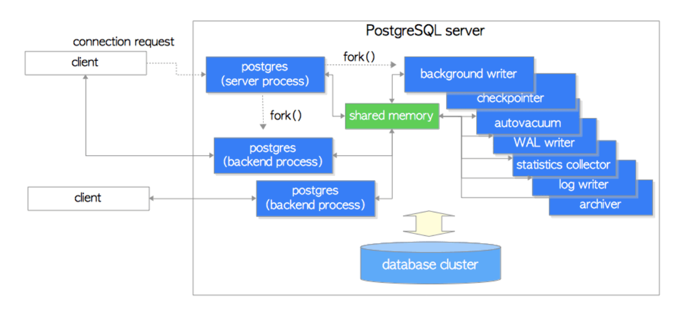

# ._.) PostgreSQL을 알아보자.
### 

 

## 🖥 PostgreSQL이란?

* 오픈 소스 객체-관계형 데이터베이스 관리 시스템(ORDBMS)

* 전 세계에서 가장 안정적이고 진보적인 오픈 소스로 평가 받는 DBMS

* 완벽한 트랜잭션(ACID)과 높은 동시성 제어(MVCC)를 지원

  

## 🖥 특징

### 유연한 객체 생성

다른 관계형 데이터베이스 시스템과 달리,

연산자, 복합 자료형, 집계 함수, 자료형 변환자, 확장 기능 등 다양한 **데이터베이스 객체**를 사용자가 임의로 만들 수 있는 기능을 SQL 차원에서 제공한다.

이런 특징은 단순한 자료 저장소로써의 기능을 넘어 마치 하나의 새로운 프로그래밍 언어처럼 개발자의 창의성에 따라 무한한 기능을 손쉽게 구현할 수 있도록 한다.

 

### 상속

java 또는 C++ 프로그래밍 언어와 같이 테이블을 만들어 그 테이블 **상속 기능**을 이용해 하위 테이블을 만들 수 있다.

테이블에 저장된 자료는 상위 테이블을 조회하면, 해당 테이블의 하위 테이블에 포함된 모든 자료를 조회할 수 있으며, 하위 테이블을 만들 때, 상위 테이블의 칼럼을 그대로 상속 받으면서, 하위 테이블에만 속하는 칼럼을 추가로 만들 수 있다.

 

### 함수

때때로, '저장 프로시저'라고 불리는 SQL문으로 작성된 함수를 서버환경에서 사용할 수 있다. 비록 다른 언어와는 달리 제어문과 반복문을 사용하지는 못하지만, 다른 언어와 결합시킬 수 있다. 일부 언어에서는 심지어 트리거 내부에서 실행시킬 수 있다.

이러한 언어의 예는 다음과 같다.

* PL/pgSQL (오라클의 PL/SQL과 유사하다)
* 스크립트 언어를 통한 지원 (예, PL/Python, PL/php, PL/Perl)
* 컴파일 언어를 통한 지원 (예, C/C++, PL/Java)
* 통계적 언어를 통한 지원 (예, PL/R)
* PostgreSQL은 테이블에 대한 질의 결과를 반환하기 위한 '행 반환 함수'를 지원한다.

실행권한은 함수 작성자 및, 실행자 모두에게 있다.

  

## 🖥 PostgreSQL의 구조

* 클라이언트/서버 모델

* 서버

    * 데이터베이스 파일들을 관리

    * 클라이언트 애플리케이션으로부터 들어오는 연결을 수용

    * 클라이언트를 대신하여 데이터베이스 액션을 수행

    * 클라이언트의 연결 요청이 오면 각 커넥션에 대해 새로운 프로세스를 `fork`한다.

* 클라이언트

    * 기존 서버와의 간섭 없이 새로 생성된 서버 프로세스와 통신

   
***

## 참고
* [PostgreSQL 개요](https://guide-fin.ncloud-docs.com/docs/database-postgresql-postgresqloverview)
* [[PostgreSQL] PostgreSQL이란?](https://mangkyu.tistory.com/m/71)
* [[DB] PostgreSQL이란 ? 및 설치 방법](https://learning-e.tistory.com/m/25)
* [기업 데이터 환경에 PostgreSQL이 최적인 이유
](https://bitnine.tistory.com/m/516)