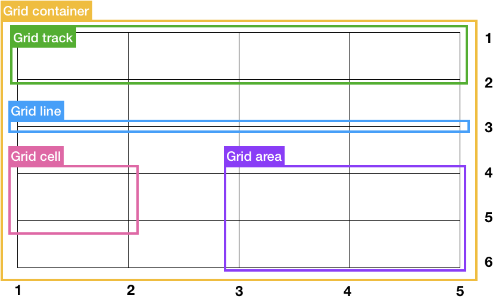
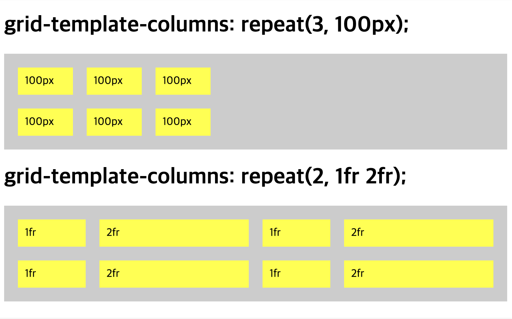
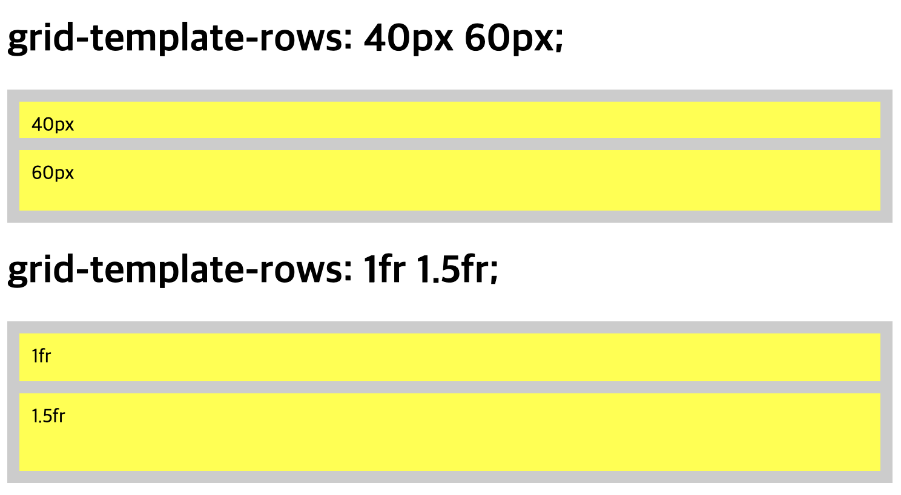
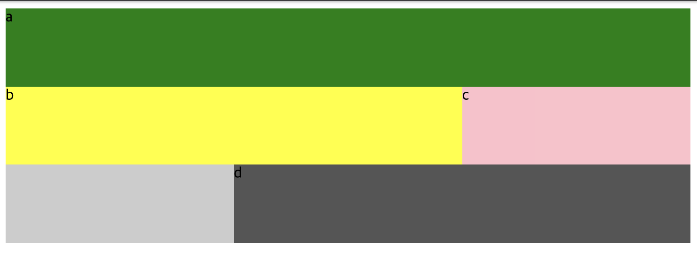
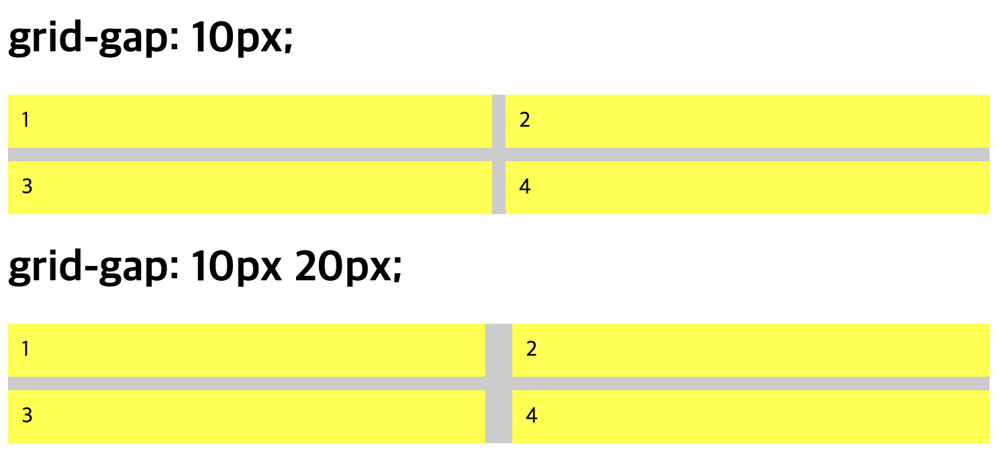
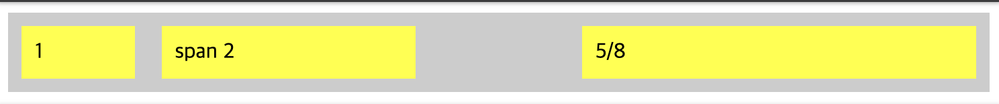
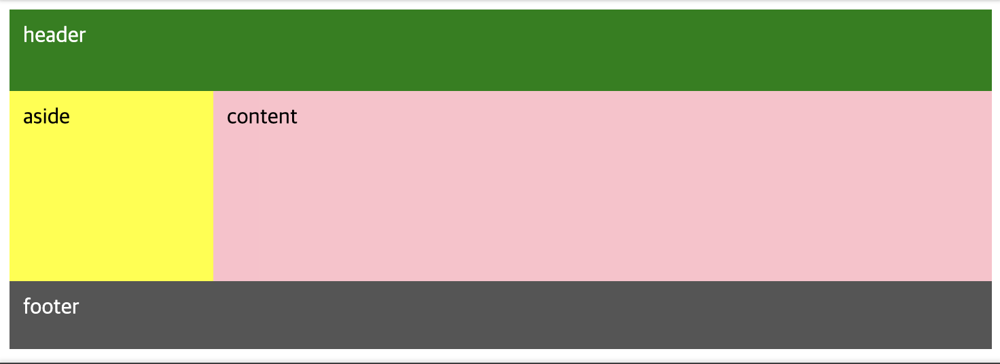

# ._.) 그리드(Grid)로 레이아웃을 짜보자
### grid는 flex와 달리 2차원(행과 열) 형태의 레이아웃이다.
<br/>

## 🖥 Grid 레이아웃의 구성요소
* Grid layout은 행과 열로 구성된다.

<p align="center">

</p>

* `Grid container` : 전체 Grid layout을 감싸는 역할을 수행한다. `display: grid | inline-grid` 속성을 통해 지정할 수 있다. 

* `Grid item` : Grid container에 속해있는 하위 DOM 요소를 뜻한다.

* `Grid track` : Grid layout에 존재하는 행 또는 열을 의미한다. Grid track의 개수는 명시적으로 지정할 수도, 암묵적으로 늘어나게 할 수도 있다.

* `Grid line` : Grid track을 구분하는 선을 의미한다. 선의 번호는 위에서 아래로(↓), 왼쪽에서 오른쪽으로(→) 메겨진다. 그리드 라인의 번호는 1부터 시작된다는 점을 주의하자.

* `Grid cell` : 그리드 레이아웃에서 가장 작은 단위 요소이며, 테이블의 셀과 유사하다.

* `Grid area` : 다수의 Grid cell로 이루어진 영역을 뜻한다. Grid area는 항상 사각형의 모양을 가져야한다(ㄴ자, ㄱ자 형태 불가능).
<br/><br/>

## 🖥 Grid 레이아웃의 주요 CSS 속성
Grid 레이아웃은 `container`와 `item`에 부여할 수 있는 속성이 구분되어 있다.
* __container__
    * `grid-template-columns`
    * `grid-template-rows`
    * `grid-template-areas`
    * `grid-gap`
* __item__
    * `gird-column`
    * `grid-row`
    * `grid-area`
<br/>

## ⌨️ Container 속성
### grid-template-columns
```
grid-template-columns: none | <track-list> | <auto-track-list>
```

* grid-template-columns를 이용해 열의 개수 및 크기를 지정할 수 있다.
* 예를들어 100px로 이루어진 3개의 열을 구성하고 싶을 경우,
* `grid-template-columns: 100px 100px 100px`로 값을 지정하면 된다.
* 이를 보다 간결하게 쓰려면,
* `grid-template-columns: repeat(3, 100px)`

<p align="center">

</p>

### _🖐🏻 잠깐! 여기서 fr이란? - fraction(분수)의 약자_
  * 위의 예제를 보면 fr이라는 새로운 단위가 등장한다.
  * fr은 그리드 트랙에 남아있는 여백의 크기를 fr앞에 기입된 숫자의 비율대로 나누어, 각 열 또는 행에 할당한다.
  * 이를 이용해 반응형 레이아웃을 손쉽게 구현할 수 있다.
<br/>

### grid-template-rows
```
grid-template-rows: none | <track-list> | <auto-track-list>
```
* grid-template-rows는 행의 개수 및 크기를 지정할 수 있다.
* 작성 방법은 grid-template-columns와 동일하다.

<p align="center">

</p>
<br/>

### grid-template-area
```
grid-template-areas: none | <string>
```
* 각각의 행과 열에 이름을 붙여 해당 영역에 특정 그리드 아이템이 위치하도록 한다.
* 이 속성은 뒤에 설명할 grid-area와 함께 쓰인다.
* grid-template-areas에서 전체 레이아웃을 구성하면, grid-area을 이용해 레이아웃의 각 요소를 정의할 수 있다.


```
.grid-container {
  display: grid;
  grid-template-areas:  'a a a'
                        'b b c'
                        '. d d';
  grid-template-rows: repeat(3, 1fr);
  grid-template-columns: repeat(3, 1fr);
  height: 250px;
  background-color: #ccc;
}

.a {
  grid-area: a;
  background-color: green;
}

.b {
  grid-area: b;
  background-color: yellow;
}

.c {
  grid-area: c;
  background-color: pink;
}

.d {
  grid-area: d;
  background-color: #555;
}
```
<p align="center">

</p>
<br/>

### grid-gap
```
grid-gap: <row-gap> <column-gap>?
```
* 일반적으로 요소 간 여백을 주기 위해서는 margin을 사용하지만,

* 그리드 레이아웃에서는 grid-gap을 이용해 각 그리드 사이 여백을 설정할 수 있다.

* but) 외곽은 여백 지정이 안되기 때문에 padding을 사용하기.

<p align="center">

</p>
<br/><br/>

## ⌨️ Item 속성 네가지

### grid-column
```
grid-column: <grid-line> [/ <grid-line>] ?
```
* Grid line 번호를 이용해 해당 그리드 아이템이 몇개의 열을 차지할지 정할 수 있다.

* 예를 들어 `grid-column: 1 / 3`일 경우 1번 grid line부터 3번 grid line까지의 열을 차지하게 된다.

* span 키워드를 이용해 특정 grid line이 아닌 칸의 개수를 지정할 수도있다.

* `grid-column: span 2`으로 설정하면 해당 gird item이 시작되는 열에서 2칸을 더 차지하게 된다.

<p align="center">

</p>
<br/>

### grid-row
```
grid-row: <grid-line> [/ <grid-line>] ?
```
* gird-column과 동일하되, 열이 아닌 행에 대하여 작동한다.

<p align="center">

</p>
<br/>

### grid-area
```
grid-area: <grid-line> [/ <grid-line>] ? [/ <grid-line>] ? [/ <grid-line>] ? | <custom-ident>
```

* grid-area는 grid-column과 grid-row를 함께 사용할 수 있는 속성이다.

* `grid-area: 1 / 4 / 1 / 1`과 같이 `grid-area: 시작 열 / 끝 열 / 시작 행 / 끝 행` 순으로 지정할 수 있다.

* 또한 앞서 보았던 `grid-template-areas` 에서 지정한 영역의 이름으로 지정하면 해당 영역을 차지하게 된다.

<p align="center">

</p>
<br/><br/>

## ._.) 이제 그리드를 연습해보자
### 전체 페이지 레이아웃 구성하기
```
.grid-container {
  display: grid;
  grid-template-areas:  'header header'
                        'aside content'
                        'footer footer';
  grid-template-rows: 60px 1fr 50px;
  grid-template-columns: 150px 1fr;
  height: 250px;
  background-color: #ccc;
}

.grid-item {
  padding: 10px;
}

.header {
  grid-area: header;
  color: white;
  background-color: green;
}

.aside {
  grid-area: aside;
  background-color: yellow;
}

.content {
  grid-area: content;
  background-color: pink;
}

.footer {
  grid-area: footer;
  color: white;
  background-color: #555;
}
```

<p align="center">

</p>
<br/><br/>

## 🖥 auto-fit, minmax를 이용한 반응형 레이아웃
### grid-template-columns에 auto-fix, minmax를 이용해 가변적으로 크기가 변하는 레이아웃을 구현할 수 있다.

* `minmax`
   * grid item의 최소/최대 사이즈를 설정할 수 있다.
   * 예를 들어 minmax(300px, 1fr)일 경우 해당 grid item의 크는 최소 300px로 설정되며,
   * 브라우저의 크기가 커지면 브라우저 크기 / 그리드 아이템 개수로 늘어나게 된다.
* `auto-fit`
   * 앞서 살펴보았던 grid-template-columns, grid-template-rows는 행 또는 열의 개수를 고정시켜놓았지만 auto-fit을 이용하면 가변적으로 그 개수를 조정할 수 있다.
   * minmax에 의해 그리드 아이템의 크기가 가변일 경우 해당 grid container가 수용 가능한 개수만큼 행 또는 열의 개수를 자동으로 조정한다.
   * 이와 비슷한 속성으로 auto-fill이 있다.
<br/><br/><br/>

***
## 참고
* [armadillo's blog - [CSS] Grid layout 이해하기](https://armadillo-dev.github.io/css/understanding-grid-layout/#grid-template-columns)
* [1분코딩 - 이번에야말로 CSS Grid를 익혀보자](https://studiomeal.com/archives/533)
* [nana_log - [CSS] CSS Grid (그리드) 배우기](https://nykim.work/59)
