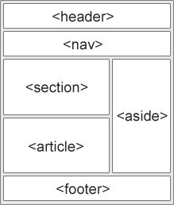
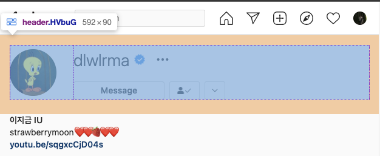
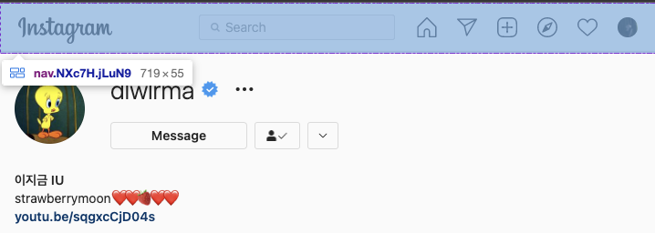
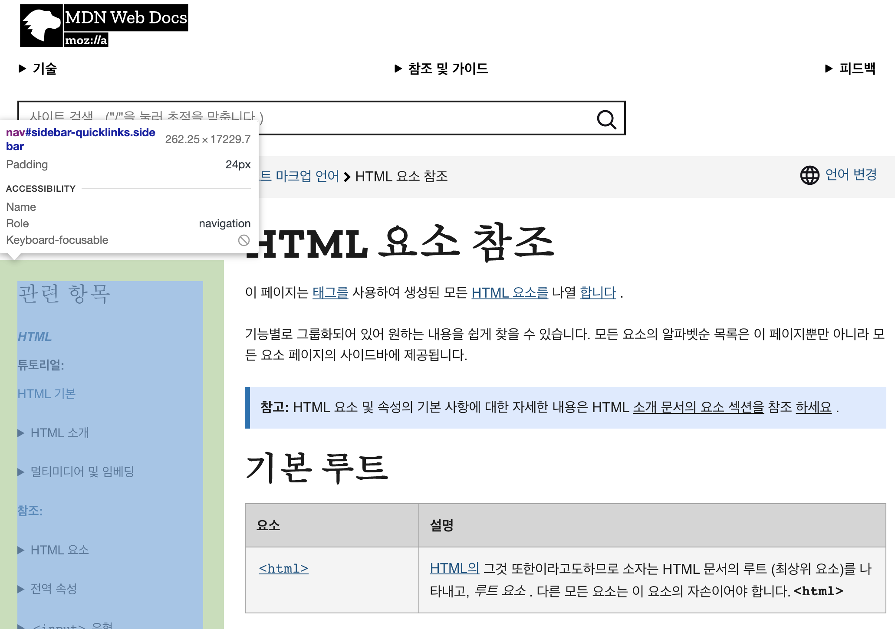
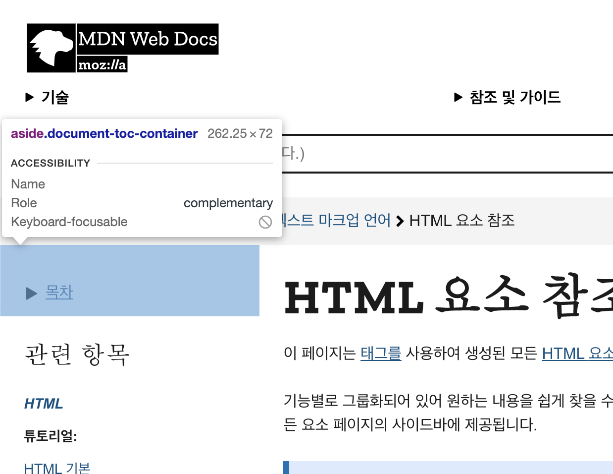
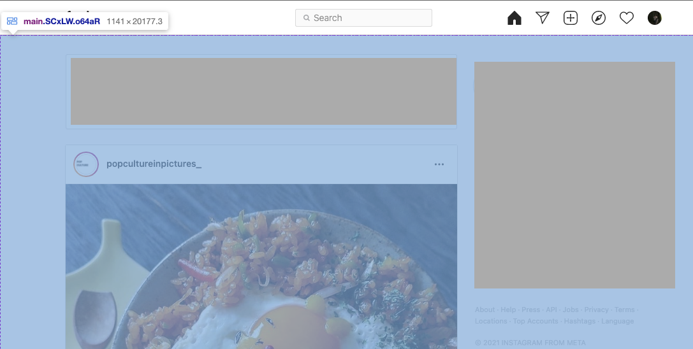

# ._.) 의미론적 HTML이란 무엇일까?
### Semantic HTML을 직역하면 의미론적 HTML이다.
### 의미를 가진 element를 사용함으로써 element의 의미를 브라우저와 개발자 모두에게 알려주는 것을 말한다.
 

## 🖥 시맨틱하지 않은(non-semantic) elements의 예시
* `
`와 `` 등이 있다.

* 이 element는 내용물에 대한 어떠한 것도 알려주지 않고 있다.

* `
`와 ``으로만 이루어진 코드는 실제 돌아가긴 하겠지만 내용물이 직관적으로 보이지는 않는다.
  

## 🖥 시맨틱한(semantic) elements의 예시
* `<form>`, `<table>`, `<article>` 등이 있다.

* 이런 element들은 그들의 내용물에 대해 확실한 정보를 제공한다.

## ._.) 그렇다면 코드를 왜 시맨틱하게 짜야할까?
* 의미론적 마크업을 통해 중요 키워드가 검색 엔진에 영향을 줄 수 있다.

* 시각 장애가 있는 사용자가 페이지를 탐색할 때 의미론적 마크업의 도움으로 보다 쉽게 읽어낼 수 있다.

* 의미를 부여하면 코드 블록을 분류하고 정리하는 데에 훨씬 도움이 된다.

* 개발자에게 태그 안에 들어갈 데이터 유형을 제안한다.
  

## 🖥 Semantic Elements
* `<article>` - 글

* `<aside>` - 페이지의 내용 주변에 있는 내용

* `
` - 사용자가 볼 수 있거나 숨겨진 추가적인 세부사항

* `<figcaption>` - <figure>의 설명

* `<figure>` - 일러스트, 도형, 사진, 코드같은 그 자체로 의미를 갖는 내용

* `<footer>` - 문서나 섹션의 꼬릿말
  
* `<header>` - 문서나 섹션의 머릿말

* `<main>` - 문서의 주된 내용

* `<mark>` - 마크되거나 하이라이트된 글

* `<nav>` - 네비게이션 링크

* `<section>` - 문서의 섹션

* `
` - 
를 위한 가시적인 제목

* `<time>` - 날짜나 시간
  
  
## 🖥 주요 시맨틱 태그와 용도

  
### __1. header__
검생창, 새로고침, 뒤로가기/앞으로가기 버튼 등 사용자가 접근할 수 있는 영역이다.

  * 페이지의 제목과 같은 소개 내용을 포함한다.

  * 일반적으로 heading 태그나 로고 또는 아이콘, 저작권 정보, 검색 양식, 작성자 이름 등을 포함한다.
  

  

  
### __2. nav__
  * 보통 메뉴, 목차 등에 사용된다.
  
  

  
  

  
### __3. aside__
  * 간접적으로 문서와 관련된 내용을 나타낸다.
  
  * 사이드바 또는 콜아웃 상자로 사용된다.
  

  
### __4. main__
  * 지배적인 콘텐츠 영역을 나타내는 태그이다. 
  

  
### __5. section__
  * 구체적인 시맨틱 태그가 없는 문서의 독립적인 영역을 나타낸다.
  
  * 섹션에는 매우 소수의 예외를 제외하고 항상 제목이 있는 것이 일반적이다.
  
### __6. article__
  * 그 자체로 의미가 있는 웹사이트의 부분이며, 독립적으로 배포 또는 재사용되도록 의도 된 문서이다.
  
  * 게시물, 잡지 또는 신문 기사, 블로그 작성글, 제품 카드, 사용자가 제출한 댓글, 대화형 위젯 등이 있다.
  

  
### __7. footer__
  * 일반적으로 섹션의 작성자에 대한 정보, 저작권 데이터 또는 관련 문서에 대한 링크를 포함한다.
 
  
## 그 외
### 강조할 땐 em, strong
  * 강조되는 텍스트에 사용된다.
  
  * 보통 브라우저에서 em은 기울기체, strong은 볼드체로 나타난다.

### p 태그 남용하지 않기
  * p 태그는 글의 단락에 사용된다.
  
  * 리스트의 텍스라면 li 태그를, 다른 페이지를 접속할 링크라면 a 태그, 제목이라면 heading (h1 ~ h6) 등 데이터의 특성을 잘 나타내는 태그로 사용하자
  
***
## 참고
* [빠리의 택시 운전사 - [HTML]시맨틱(Semantic) HTML을 짜보자](https://geonlee.tistory.com/96)
* [보망고의 WEB 파헤치기 - 프론트엔드 로드맵8 의미론적(Semantic)인 HTML란 무엇인가?](https://bomango.tistory.com/14)
* [youngDev - HTML 시맨틱 태그](https://velog.io/@syoung125/%EC%8B%9C%EB%A7%A8%ED%8B%B1-%ED%83%9C%EA%B7%B8-Semantic-Tag-%EC%9E%98-%EC%82%AC%EC%9A%A9%ED%95%98%EA%B8%B0)
