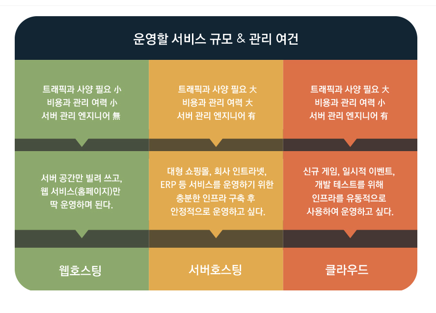

# ._.) 호스팅이란 무엇일까?
### 호스팅(hosting)의 사전적 의미: '주인', '주최하다', '주인 노릇을 한다'
### 따라서, 인터넷 서비스를 위한 환경을 '제공하는 것'을 IT분야에서 '호스팅'이라고 부른다.

## 🖥 서버 호스팅
* 서버 호스팅이란 서버를 통째로 빌려 운영하는 서비스이다.

* 서버 한 대를 기업에서 단독으로 빌려 쓰거나 구매한 서버의 운영 대행을 맡기는 것을 말한다.

### ._.) 서버 호스팅은 단독 주택에 비유할 수 있다.
* 단독 주택에 살면 장점이 뭘까?

먼저 내 마음대로 집을 확장할 수 있다. 창고가 부족하면 옆에 창고를 하나 더 지으면 되고 화장실이나 방이 부족하면 확장하면 된다. 전기와 수도 같은 자원도 혼자서만 공유한다. 비록 집안에서 누군가 전기를 많이 쓰는 가전제품을 사용하면 갑자기 전기가 끊길 수 있지만, 전기 공급량을 늘리면 해결된다.

* 여기서 집 자체는 서버와 같고 인터넷 회선은 전기와 같다.

저장 공간이 부족하면 창고나 방을 하나 더 짓듯 데이터 저장 공간이 부족하면 하드디스크를 하나 더 추가할 수 있다. 전기가 부족하면 전기 공급량을 늘리듯 인터넷 회선 용량이 부족하면 더 많은 데이터를 전송할 수 있도록 회선 용량을 추가할 수 있다.

또한, 층간 소음이나 옆집 눈치를 볼 필요가 없다는 장점도 있는데, 서버 호스팅도 마찬가지이다.
  

## 🖥 웹 호스팅
* 서버 호스팅이 서버 전체를 사용하는 것이라면, 웹 호스팅은 서버의 일부분만 빌려 쓰는 형식이다.

### ._.) 웹 호스팅은 가구 주택(아파트 등)에 전세나 월세로 사는 것과 같다.
* 아파트에 월세로 살면 장점이 뭘까?

아파트 월세를 예로 들면, 세입자는 집주인에게 매달 정해진 비용을 낸다. 대신 모든 것이 갖춰진 곳에 간단한 살림살이만 들고 가면 된다. 수리가 필요하면 집 주인에게 말하면 되고 집이 작으면 조금 더 큰 곳으로 이사가면 된다.

* 작은 규모일 경우 가성비가 좋다.

웹 호스팅도 똑같다. 이미 만들어진 서버(아파트) 한 공간(한 호)에 들어가는 것과 같다. 대신 자기가 원하는 상품(평수)을 선택할 수 있어 합리적이다. 하루에 1,000명 오는 웹 사이트가 필요한데 수십만 원씩 주면서 서버 호스팅을 할 필요는 없기 때문에, 웹 호스팅을 이용한다.
따라서, 웹 호스팅은 개인용 또는 중소기업에서 홈페이지를 운영하기 적합한 호스팅 서비스입니다.

* 이런 웹 호스팅도 단점은 있다.

바로 내 마음대로 할 수 없다는 것. 집이 작다고 마음대로 공사해서 늘릴 수 없고 창고나 방을 더 지을 수도 없듯 웹 호스팅도 미리 정해진 상품에서만 선택해야 한다.
  

## 🖥 클라우드 호스팅
### ._.) 두마리 토끼를 잡은 클라우드 호스팅!
* 웹호스팅의 장점과 서버호스팅의 장점을 모두 가지고 있는 호스팅 방법

* 앉은자리에서 클릭 몇번으로 10분안에 누구나 서버를 생성하고 관리할 수 있다.

* 트래픽의 변동에도 유연하게 대처할 수 있다.

* 일시적인 이벤트나 인프라가 유동적인 곳에 사용하기 편리하다는 장점이 있다.
  

## 🖥 비교

* 개인 블로그나 소규모 트래픽이 필요한 곳 ▶️ 웹 호스팅

* 트래픽과 DB의 사용량이 많아 서버 관리 인프라가 같이 필요한 곳 ▶️ 서버 호스팅

* 트래픽의 변화에 유동적인 대처가 가능하며 빠른 시간안에 서버를 구축할 수 있는 서비스 ▶️ 클라우드 호스팅

  

***
## 참고
* [U+ Biz Smart SME 공식 블로그 - 호스팅이란 무엇일까요?](https://uplusbizstory.tistory.com/40)
* [크레용 신짱 위키 - 와르르맨션](https://shinchan.fandom.com/ko/wiki/%EC%99%80%EB%A5%B4%EB%A5%B4%EB%A7%A8%EC%85%98)
* [dreamjh.log - 호스팅이란?](https://velog.io/@dreamjh/%ED%98%B8%EC%8A%A4%ED%8C%85%EC%9D%B4%EB%9E%80)
