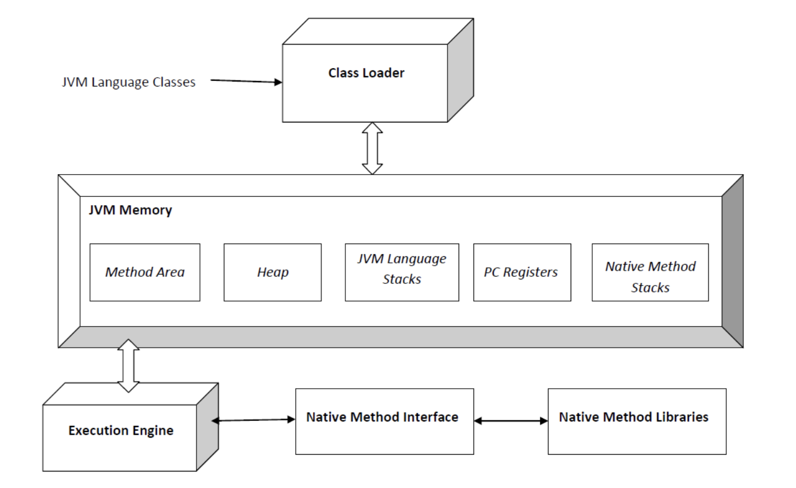

# ._.) Java를 배워보자.
### 객체 지향 프로그래밍(Object Oriented Programming)

 

## 🖥 객체 지향 프로그래밍의 특징

 

### ⌨️ 1) 상속 (Inheritance)

부모 클래스의 변수와 메서드를 자식 클래스가 전부 물려받는 것 

 

### ⌨️ 2) 캡슐화 (Encapsulation, Information Hiding)
객체의 변수 및 메서드를 외부 객체가 함부로 건드리지 못하게 감싸는 개념

* 클래스의 getter/setter 등을 통해 은닉한다.

 

### ⌨️ 3) 다형성(Polymorphism)

- Poly(다양한) + morphism(변형,변신) 의 합성어 

- 하나의 객체가 여러가지 타입을 가질 수 있는 것을 의미함

- 자바에서는 한 레퍼런스 변수가 다른 형태의 객체를 참조할 수 있다.

- __오버로딩,__ __오버라이딩,__ __업캐스팅,__ __다운캐스팅__ 등

 

### ⌨️ 4) 추상화 (Abstraction) 
- 자바에서 공통의 속성, 기능을 묶어 이름을 붙이는 것
 
- 자바에서 추상화는 추상클래스, 인터페이스를 통해 구현된다.

- 추상클래스 : 추상메서드를 하나 이상 포함한 추상 클래스
 
- 인터페이스 : 추상메서드만을 포함한 추상 클래스, 다중 상속 가능 

    - JAVA 8부터는 인터페이스 안에 default 선언을 하면 바디가 있는 메서드도 선언할 수 있다.

  

## 🖥 자동 메모리 관리 by Garbage Collector

* C/C++ 등 다른 언어의 경우 더이상 사용하지 않는 메모리는 재사용 가능하게 해제해야 한다. 이는 개발자가 직접 메모리를 해제해야 함을 의미

* 하지만 자바는 메모리를 직접 관리한다.

* __Garbage Collector__
    
    * : 객체를 생성할 때 자동으로 메모리 영역을 찾아 할당하고,
    
    * 사용이 끝나면 Garbage Collector를 실행해 자동으로 사용하지 않는 객체를 제거해준다.

* 개발자는 메모리 관리 대신 코드 작성에 집중할 수 있음

> 만약 개발자가 직접 메모리를 해제하고 싶은 경우, `System.gc();`로 Garbage Collector를 호출하여 해제할 수 있다.
  

## 🖥 운영체제에 독립적
* 자바는 운영체제에 독립적이다.

* 자바의 개발 환경과 배포환경이 다를 경우, 프로그램을 다시 컴파일 할 필요 없이 실행가능함을 의미

    * 이는 자바가 `Java Virtual Machine` 위에서 돌아가기 때문

* `Java Virtual Machine`에서 별도의 `Java Compiler`를 통해 사용자의 코드를 Byte 코드로 변환한다.

* 따라서 모든 자바 프로그램은 이론적으로 CPU나 운영체제의 종류와 무관하게 동일하게 작동한다.

 

* Java Virtual Machine 구조

  

## 🖥 멀티쓰레드 프로그래밍 가능
* 자바는 하나의 프로그램에서 여러 개의 쓰레드가 동시에 실행할 수 있는 환경을 지원한다.  

* C/C++은 운영체제의 도움을 받아 멀티 쓰레드를 수행하지만,

* 자바는 운영체제 지원없이 [멀티스레드](https://github.com/3o14/CS/blob/main/OS/thread.md#-멀티-스레딩) 프로그래밍이 가능 

### _🖐🏻 잠깐! 여기서 __멀티스레드__ 란?_

* 여러 스레드(프로그램의 실행단위, 프로세스 내 주소공간 및 자원 공유함)를 동시에 실행시키는 응용프로그램을 작성하는 기법

* 장점은 프로세스 내 메모리 공유를 통해 시스템 자원 소모가 줄어든다는 점이지만,

* 반면에 자원을 공유하기 때문에 충돌이 일어날 수 있다.

 

### ⌨️  멀티쓰레드 구현방법

#### 1) Thread 클래스 (화이트박스 방식)
* 자바에서 스레드를 만들기 위해 Thread class 상속하여 스레드를 생성

    * Thread pool : 필요시 스레드를 가져오거나 이전 코드에서 실행완료되었을 때 재사용하는 풀(Pool)

 

#### 2) Runnable 인터페이스 (블랙박스 방식)
* Thread class와 같이 자바에서 스레드 실행시키는 인터페이스입니다.

* 다중상속이 지원되기 때문에 Thread class보다 많이 쓰임

  

## 🖥 5. 동적 로딩(Dynamic loading)

* 자바는 애플리케이션이 실행될 때 모든 객체가 생성되지 않고, 객체가 필요한 시점에 클래스를 동적 로딩하여 생성한다.

* __장점__
    
    * __동적로딩(Dynamic Loading)__ 은 클래스 일부 변경 시 다시 컴파일하지 않아도 된다.
    
    * 비교적 적은 작업으로 처리할 수 있다. -> 유연성
    
* __단점__
    
    * 프로그램 실행 속도가 정적로딩에 비해 느리다.
      
        * (그때그때 메모리에서 불러오기 때문)
    
    * 느린 속도를 해결하기 위해 `static` 키워드를 사용함
 
### _🖐🏻 잠깐! 여기서 __정적 로딩(Static Loading)__ 이란?_

* 프로그램 실행 시 모든 실행파일이 메모리에 적재되어 실행되는 로딩방법 

* 대표적으로 C언어가 있다. 

* 정적로딩은 모든 파일이 메모리에 적재되어 메모리를 많이 차지하지만, 빠르게 가져와 사용할 수 있다는 장단점이 있음

   
***

## 참고
* [[JAVA] 자바 언어의 특징 5가지](https://life-with-coding.tistory.com/430)
* [자바(JAVA)의 특징](https://yolojeb.tistory.com/17)
* [[Java] Java란? Java의 특징](https://girawhale.tistory.com/97)