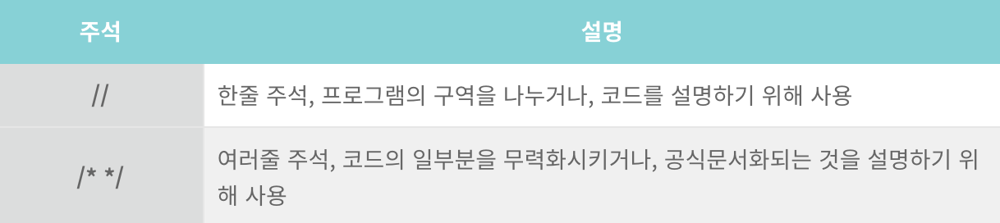

# .__.) 자바스크립트를 써보자!
### 어떻게 쓰는거지

## 🖥 언어 삽입
### 1. script 언어로 삽입 - <body>안에 자손으로 삽입

```html
<!DOCTYPE html>
<html lang="ko">
    <head>
        <meta charset="UTF-8">
        <title>자바스크립트(JAVASCRIPT) 소개</title>
    </head>
    <body>
        <h1 id="title">안녕하세요!</h1>
        <script>
            var title = document.getElementById('title');

            title.style.color = 'red';
        </script>
    </body>
</html>
```
  
<p align="center">

</p>
<br/>
  
### 2. script 언어로 삽입 - <head>안에 자손으로 삽입

```html
<!DOCTYPE html>
<html lang="ko">
    <head>
        <meta charset="UTF-8">
        <title>자바스크립트(JAVASCRIPT) 소개</title>
        <script>
            window.onload = function(){
                var title = document.getElementById('title');
                
                title.style.color = 'red';
            }
        </script>
    </head>
    <body>
        <h1 id="title">안녕하세요!</h1>
    </body>
</html>
```
  
<p align="center">

</p> 
<br/>

### 3. 외부 JS 문서를 html에 연결

```html
<!DOCTYPE html>
<html lang="ko">
    <head>
        <meta charset="UTF-8">
        <title>자바스크립트(JAVASCRIPT) 소개</title>
        <script src="test.js"></script>
    </head>
    <body>
        <h1 id="title">안녕하세요!</h1>
    </body>
</html>
```

js코드 - test.js
```js
window.onload = function(){
    var title = document.getElementById('title');

    title.style.color = 'red';
}
```
  
<p align="center">

</p> 
<br/><br/>
  
## 🖥 언어 출력
### 1. 자바스크립트 데이터 표시 방법
<p align="center">

</p> 
<br/>
  
### 2. innerHTML 예제

```html
<!DOCTYPE html>
<html lang="ko">
    <head>
        <meta charset="UTF-8">
        <title>자바스크립트 출력(output)</title>
        <script>
            window.onload = function(){ //준비구문
                //아이디가 demo인 문서객체를 읽은 후 명령을 줘야하므로
                //준비구문을 작성한 후 명령 코드 작성
                document.getElementById('demo').innerHTML = '테스트';
            }
        </script>
    </head>
    <body>
        <h1 id="demo"></h1>
    </body>
</html>
```
  
<p align="center">

</p> 
<br/>
  
### 3. document.write()
```html
<!DOCTYPE html>
<html lang="ko">
    <head>
        <meta charset="UTF-8">
        <title>자바스크립트 출력(output)</title>
        <script>
            document.write('<h1>테스트</h1>');
        </script>
    </head>
    <body>
        <h1 id="demo"></h1>
    </body>
</html>
```
  
<p align="center">

</p> 
<br/>
  
### 4. alert() - 경고창으로 출력
  
```html
<!DOCTYPE html>
<html lang="ko">
    <head>
        <meta charset="UTF-8">
        <title>자바스크립트 출력(output)</title>
        <script>
            window.alert('테스트');
            alert('테스트');
        </script>
    </head>
    <body>

    </body>
</html>
(window는 적지 않아도 출력됨)
  
<p align="center">

</p> 
<br/>
  
### 5. console.log() - 브라우저 개발자모드 콘솔로 출력
```html
<!DOCTYPE html>
<html lang="ko">
    <head>
        <meta charset="UTF-8">
        <title>자바스크립트 출력(output)</title>
        <script>
            console.log('테스트');
        </script>
    </head>
    <body>
    </body>
</html>
```
  
<p align="center">

</p> 
<br/>
- [F12]를 누르면 나오는 개발자 모드에서 [console]을 클릭하면 결과를 확인할 수 있다.
<br/><br/>

## 🖥 자바스크립트 기본 용어
### 1. 자바스크립트 키워드
<p align="center">

</p> 
<br/>
  
### 2. 자바스크립트 식별자
- 자바스크립트에서 개발자가 지정하는 이름
- 변수, 함수 등의 이름을 지정할 때 사용
- 식별자 규칙
  ① 첫번째 문자는 영문, 밑줄(_), 달러기호($)
  ② 영어 대소문자 구별     ex) a1 ≠ A1
  ③ 숫자는 영문 뒤에 사용
  ④ 공백사용X
  ⑤ 키워드사용X
  
### 3. 주석
코드를 설명하고 더 쉽게 읽을 수 있게 사용되는 코멘트
<p align="center">

</p> 
<br/>
  
```html
<!DOCTYPE html>
<html lang="ko">
    <head>
        <meta charset="UTF-8">
        <title>자바스크립트 기본용어</title>
        <script>
        	//변수선언
        	var cup;
            
            /*
            1 + 2;
            3 + 5;
            */
        </script>
    </head>
    <body>
        
    </body>
</html>
```
<br/><br/><br/>

***
## 참고
* [오쌤의 니가스터디 - [JS강좌] 1강 자바스크립트 소개 및 기본용어](https://ossam5.tistory.com/125)

  
