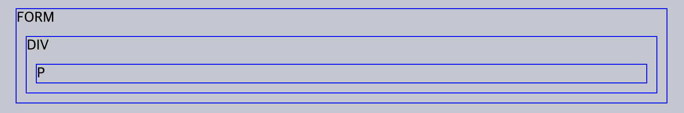
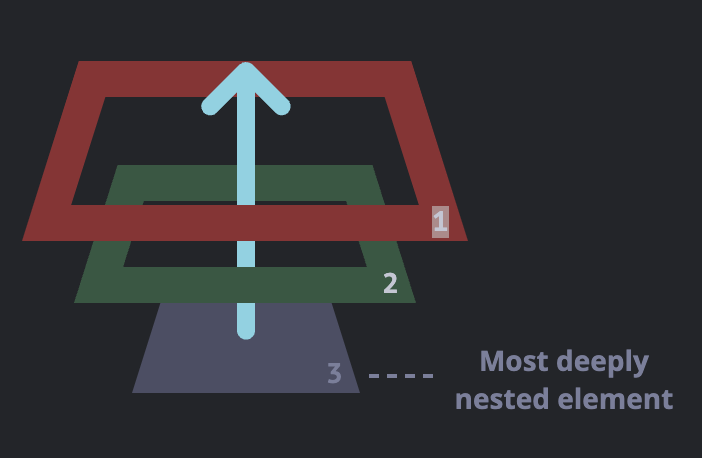
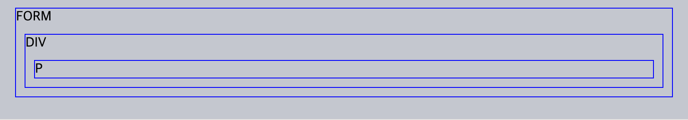

# ._.) 이벤트 버블링에 대해 알아보자!
### 만약 부모 요소와 자식 요소에 둘 다 같은 종류의 이벤트가 할당 되어있을 때, 이벤트를 동작시키면 어떤 이벤트가 먼저 실행될까?
<br/>

## 🖥 이벤트 버블링(Event Bubbling)
이벤트 버블링이란 한 요소에 이벤트가 발생하면 이 요소에 할당된 핸들러가 동작하고, 이어서 부모 요소의 핸들러가 동작하고 최상단의 부모 요소를 만날 때까지 반복되면서 핸들러가 동작하는 현상을 말한다.

<p align="center">
  
</p>

3개의 요소가 `FORM > DIV > P` 형태로 중첩된 구조를 살펴보자.

요소 각각에 핸들러가 할당되어 있다.


```html
<style>
  body * {
    margin: 10px;
    border: 1px solid blue;
  }
</style>

<form onclick="alert('form')">FORM
  <div onclick="alert('div')">DIV
    <p onclick="alert('p')">P</p>
  </div>
</form>
```

<p align="center">
  
</p>

가장 안쪽의 `<p>`를 클릭하면 순서대로 다음과 같은 일이 벌어진다.

1. `<p>`에 할당된 `onclick` 핸들러가 동작한다.
2. 바깥의 `<div>`에 할당된 핸들러가 동작한다.
3. 그 바깥의 `<form>`에 할당된 핸들러가 동작한다.
4. `document` 객체를 만날 때까지, 각 요소에 할당된 `onclick` 핸들러가 동작한다.

<p align="center">
  
</p>

이런 동작 방식 때문에 `<p>` 요소를 클릭하면 `p` → `div` → `form` 순서로 3개의 얼럿 창이 뜨게 된다.

이런 흐름을 `'이벤트 버블링’`이라고 부른다.

이벤트가 제일 깊은 곳에 있는 요소에서 시작해 부모 요소를 거슬러 올라가며 발생하는 모양이 마치 물속 거품(bubble)과 닮았기 때문
<br/>

### 📍 거의 모든 이벤트는 버블링 된다.
* 키워드는 ‘거의’ 이다.

* `focus` 이벤트와 같이 버블링 되지 않는 이벤트도 있다.

* 버블링 되지 않는 이벤트의 종류에 대해선 조금 후에 알아보자.

* 몇몇 이벤트를 제외하곤 대부분의 이벤트는 버블링 된다.
<br/><br/>

## 🖥 이벤트 캡처링(Event Capturing)
실제 코드에서 자주　쓰이진 않지만, 종종 유용한 경우가 있으므로 알아보자.

<p align="center">
  
</p>

이벤트엔 버블링 이외에도 ‘캡처링(capturing)’ 이라는 흐름이 존재한다. 

표준 [DOM 이벤트](https://www.w3.org/TR/DOM-Level-3-Events/)에서 정의한 이벤트 흐름엔 3가지 단계가 있다.

1. 캡처링 단계 – 이벤트가 하위 요소로 전파되는 단계
2. 타깃 단계 – 이벤트가 실제 타깃 요소에 전달되는 단계
3. 버블링 단계 – 이벤트가 상위 요소로 전파되는 단계


<br/><br/><br/>

***
## 참고
* [JavaScript.info - 버블링과 캡처링](https://ko.javascript.info/bubbling-and-capturing)
* [이벤트 버블링과 캡처링에 대한 정리](https://velog.io/@tlatjdgh3778/%EC%9D%B4%EB%B2%A4%ED%8A%B8-%EB%B2%84%EB%B8%94%EB%A7%81%EA%B3%BC-%EC%BA%A1%EC%B2%98%EB%A7%81%EC%97%90-%EB%8C%80%ED%95%9C-%EC%A0%95%EB%A6%AC)
* [[JavaScript] 이벤트 버블링, 캡쳐링, 위임](https://velog.io/@soulee__/JavaScript-%EC%9D%B4%EB%B2%A4%ED%8A%B8-%EB%B2%84%EB%B8%94%EB%A7%81-%EC%BA%A1%EC%B3%90-%EC%9C%84%EC%9E%84)
* [JavaScript - 이벤트 버블링과 이벤트 캡처링](https://jongminfire.dev/java-script-%EC%9D%B4%EB%B2%A4%ED%8A%B8-%EB%B2%84%EB%B8%94%EB%A7%81%EA%B3%BC-%EC%9D%B4%EB%B2%A4%ED%8A%B8-%EC%BA%A1%EC%B2%98%EB%A7%81)
* [이벤트 버블링(bubbling)과 캡처링(capturing) :: 마이구미](https://mygumi.tistory.com/315)
  
