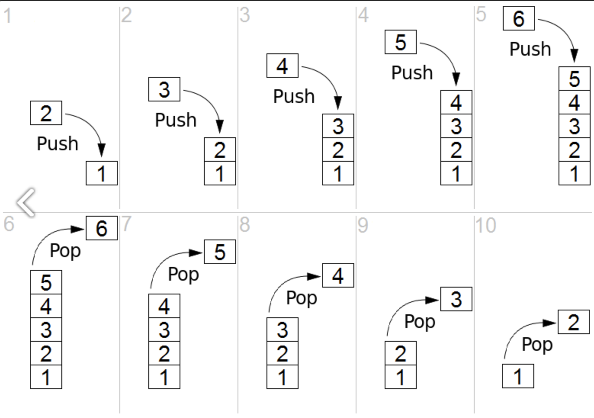
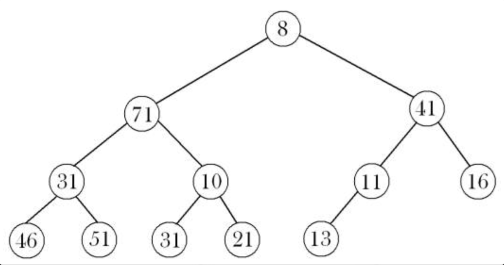

# ._.) C#을 알아보자.
### Micro Soft에서 개발한 언어, C#
 

## 🖥 C#이란

* 마이크로소프트에서 개발한 객체지향 프로그래밍 언어

* 닷넷 프레임워크의 한 부분으로 만들었으며 나중에 ECMA와 ISO의 표준으로 자리잡음

* c++과 자바의 문법과 비슷하다.

 

### _🖐🏻 잠깐! 여기서 __ECMA, ISO__ 란?_

* ECMA Script (또는 ES)란,

    * Ecma International이 ECMA-262 기술 규격에 따라 정의하고 있는 표준화된 스크립트 프로그래밍 언어

* ISO란,

    * 국제표준화기구

    * International Organization for Standardization

 > 

## 🖥 동시성

* C# 프로그래밍에서 동시성이란 한 번에 두 가지 이상의 작업을 수행 하는 것을 의미

* 대부분의 개발자는 동시성 이라는 단어를 들으면 멀티스레딩 을 생각하지만, 이 두가지의 개념은 구별해야 한다.

 

### ⌨️ 멀티스레딩이란?

* 다수의 실행 스레드를 사용하는 동시성의 한 형태

* 멀티스레딩은 말 그대로 다수의 스레드를 사용한다는 뜻

* 멀티스레딩은 동시성의 한 형태일뿐 유일한 형태가 아님

 

### ⌨️ 병렬 처리란?

* 병렬 처리란 많은 작업을 여러 스레드에 나눠서 동시에 수행하는 것

* 병렬 처리 또는 병렬 프로그래밍은 멀티스레딩을 사용해서 멀티 코어 프로세서를 최대한 활용하는 방법이다.

* 요즘 CPU는 코어가 여러개 이고, 해야할 작업이 많을 때 하나의 코어에 모든 일을 맡기고 다른 코어를 쉬게 두면 비효율 적이다.

* 병렬 처리는 작업을 나눠서 각각 다른 코어에서 독립적으로 실행할 수 있는 여러 스레드에 맡긴다.

* 병렬 처리는 멀티스레딩의 한 형태이고, 멀티스레딩은 동시성의 한 형태이다.

 > 

## 🖥 C# 컴파일러와 개발 도구들

### (1) Microsoft Visual C#
* Microsoft가 C#에 대하여 내리는 모든 표준 정의를 가장 정확하고 안정적으 로 반영하는 컴파일러

* 최근에는 C# 3.0에 포함될 LINQ 확장과 같은 부분에 대한 기술적인 레퍼런스를 미리 테스트해볼 수 있는 도구로도 자주 쓰임

### 2) Borland(CodeGear) C# Builder

* 코드기어 RAD 스튜디오(Codegear RAD Studio) 안에서 Delp hi.net 과 CH.net 두 가지 언어로 .net 을 지원

* Microsoft Rotor 프로젝트: Microsoft.NET Fra mework가 발표된 후 수 개월 이후에 같이 발표되는 오픈 소스 프로젝트로 Microsoft 닷넷 플랫폼에 대한 대체 구현을 제공

### 3) Mono

* 마이크로소프트 닷넷 플랫폼에 대한 구현이 시작될 무렵에 시작되었으며, 현재는 제3자 닷넷 플랫폼 중에서 가장 안정적이고 성숙되었다고 평가되는 프로젝트

* 마이크로소프트 닷넷 플랫폼이 윈도우와 소수의 유닉스 플랫폼을 대상으로 하고 있는 것과는 달리 모노 플랫폼의 경우 윈도우보다는 리눅스, 유닉스, 맥 OS X, 솔라리스와 같이 윈도우 외의 운영 체제와 플랫폼을 대상으로 함

### 4) DotGNU Project

* 모노와 비슷한 시기에 개발을 시작하였지만 아직 안정적인 버전이 출시되지 못함

* 특유의 Portable.NET 엔진을 사용하고 있다.

 > 

## 🖥 닷넷 프레임워크의 구조

### CLI

* .NET 프레임워크의 가장 중요한 콤포넌트는 공통 언어 기반(Common Language Infrastructure)이다.

* CLI를 둔 목적은 애플리케이션의 개발과 실행 시 언어에 종속적이지 않은 플랫폼을 제공하기 위함임

    * 예외 처리, 가비지 콜렉션, 보안, 호환 등을 위한 소프트웨어 콤포넌트 등

* 마이크로소프트가 구현한 CLI를 일컬어, 공통 언어 런타임 CLR(Common Language R untime)이라고 한다.

 > 

## 🖥 C#의 메모리구조

우선 메모리 공간은 크게 2가지로 나뉜다.

* **스택영역** : 관리되지 않는 공간

* **힙영역** : 관리가 되는 영역

여기서 관리가 된다는 것은 사용하지 않는 메모리를 스스로 해제하여 사용하지 않은 공간을 정리해서 다른 메모리가 올라갈 수 있게 하는 것이다.

이때 메모리를 정리하는 일을 하는 것이 `가비지 컬렉터`이다. 하지만 가비지 컬렉터가 자주 호출되면 메모리 공간을 정리하기 위한 리소스를 많이 사용하기 때문에 성능이 많이 떨어지게 된다. 그래서 코딩을 할때 메모리 공간을 잘 활용하면서 코딩하는 습관이 중요하다.

 

### ⌨️ 스택(Stack) 영역

* 스택 영역 : 값 형식(Value Type)이 들어가는 메모리 공간 

* 일반적으로 Value Type에는 `int`, `string`, `double` 과 같은 것들이 있다.

* 프로그래머가 선언한 Value Type 외에도 참조 형식의 메모리 구조도 스택영역에 들어가게 된다.

* 스택 영역은 함수에서 선언된 값 형식들은 함수를 빠져나가면 자동으로 메모리가 해제가 되기 때문에 따로 관리를 할 필요가 없다.

### ⌨️ 힙(Heap) 영역

* 힙 영역은 참조 형식(Ref Type)이 추가되는 메모리 공간이다.

* 힙 영역은 아래 그림처럼 도식화 할 수 있다.

힙 영역에 할당된 데이터는 계층 구조를 갖게 되는데, 이때 중간 중간 메모리가 해제되면 계층 구조가 사라지거나, 노드 사이에 관계가 사라지게 된다.

그렇게 되면 빈 공간들이 생기게 되는데, 이런 공간들은 사용하지 못하는 공간이 된다. 그래서 빈공간을 없애주고 메모리들을 정리하는 기능을 해줘야 한다. 이런 기능을 `가비지 컬렉터`가 해주는 것이다.

   
***

## 참고
* [C#이란 무엇이며 C#에 대한 모든 것](https://davey.tistory.com/entry/C-프로그래밍-Davey식-C-강좌-C이란-무엇이며-C에-대한-모든-것)
* [[C# 동시성 프로그래밍] - 동시성 프로그래밍 개념 정리](https://afsdzvcx123.tistory.com/entry/C-동시성-프로그래밍-동시성-프로그래밍-개념-정리)
* [C# 언어에 대한 기본적인 이해](https://velog.io/@yunicorn/C-언어에-대한-기본적인-이해)
* [C# 메모리구조, 스택(Stack), 힙(Heap)](https://tip1234.tistory.com/181)