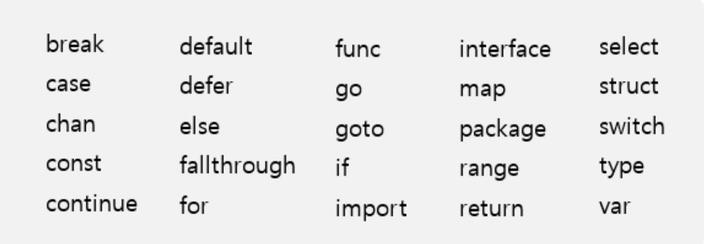
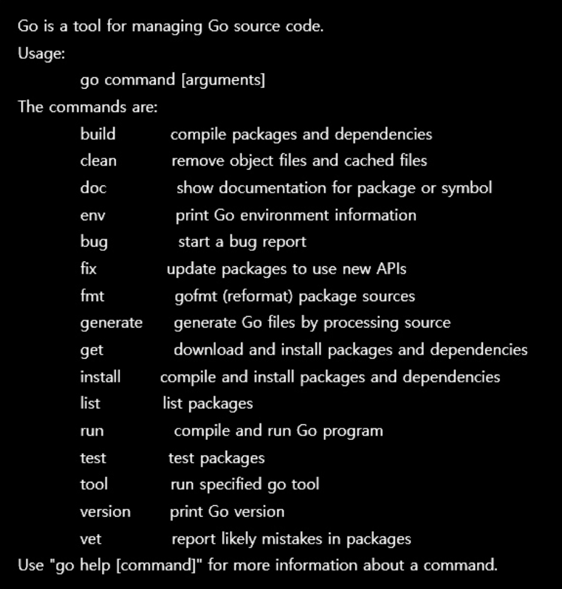

# ._.) Go 언어를 알아보자.
### Google이 만든 프로그래밍 언어, Go

<br/>

## 🖥 Go 언어란?

* Go 언어는 2009년 구글이 개발한 프로그래밍 언어

* 빠른 성능, 안정성, 편의성, 쉬운 프로그래밍을 목표로한 범용 프로그래밍 언어

다. Go 언어의 공식 사이트에서는 다음과 같이 Go 언어를 소개한다. 번역하면 다음 특징을 가진 소스 프로그래밍 언어다.

<br/><br/>

## 🖥 간결한 문법, 빠른 컴파일

- C언어와 유사

- 키워드가 25개로 C(37개), C++ 11(84개)에 비해 간결하다.

<p align="center">

</p>

- 소스코드 자체를 패키지화
    - 기존에 사용하던 헤더 파일을 정의하는 방식 대신, 소스 자체를 패키지화함

    - 복잡도를 낮추고 컴파일 속도 향상을 위함

    - 변경된 부분만 컴파일함으로써 컴파일 속도를 향상시킴

- 소스 내에 사용하지 않는 변수or패키지가 있을 경우 컴파일 시 오류 발생  
    
    - 불필요한 패키지 가져오기에 따른 지연시간을 줄이고 사용하지 않는 변수 및 패키지 선언으로 인해 향후에 발생할 수 있는 버그를 줄이기 위함


<br/><br/>

## 🖥 풍부한 기능, 유틸리티 제공

기존 개발자들이 사용하던 IDE(Integrated Development Environment)에서 쉽게 환경을 구성할 수 있다.

공식 홈페이지(www.golang.org)에서 Go 언어로 작성된 파일을 컴파일·실행·관리할 수 있는 go 바이너리를 다운로드하고 소수의 환경변수 $GOROOT, $GOPATH($GOPATH를 $PATH에 추가)를 설정하는 것만으로 개발 환경을 구성할 수 있음

다운로드한 유틸리티 go 파일은 Go 언어로 작성한 소스파일을 컴파일(build)하여 실행 가능한 바이너리를 생성하는 것은 물론, 컴파일 후 바로 실행(run)하는 기능을 제공한다.

```go
package main
import (
    "fmt"
)
func main() {
    fmt.Println("hello GO")
}
```

```go
$ go build hello.go // 빌드 후 바이너리를 생성
$ ./hello
Hello GO
$ go run hello.go // 빌드 + 실행까지 한번에
Hello GO
```

Go 언어는 소스에 기술된 패키지 단위로 관리되며 Go 소스로 작성할 수도 있고 이미 정의되어 있는 패키지를 import 문으로 가져와서 사용할 수 있다.

필요한 외부 패키지가 있을 경우엔 get 커맨드로 패키지를 받아와 사용한다.

그 외에도 Go 소스 파일의 형식을 맞춰주는 포맷팅(fmt), 사용되는 패키지 리스트업(list), 테스트 코드 수행 등 Go 언어로 패키지를 작성 및 사용하기 위한 여러 가지 기능을 제공하고 있다.

<p align="center">

</p>

<br/><br/>

## 🖥 다양한 패키지

- 기본 패키지 이외에도 여러 벤더에서 다양한 패키지를 제공

    - 개발자는 이를 활용하여 쉽게 애플리케이션을 개발할 수 있다.

- 시스템 프로그램에 자주 사용되는 `http` 패키지는 물론 통신에 필요한 암호화 모듈까지 기본 내장되어 있어 웹 서버를 쉽게 구축할 수 있다.

    - 예를 들어, “hello GO”를 출력하는 웹 서버는 다음과 같이 단 몇 줄로 구현이 가능

```go
package main
import (
    "fmt"
    "net/http"
    )
func main() {
    http.HandleFunc("/hello", helloGo)
    http.ListenAndServe(":8080", nil)
}
func helloGo(w http.ResponseWriter, r *http.Request) {
    fmt.Fprintf(w, "hello GO\n")
}
```

```terminal
$ go run hello.go &
$ curl locallhost:8080/hello
Hello GO
```

또한 Go 소스 내에 cgo라는 별도 지시자(directives)를 설정함으로써, C 언어로 작성된 라이브러리를 직접 사용하는 것도 가능하다.

이러한 강점때문에 기존 인프라 소프트웨어를 대체할 수 있는 언어로 선택되며 대표적인 예로 SSH의 Go 언어 구현체인 텔레포트(Teleport)가 있다.

<br/><br/>

## 🖥 동시성(Concurrency)

- Go 언어는 시스템 프로그램, 특히 서버 개발용으로 설계되었다.

기존에 서버 개발에 널리 사용되던 C, C++, Java는 멀티 코어, 네트워킹 및 웹 애플리케이션 개발이 활발히 이뤄지기 전에 만들어진 언어들이라 사용하기 어렵거나 기능이 제한적이었다.

Go 언어는 이러한 클라이언트가 있는 웹 서버를 실행하는 멀티코어 환경에 맞추어 쉽게 프로그래밍할 수 있도록 `고루틴(goroutine)`과 `채널(channel)`을 제공한다.

### _🖐🏻 잠깐! 여기서 __고루틴(goroutine)__ 이란?_

- `고루틴`은 Go 런타임에서 관리되는 일종의 경량 스레드

- `채널`을 통해 고루틴 간에 메시지를 주고 받을 수 있는 매커니즘을 제공

- `고루틴`과 `채널`을 활용해 멀티코어 환경에서 병렬 처리를 쉽게 구현할 수 있다.


> 고루틴은 자체 Go 런타임 스케줄러에 의해 관리되며 OS 스레드에 비해서도 경량이다. OS 스레드를 생성하는데 필요한 메모리가 1MB인 반면, 고루틴은 2KB이다. 또한 일반 스레드와 달리 메모리의 스택 영역을 사용하며 자체 스케줄러에 의해 관리하므로 컨텍스트 스위칭 비용을 줄인다. 여기에 Go 런타임에서 사용하는 CPU 코어 수를 지정하는 환경변수 GOMAXPROC를 지정함으로써 병렬적으로 고루틴을 실행할 수 있다. 하나의 프로세스에서 보통 1만 개의 고루틴을 실행시킬 수 있으며 몇십만 단위의 고루틴도 실행 가능하도록 스케줄러가 구현되어 있다. (스택 메모리가 부족하면 힙 영역까지 확장)

<br/><br/>

## 🖥 에러 처리, 함수 흐름 제어

> Go 언어는 에러 처리에 있어서 기존의 `try-catch-finally` 형식이 코드가 복잡하고 읽기 어려워진다고 판단했다. 기존 C, C++은 반환되는 값 하나만으로 에러 케이스를 분석하고 그에 따른 조치를 취해야 했기에 흔히 발생하는 에러 케이스를 공통 모듈화 하는 과정에서 상세정보가 누락되는 일도 많았다.

- Go 언어에서 함수는 복수 개의 값을 반환할 수 있다.

    - 이를 통해 에러가 발생했을 때 일반적인 리턴과 함께 오류 메시지를 반환할 수 있고 이 기능은 에러 처리를 쉽게 한다.
    
    - 예를 들어, Go 기본 패키지 os의 Write 함수는 다음과 같이 정의되며, write에 성공한 바이트 수와 에러 메시지를 함께 반환한다. (Go 언어에서 함수 선언 시 반환 값은 제일 마지막에 변수명, 타입 순으로 정의한다.)

```go
func (file *FIle) Write(b []byte)(n int, err error)
```

<br/><br/>

## 🖥 제약 사항

작고 이해하기 쉬울 뿐만 아니라 기존 인프라 소프트웨어를 대체할 수 있을 만큼 강력한 Go 언어지만, 설계 철학에 어긋나는 제네릭(Generic) 같은 일부 기능은 의도적으로 빠졌다.

그 외에 C 구문을 따랐다고 하지만 포인터 연산을 없앤 점 등 C와 다른 부분이 분명 존재하기 때문에 커널이나 장치 드라이버, 임베디드 소프트웨어 같은 저수준 프로그램엔 적합하지 않다.

또한 상용 하드웨어 전용으로 설계되어 있어 하드웨어 가속을 사용할 수 없다. (그래픽스 분야에는 맞지 않음) 따라서, Go 언어는 유틸리티나 네트워크 서비스와 같은 프로그램을 만들 때 유용함

<br/>

[GO 언어 투어하기](https://tour.golang.org)
<br/><br/><br/>
***

## 참고
* [Google이 만든 프로그래밍 언어, Go](https://www.samsungsds.com/kr/insights/golang.html)
* [내가 Go 언어를 선택한 이유](https://pronist.dev/67)
* [예제로 배우는 Go 프로그래밍](http://golang.site/go/basics)
* [Go (프로그래밍 언어)](https://ko.wikipedia.org/wiki/Go_(프로그래밍_언어))
* [[Go] Go 언어란? / 특징과 배워야 하는 이유](https://m.blog.naver.com/dsz08082/221970891331)