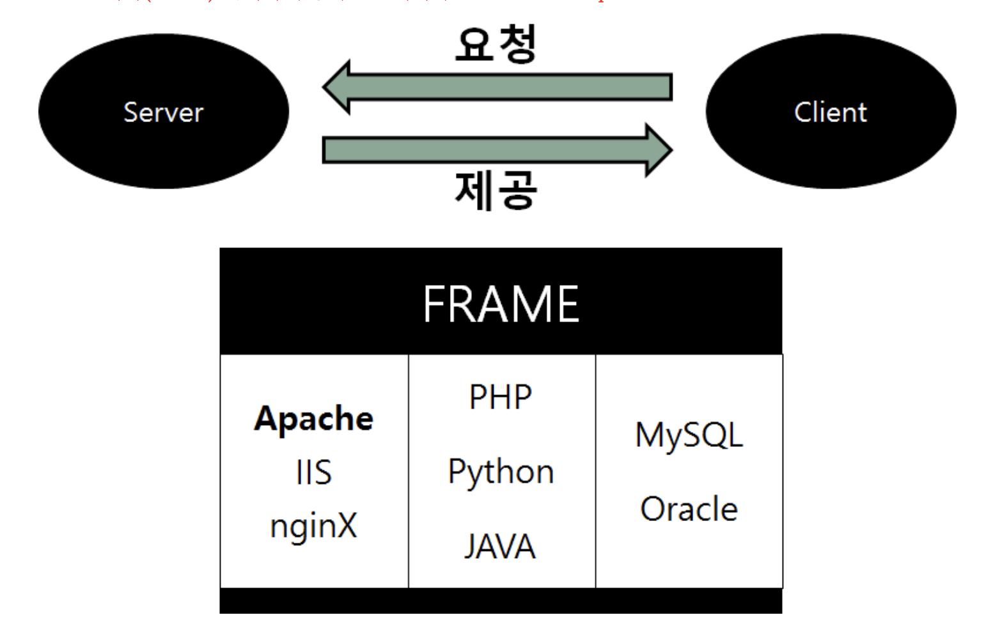

# ._.) PHP에 대해서 알아보자.
### PHP(PHP : Hypertext Preprocessor)

 

## 🖥 PHP란?

* 주로 HTML 코드를 동적으로 생성

* 사용자의 요청에 따라 웹에서 이용하는 HTML 등의 HyperText 문서를 동적으로 생성하여 화면을 빠르게 만든다.

    * 빠른 실행 속도와 낮은 구현 난이도

* PHP는 서버(Server)쪽에서 구동되는 프로그래밍 언어이다.

    * 즉, Server Side Script
    
    * (JavaScript는 클라이언트 측 스크립트)

* Personal Home Page Tools 의 약자에서 PHP:Hypertext Preprocessor 로 의미가 변경됨

  

## 🖥 PHP의 특징

### ⌨️ PHP의 장점

* 웹에 최적화된 언어

* 웹개발에 필요한 수많은 로직들이 함수의 형태로 미리 제공됨

* 크로스플랫폼

* 거의 모든 데이터베이스를 지원

* 가장 많은 공개소프트웨어가 PHP로 만들어짐

    * MySQL, mSQL, Oracle, Sybase 및 윈도우 ODBC

* 가장 많은 공개소프트웨어가 PHP로 만들어짐

    * -> 빠른 생산성, 저렴한 유지비용

* 프로그래밍 속도를 높여주며, 매우 직관적이다.

* 체를 지향하는 부분도 추가되어 복잡한 프로그래밍도 관리하다.

* PHP는 무료 라이선스가 가능한 리눅스에  또 데이터베이스로 Mysql이 설치되는 경우 저렴하다.

 

### _🖐🏻 잠깐! 여기서 __서버 사이드 스크립트__ 란?_

* Server Side Script

* 웹에서 사용되는 스크립트 언어 중 서버 사이드에서 실행되는 스크립트 언어이다.

    * 그렇다면 __서버 사이드(server-side)__ 란?
    
    * 네트워크의 한 방식인 클라이언트-서버 구조의 서버 쪽에서 행해지는 처리
    
    * 이는 클라이언트에서 프로그램이 구동되는 클라이언트 사이드와는 대조된다.

* 서버 사이드 스크립트의 예

    * PHP, Python, Node.js, ruby 등

 

### ⌨️ PHP의 단점

* 웹을 위해 만들어진 언어이기 때문에 웹 이외에는 사용하기 힘들다.

* 오픈소스 커뮤니티 같은 곳에서 수많은 사람의 손을 타기 때문에 함수의 인자 위치 , 함수의 이름 예측이 안되는 등 일관성이 없다.

    * 즉 기억해야 할 것이 많다.

  

## 🖥 PHP의 동작 원리

 

1.  클라이언트가 웹 브라우저를 통해 웹 서버에 원하는 웹 페이지를 요청한다.

2. 웹 서버는 클라이언트가 요청한 웹 페이지의 로직 및 데이터베이스와의 연동을 위해 PHP 파서(parser)에 이에 대한 처리를 요청한다.

3. 이때 PHP 파서는 데이터베이스와의 연동이 필요하면 데이터베이스와 데이터의 처리를 수행한다.

4. PHP 파서는 웹 페이지의 로직 및 데이터베이스와의 작업 처리 결과를 웹 서버로 전달한다.

5. 웹 서버는 전달받은 데이터로 웹 페이지를 완성하여 웹 브라우저로 응답을 전송한다.

   
*** 

## 참고
* [PHP란?](https://jeongchul.tistory.com/324)
* [[PHP] php의 특징](https://nevertrustbrutus.tistory.com/290)
* [[PHP] PHP란 무엇인가? (자바스크립트와 차이점)](https://choseongho93.tistory.com/61)
* [PHP 01) php 소개 2. php 특징](https://psklog.tistory.com/117)
* [PHP 특징 및 동작 원리](https://junnykorea.tistory.com/214)
* [PHP 소개](http://www.tcpschool.com/php/php_intro_intro)
* [PHP의 특징](https://devsnote.com/writings/183)
* [PHP란 무엇인가?](https://server-talk.tistory.com/25)
* [서버 사이드 스크립트 언어](https://ko.wikipedia.org/wiki/서버_사이드_스크립트_언어)