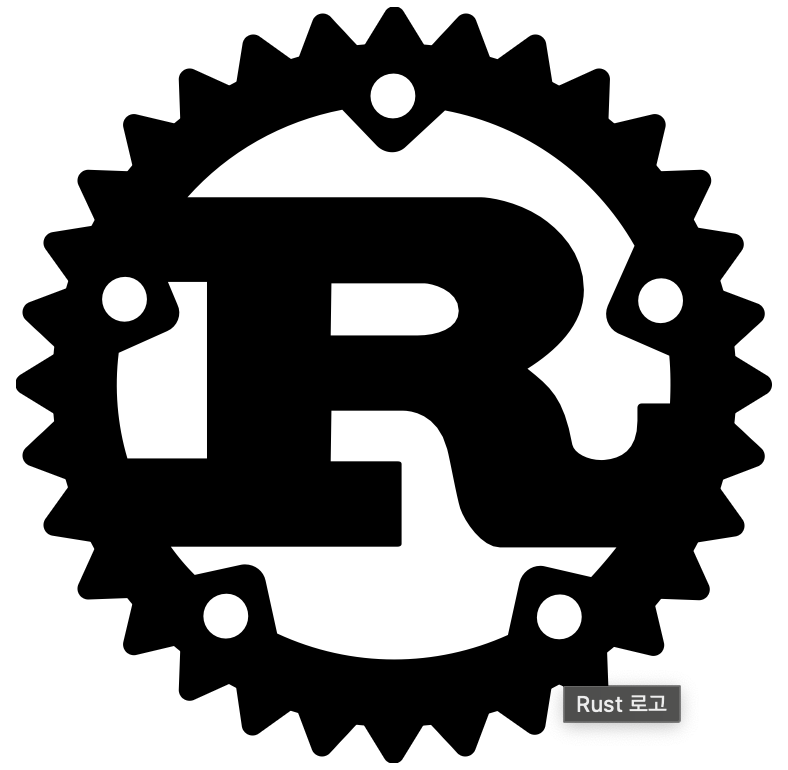

# ._.) Rust 언어를 알아보자.
### 가장 사랑받는 언어, **Rust**

<br/>

## 🖥 RUST
* 메모리 안전성과 성능 및 편의성에 중점을 둔 프로그래밍 언어

* 가비지 컬렉터 없이 메모리 안전성을 제공하는 대표적인 언어

[Rust Book](https://doc.rust-lang.org/book/ch00-00-introduction.html)에 따르면, Rust는 low-level 언어의 성능과 제어능력에 high-level 언어의 추상적 능력을 가지고 있다고 한다. 그리하여 더 안전한 C나 성능이 더 뛰어난 Python을 대체하기에 적합하다고 한다.

<br/>

<p align="center">

</p>

<br/>

### ⌨️ Rust 언어의 특징

#### 메모리 안전성

메모리 안전성이란 Buffer Overflow나 Dangling Pointer와 같은 메모리에 접근할 때 생길 수 있는 문제들에 대해 얼마나 보호받냐를 의미한다.

rust는 컴파일 시에 메모리 안전성을 확인하므로 컴파일이 된 이후에는 이런 문제를 걱정하지 않아도 된다.

* Buffer Overflow

    * 프로그램에 할당된 메모리 버퍼의 한계보다 데이터가 넘치게 되면 해당 정보를 덮어쓰고 많은 오류를 발생시킨다.

* Dangling Pointer

    * 포인터가 해제된 메모리 영역을 가르켜 더 이상 메모리가 유효하지 않게 된다.

#### **안전한 Concurrent programming** (동시성 프로그래밍)

Concurrent programming이란 여러개의 process가 겹치는 기간 동안 교차되어 실행되는 것을 말한다.

Data-race는 두개의 쓰레드가 동시에 메모리에 접근하게 되는 문제로 concurrent programming에서 자주 등장한다. Rust는 **borrow checker** 라는 것을 이용해서 컴파일 중에 이것을 방지한다.

#### Zero-cost Abstraction

다음의 문장이 Zero-cost abstraction을 가장 잘 설명한 문장으로 뽑힌다.

```
What you don’t use, you don’t pay for. And further: what you do use, you couldn’t hand code any better.
```

1. 쓰지 않는 기능에 대해서는 성능에 영향을 주지 않는다.
2. 쓰는 기능에 대해서는 추상적으로 코드를 작성하더라도 컴파일할 때는 가장 low-level하게 실행한다.
한마디로 요약하자면 추상적으로 적은 코드와 해당 코드를 low-level하게 쓴 경우랑 속도가 같다는 것이다.

<br/><br/>

## 🖥 Rust의 고유한 기능

> Rust 모듈 시스템: 모듈, 크레이트, 경로
> Rust 표준 라이브러리 및 타사 크레이트
> Rust Cargo 도구 및 종속성 관리자
> Rust는 언제 사용하나요?

<br/>

### ⌨️ Rust 모듈 시스템을 사용한 코드 관리

#### __Rust 모듈 시스템__
-Rust가 제공하는 코드 관리/구성하는 데 도움이 되는 기능 모음이다.

-크레이트, 모듈 및 경로 등으로 구성됨

<br/>

* __크레이트:__ 
    * Rust `크레이트`는 컴파일 단위이다. (Rust 컴파일러에서 실행할 수 있는 가장 작은 코드 부분)
    
    * 크레이트에 있는 코드는 이진 실행 파일이나 라이브러리를 생성하기 위해 함께 컴파일된다. 
    
    * Rust에서는 크레이트만이 다시 사용할 수 있는 단위로 컴파일된다.

* __모듈:__ 
    
    * Rust `모듈`은 크레이트 내에서 개별 코드 항목의 범위를 관리하도록 하여 프로그램을 구성하는 데 도움이 된다.
    
    * 관련 코드 항목 또는 함께 사용되는 항목을 동일한 모듈로 그룹화 할 수 있다.

* __경로:__ 
    
    * Rust에서 `경로`를 사용하여 코드의 이름 항목을 지정할 수 있다.
    
    * 예를 들어, 경로는 벡터, 코드 함수, 모듈 등의 데이터 정의가 될 수 있다.
    
    * 모듈 기능을 사용하면 경로에 대한 개인 정보를 제어할 수도 있다. 
    
    * 공개적으로 액세스할 수 있는 코드 부분 및 전용 파트를 지정할 수 있다. (이 기능을 통해 구현 세부 정보를 숨길 수 있음)

<br/>

### ⌨️ Rust 크레이트 및 라이브러리 사용

#### Rust 표준 라이브러리 std

-Rust 프로그램의 기본 정의 및 작업에 사용할 수 있는 코드가 포함되어 있다.

-이 라이브러리에는 String 및 Vec<T>와 같은 핵심 데이터 형식, Rust 기본 형식에 대한 작업, 일반적으로 사용되는 매크로 함수를 위한 코드, 입력 및 출력 작업에 대한 지원, 기타 여러 기능 영역이 포함되어 있다.

-Rust 프로그램에서 사용할 수 있는 수만 개의 라이브러리와 타사 크레이트가 있으며, 대부분의 경우 Rust의 타사 크레이트 리포지토리인 crates.io를 통해 액세스할 수 있다.

* `std` -Rust 표준 라이브러리.
    
    * std:: collections - `HashMap` 등의 컬렉션 형식에 대한 정의
    
    * std:: env - 사용자 환경으로 작업하기 위한 함수.
    
    * std:: fmt - 출력 형식을 제어하는 기능.
    
    * std:: fs - 파일 시스템을 사용하기 위한 함수.
    
    * std:: io - 입/출력 작업을 위한 정의 및 기능.
    
    * std::path - 파일 시스템 경로 데이터 작업을 지원하는 정의 및 함수

* `structopt` - 명령줄 인수를 쉽게 구문 분석하기 위한 타사 크레이트

* `chrono` - 날짜 및 시간 데이터를 처리하는 타사 크레이트

* `regex` - 정규식을 사용하는 타사 크레이트

* `serde` - Rust 데이터 구조에 대한 Serialization 및 Deserialization 작업의 타사 크레이트

<br/>

### ⌨️ Cargo를 사용하여 프로젝트 생성 및 관리

Rust 컴파일러(rustc)를 사용하여 크레이트를 직접 만들 수 있지만,

대부분의 프로젝트는 Rust 빌드 도구와 __Cargo__ 라는 종속성 관리자를 사용한다.


#### Cargo의 기능

* `cargo new` - 프로젝트 템플릿을 만든다.

* `cargo build` - 프로젝트를 빌드한다.

* `cargo run` - 프로젝트를 빌드하고 실행한다.

* `cargo test` - 프로젝트를 테스트한다.

* `cargo check` - 프로젝트 유형을 확인한다.

* `cargo doc` - 프로젝트에 대한 설명서를 작성한다.

* `cargo publish` - crates.io에 라이브러리를 게시한다.

* 크레이트 이름을 Cargo.toml 파일에 추가하여 프로젝트에 종속 파일을 추가한다.

<br/><br/>

## 🖥 그래서 Rust는 언제 써?

#### Rust 언어에는 프로젝트에 가장 적합한 언어를 선택할 때 고려해야 할 몇 가지 장점이 있다.

* Rust를 사용하면 C 및 C++와 같은 언어로 작성된 프로그램 및 라이브러리의 성능 및 리소스 사용을 제어하면서, 기본적으로 메모리 안전 상태에서 일반적인 버그의 전체 클래스를 제거할 수 있다.

* Rust에는 개발자가 규칙 또는 설명서에 의존하지 않고 프로그램의 다양한 고정 요소를 컴파일러가 확인하는 코드로 인코딩할 수 있는 다양한 추상화 기능이 있다. 이 기능으로 인해 "컴파일하면 작동한다"라는 느낌을 받을 수 있다.

* Rust에는 코드를 빌드, 테스트, 문서화 및 공유하기 위한 기본 제공 도구와 타사 도구 및 라이브러리의 풍부한 에코시스템이 포함되어 있다. 이러한 도구를 사용하면 일부 언어에서는 어려운 일부 작업(예: 종속성 빌드)을 Rust에서 쉽고 생산적으로 처리할 수 있다.

<br/><br/><br/>
***

## 참고
* [Rust란 무엇인가](https://learn.microsoft.com/ko-kr/training/modules/rust-introduction/)
* [가장 사랑받는 언어, Rust - 왜 러스트 인가?](https://dingrr.com/blog/post/가장-사랑받는-언어-rust-왜-러스트-인가)
* [Rust를 배워야 하는 이유](https://velog.io/@gtfo/Rust를-배우자)