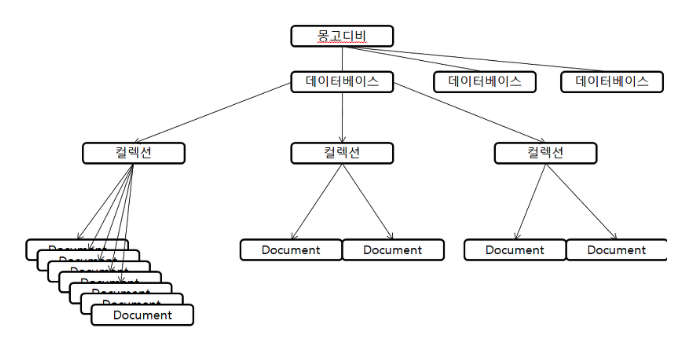

# ._.) MongoDB를 알아보자!
### document 지향 데이터 모델을 사용하는 DB MongoDB

 

## 🖥 MongoDB란?

* NoSQL 중 가장 많이 쓰이는 비관계형 데이터베이스 관리 시스템

* 자유 오픈소스 소프트웨어

* 몽고DB는 NoSQL DB 종류 가운데 Document DB

    * -> 데이터 객체들이 컬렉션 내부에서 독립된 문서로 저장되는 모델

### _🖐🏻 잠깐! 여기서 NoSQL이란?_

* NoSQL 데이터베이스는 다양한 방식으로 빠르게 바뀌는 대량의 비정형 데이터를 처리하는 SQL
* “비관계형”, “NoSQL DB” 또는 “non-SQL”이라고도 부른다.

  

## 🖥 MongoDB의 8가지 특징

### 📍 Document-Oriented Storage: 모든 데이터가 JSON 형태로 저장되며 스키마가 없음

* 스키마가 없기 때문에 각 필드는 서로 다른 데이터 타입을 가질 수 있다.

* 데이터베이스에 저장된 Documents도 각기 다른 다양한 필드를 가질 수 있다.

* 복잡한 구조를 쉽게 저장할 수 있다.

* Join을 사용하지 않아도 되고 다형성을 가능케한다.

 

### 📍 Full Index Support: RDBMS에 뒤지지 않는 다양한 인덱싱 제공

* 강력한 인덱스 기능 덕분에 거의 모든 쿼리들을 빠르게 처리할 수 있다.

* 다른 NoSQL에서 찾아보기 힘든 장정미다.

 

### 📍 Replication & High Availability

데이터 복제를 통해 데이터 가용성을 향상시킨다.

 

### 📍 Auto-Sharing

Primary key를 기반으로 여러 서버에 데이터를 나누는 scale-out이 가능하다. 

 

### 📍 Querying: Key 기반의 get, put뿐만 아니라 다양한 종류의 쿼리 제공

강력한 쿼리 기능과 다양한 쿼리를 지원한다.

 

### 📍 Fast In-Place Updates: 고성능 atomic operation 지원

 

### 📍 MapReduce: 맵리듀스 지원

 

### 📍 GridFS

별도의 스토리지 엔진을 통해 파일 저장. 스토리지 엔진에서 DB 엔진을 분리하는 새로운 아키텍처를 도입

몽고DB의 기본 스토리지 엔진인 와이어드 타이거(Wired Tiger)는 높은 쓰기 성능을 제공하고, 압축을 기본 내장해 더 적은 스토리지 비용을 요구

  

## 🖥 MongoDB의 구조

몽고DB에는 많은 데이터베이스들이 있고 하나의 데이터베이스에는 여러 컬렉션들이 존재한다.

여기서 컬렉션은 RDB의 테이블과 유사하다.

그리고 컬렉션에는 여러개의 Document들이 있고 이것은 RDB의 레코드라고 볼 수 있다.

  

## 🖥 MongoDB

### ⌨️ 장점

쌓아놓고 삭제가 없는 경우가 가장 적합

* `Flexibility` : Schema-less라서 어떤 형태의 데이터라도 저장할 수 있다.

* `Performance` : Read & Write 성능이 뛰어나다. 캐싱이나 많은 트래픽을 감당할 때 써도 좋다.

* `Scalability` : 애초부터 스케일아웃 구조를 채택해서 쉽게 운용가능하다. Auto sharding 지원

* `Deep Query ability` : 문서지향적 Query Language 를 사용하여 SQL 만큼 강력한 Query 성능을 제공한다.

* `Conversion / Mapping` : JSON형태로 저장이 가능해서 직관적이고 개발이 편리하다.

### ⌨️ 단점

정합성이 떨어지므로 트랜잭션이 필요한 경우에는 부적합

* JOIN이 없다. join이 필요없도록 데이터 구조화 필요

* memory mapped file으로 파일 엔진 DB이다. 메모리 관리를 OS에게 위임한다. 메모리에 의존적, 메모리 크기가 성능을 좌우한다.

* SQL을 완전히 이전할 수는 없다.

* B트리 인덱스를 사용하여 인덱스를 생성하는데, B트리는 크기가 커질수록 새로운 데이터를 입력하거나 삭제할 때 성능이 저하된다. 이런 B트리의 특성 때문에 데이터를 넣어두면 변하지않고 정보를 조회하는 데에 적합하다.

   

***

## 참고
* [MongoDB란?](https://kr.teradata.com/Glossary/What-is-MongoDB)
* [MongoDB란 - 역사, 설계 목표, 핵심 기능, 몽고DB를 사용하는 이유](https://hoing.io/archives/1379)
* [MongoDB란?](https://hwanine.github.io/database/MongoDB/)
* [MongoDB란?](https://velog.io/@ckstn0777/MongoDB%EB%9E%80)