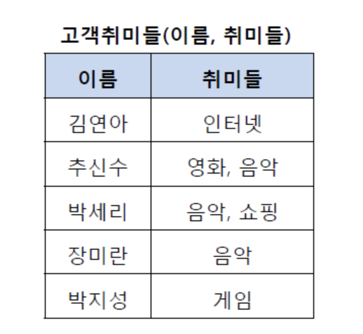
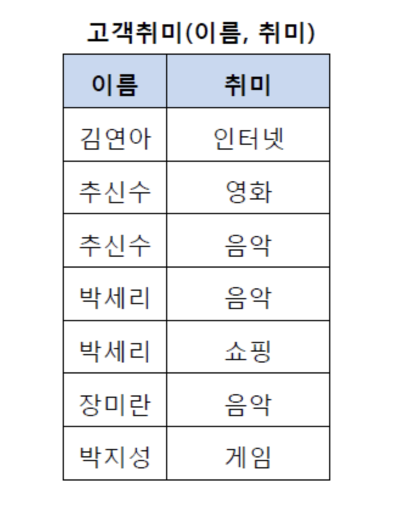
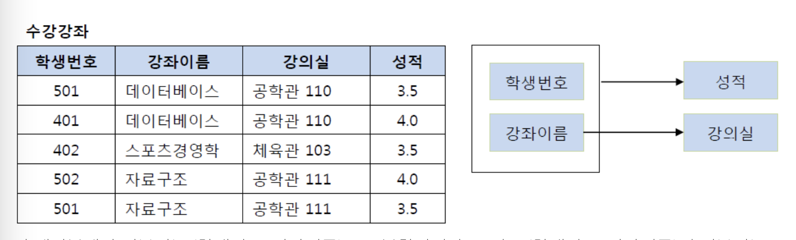
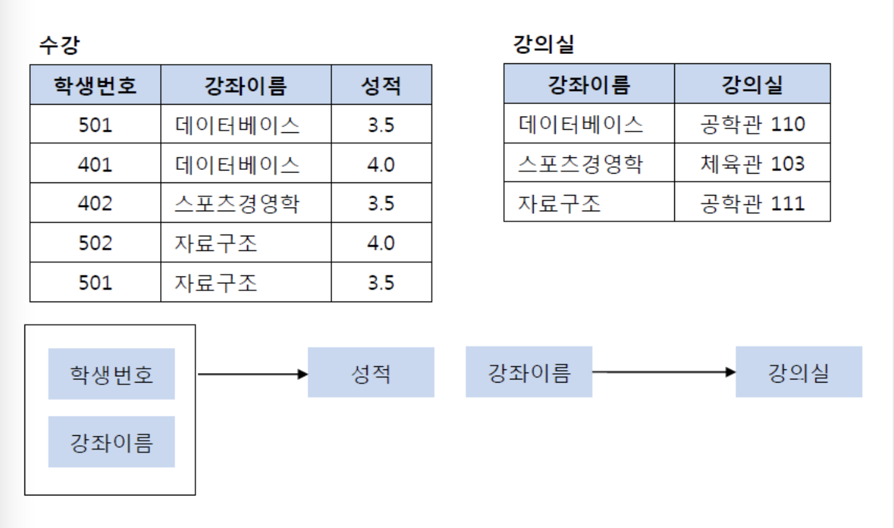
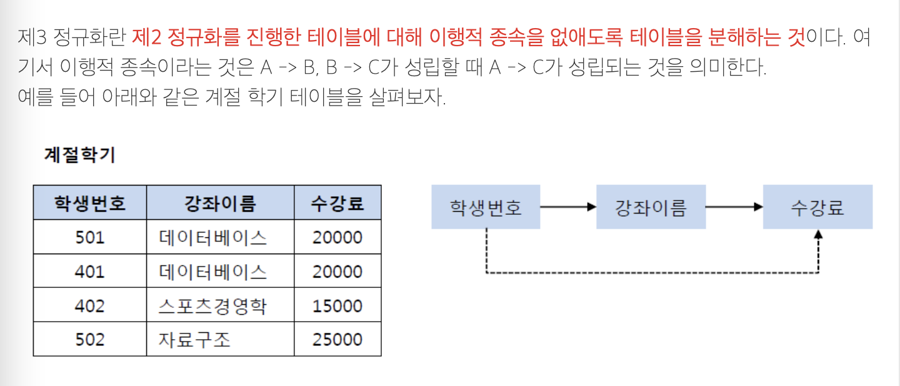
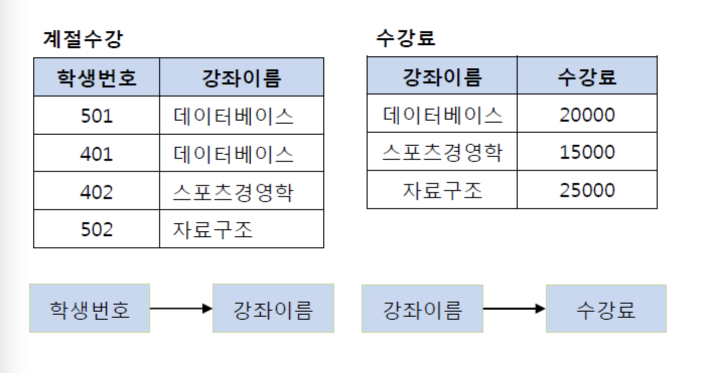
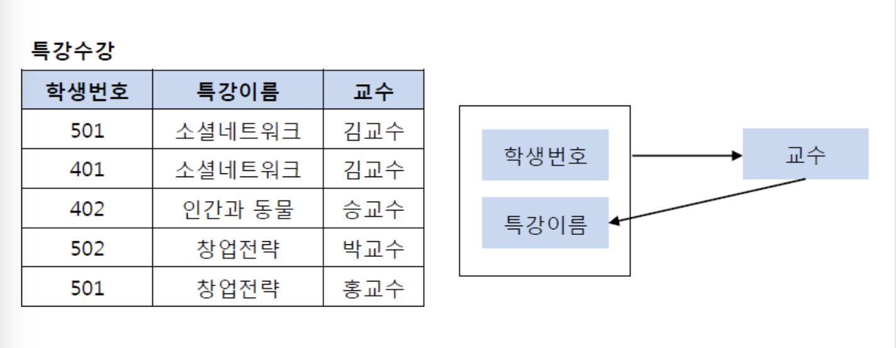
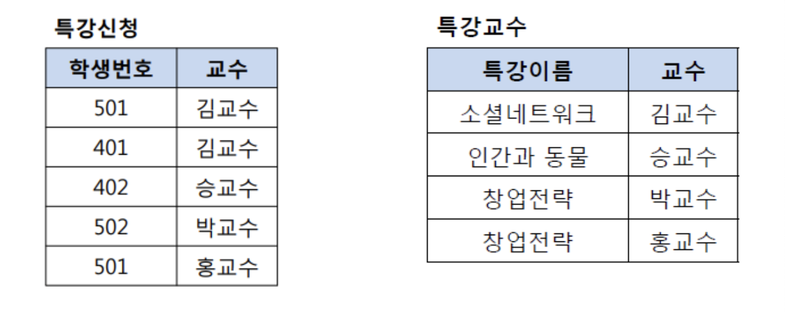

# ._.) 정규화를 알아보자.
### 데이터베이스 정규화

 

## 🖥 정규화(Normalization)란?

정규화(Normalization)의 기본 목표는 **테이블 간에 중복된 데이터를 허용하지 않는다는 것**이다. 중복된 데이터를 허용하지 않음으로써 **무결성**(Integrity)를 유지할 수 있으며, DB의 저장 용량 역시 줄일 수 있다.

이러한 테이블을 분해하는 정규화 단계가 정의되어 있는데, 여기서 테이블을 어떻게 분해되는지에 따라 정규화 단계가 달라지는데, 각각의 정규화 단계에 대해 자세히 알아보도록 하자.

 

### 📍 정규화의 장점
* 데이터베이스 변경 시 이상 현상(Anomaly)을 제거할 수 있다.

* 정규화된 데이터베이스 구조에서는 새로운 데이터 형의 추가로 인한 확장 시, 그 구조를 변경하지 않아도 되거나 일부만 변경해도 된다.

* 데이터베이스와 연동된 응용 프로그램에 최소한의 영향만을 미치게 되어 응용프로그램의 생명을 연장시킨다.

 

### 📍 정규화의 단점
* 릴레이션의 분해로 인해 릴레이션 간의 JOIN연산이 많아진다.

* 질의에 대한 응답 시간이 느려질 수도 있다. 데이터의 중복 속성을 제거하고 결정자에 의해 동일한 의미의 일반 속성이 하나의 테이블로 집약되므로 한 테이블의 데이터 용량이 최소화되는 효과가 있다. 

* 따라서 데이터를 처리할 때 속도가 빨라질 수도 있고 느려질 수도 있다.

* 만약 조인이 많이 발생하여 성능 저하가 나타나면 반정규화(De-normalization)를 적용할 수도 있다.

  

### ⌨️ 제1 정규화

* 제1 정규화란, 테이블의 컬럼이 원자값(Atomic Value, 하나의 값)을 갖도록 테이블을 분해하는 것

* 예를 들어, 아래와 같은 고객 취미 테이블이 존재한다고 하자.

위의 테이블에서 추신수와 박세리는 여러 개의 취미를 가지고 있기 때문에 제1 정규형을 만족하지 못하고 있다. 그렇기 때문에 이를 제1 정규화하여 분해할 수 있다. 제1 정규화를 진행한 테이블은 아래와 같다.

  

### ⌨️ 제2 정규화

* 제2 정규화란, 제1 정규화를 진행한 테이블에 대해 완전 함수 종속을 만족하도록 테이블을 분해하는 것

* 여기서 완전 함수 종속이라는 것은 기본키의 부분집합이 결정자가 되어선 안된다는 것을 의미한다. 

* 예를 들어 아래와 같은 수강 강좌 테이블을 살펴보자. 

이 테이블에서 기본키는 (학생번호, 강좌이름)으로 복합키이다. 그리고 (학생번호, 강좌이름)인 기본키는 성적을 결정하고 있다. (학생번호, 강좌이름) --> (성적) 

그런데 여기서 강의실이라는 컬럼은 기본키의 부분집합인 강좌이름에 의해 결정될 수 있다. (강좌이름) --> (강의실)

즉, 기본키(학생번호, 강좌이름)의 부분키인 강좌이름이 결정자이기 때문에 위의 테이블의 경우 다음과 같이 기존의 테이블에서 강의실을 분해하여 별도의 테이블로 관리하여 제2 정규형을 만족시킬 수 있다.

  

### ⌨️ 제3 정규화

* 제3 정규화란, 제2 정규화를 진행한 테이블에 대해 이행적 종속을 없애도록 테이블을 분해하는 것

* 여기서 이행적 종속이라는 것은 A -> B, B -> C가 성립할 때 A -> C가 성립되는 것을 의미한다. 

* 예를 들어 아래와 같은 계절 학기 테이블을 살펴보자. 

기존의 테이블에서 학생 번호는 강좌 이름을 결정하고 있고, 강좌 이름은 수강료를 결정하고 있다. 그렇기 때문에 이를 (학생 번호, 강좌 이름) 테이블과 (강좌 이름, 수강료) 테이블로 분해해야 한다. 

이행적 종속을 제거하는 이유는 비교적 간단하다. 예를 들어 501번 학생이 수강하는 강좌가 스포츠경영학으로 변경되었다고 하자. 이행적 종속이 존재한다면 501번의 학생은 스포츠경영학이라는 수업을 20000원이라는 수강료로 듣게 된다. 물론 강좌 이름에 맞게 수강료를 다시 변경할 수 있지만, 이러한 번거로움을 해결하기 위해 제3 정규화를 하는 것이다. 

즉, 학생 번호를 통해 강좌 이름을 참조하고, 강좌 이름으로 수강료를 참조하도록 테이블을 분해해야 하며 그 결과는 다음의 그림과 같다.

  

### ⌨️ BCNF 정규화

* BCNF 정규화란, 제3 정규화를 진행한 테이블에 대해 모든 결정자가 후보키가 되도록 테이블을 분해하는 것

* 예를 들어 다음과 같은 특강수강 테이블이 존재한다고 하자.

특강수강 테이블에서 기본키는 (학생번호, 특강이름)이다. 그리고 기본키 (학생번호, 특강이름)는 교수를 결정하고 있다. 또한 여기서 교수는 특강이름을 결정하고 있다. 

그런데 문제는 교수가 특강이름을 결정하는 결정자이지만, 후보키가 아니라는 점이다. 그렇기 때문에 BCNF 정규화를 만족시키기 위해서 위의 테이블을 분해해야 하는데, 다음과 같이 특강신청 테이블과 특강교수 테이블로 분해할 수 있다.

   
*** 

## 참고
* [[Database] 정규화(Normalization) 쉽게 이해하기](https://mangkyu.tistory.com/110)
* [[DB] 정규화(Normalization)란? 정규화 예시, 1NF, 2NF, 3NF, BCNF](https://code-lab1.tistory.com/48)