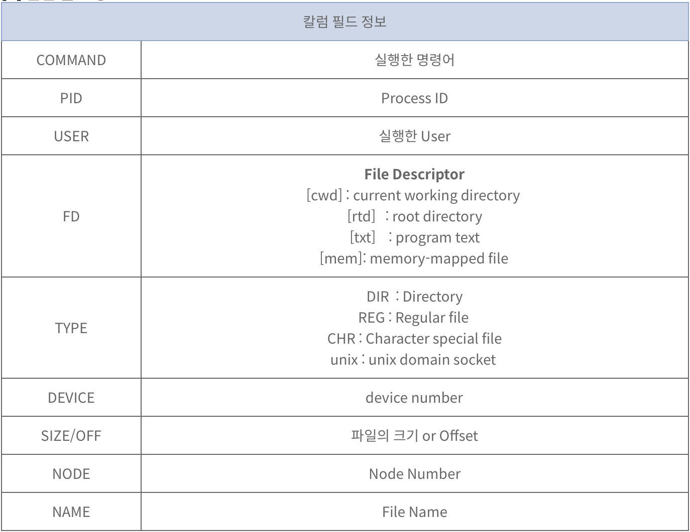

# ._.) 터미널 기본명령을 알아보자! (上)
### grep, awk, sed, lsof, curl, wget, tail, head, less, find, ssh, kill
> 터미널 기본명령을 알아보자!（上） - grep, awk, sed, lsof, curl, wget
> 
> 터미널 기본명령을 알아보자!（下） - tail, head, less, find, ssh, kill

<br/>

## 🖥 grep : 파일 내 특정 문자열 찾기
* 사용법 : `grep [옵션][패턴][파일명]`

* grep의 종류
  * grep: 다중 패턴을 검색한다.
  
  * egrep: 정규 표현식 패턴으로 검색한다.
  
  * fgrep: 문자열 패턴으로 검색한다.

<br/>

### ⌨️ 문자열로 찾기
* 특정 파일에서 'error' 문자열 찾기

```js
grep 'error' 파일명
```
* 여러개의 파일에서 'error' 문자열 찾기

```js
grep 'error' 파일명1 파일명2
```

* 현재 디렉토리내에 있는 모든 파일에서 'error' 문자열 찾기
```js
grep 'error' *
```

* 특정 확장자를 가진 모든 파일에서 'error' 문자열 찾기
```js
grep 'error' *.log
```

<br/>

### ⌨️ 정규표현식으로 찾기
* 특정 파일에서 문자열이 포함된 행을 찾는다.
```js
grep '^[ab]' 파일명 
```

* 특정 파일에서 a로 시작하는 모든 단어를 찾는다.
```js
grep 'a*' 파일명 
```

* 특정 파일에서 a로 시작하고 z로 끝나는 5자리 단어를 찾는다.
```js
grep 'a...z' 파일명 
```

* 특정 파일에서 a,b,c로 시작하는 단어를 모두 찾는다.
```js
grep [a-c] 파일명
```

* 특정 파일에서 apple 또는 Apple로 시작하는 단어를 모두 찾는다.
```js
grep [aA]pple 파일명 
```

* 특정 파일에서 a나 b로 시작되는 모든 행을 찾는다.
```js
grep '^[ab]' 파일명 
```

* 특정 파일에서 apple로 시작되고 0나 9의 숫자로 끝나로 시작되는 모든 행을 찾는다.
```js
grep 'apple'[0-9] 파일명
```
<br/>

### ⌨️ 자주 사용하는 옵션

* -c : 일치하는 행의 수를 출력한다.

* -i : 대소문자를 구별하지 않는다.

* -v : 일치하지 않는 행만 출력한다.

* -n : 포함된 행의 번호를 함께 출력한다.

* -l : 패턴이 포함된 파일의 이름을 출력한다.

* -w : 단어와 일치하는 행만 출력한다.

* -x : 라인과 일치하는 행만 출력한다.

* -r : 하위 디렉토리를 포함한 모든 파일에서 검색한다.

* -m 숫자 : 최대로 표시될 수 있는 결과를 제한한다.

* -E : 찾을 패턴을 정규 표현식으로 찾는다.

* -F : 찾을 패턴을 문자열로 찾는다.

<br/><br/>

## 🖥 sed : 파일 내용 출력하기
* stream editor의 약자 

* 파일 내용을 출력할 때 사용하는 스트림의 내용을 수정하는 명령어

### ⌨️ 옵션
* `{RANGE}p`: RANGE내의 라인을 출력

* `{RANGE}d`: RANGE내의 라인을 삭제

* `/{PATTERN}/p`: 패턴에 매칭되는 라인을 출력

* `/{PATTERN}/d`: 패턴에 매칭되는 라인을 삭제

* `s /{REGEX}/{REPLACEMENT}`: 정규표현식에 매칭되는 부분을 REPLACE로 대체

<br/>

### ⌨️ sed 사용 예
1.
```js
tail /etc/passwd | sed -n '1,5p'
```
```
> tail /etc/passwd | sed -n '1,5p'
_demod:*:275:275:Demo Daemon:/var/empty:/usr/bin/false
_rmd:*:277:277:Remote Management Daemon:/var/db/rmd:/usr/bin/false
_accessoryupdater:*:278:278:Accessory Update Daemon:/var/db/accessoryupdater:/usr/bin/false
_knowledgegraphd:*:279:279:Knowledge Graph Daemon:/var/db/knowledgegraphd:/usr/bin/false
_coreml:*:280:280:CoreML Services:/var/empty:/usr/bin/falsef
```
`/etc/passwd` 파일의 마지막 10줄을 출력하는데 1~5 번째 라인만 출력한다

2.
```js
tail /etc/passwd | sed '1,5d‘
```
```
> tail /etc/passwd | sed '1,5d'   
_sntpd:*:281:281:SNTP Server Daemon:/var/empty:/usr/bin/false
_trustd:*:282:282:trustd:/var/empty:/usr/bin/false
_darwindaemon:*:284:284:Darwin Daemon:/var/db/darwindaemon:/usr/bin/false
_notification_proxy:*:285:285:Notification Proxy:/var/empty:/usr/bin/false
_oahd:*:441:441:OAH Daemon:/var/empty:/usr/bin/false
```
`/etc/passwd` 파일의 마지막 10줄을 출력하는데 1~5 번째 라인을 제외하고 출력한다.
3.
```js
tail /etc/passwd | sed -n '/Daemon/p'
```
```
> tail /etc/passwd | sed -n '/Daemon/p'
_demod:*:275:275:Demo Daemon:/var/empty:/usr/bin/false
_rmd:*:277:277:Remote Management Daemon:/var/db/rmd:/usr/bin/false
_accessoryupdater:*:278:278:Accessory Update Daemon:/var/db/accessoryupdater:/usr/bin/false
_knowledgegraphd:*:279:279:Knowledge Graph Daemon:/var/db/knowledgegraphd:/usr/bin/false
_sntpd:*:281:281:SNTP Server Daemon:/var/empty:/usr/bin/false
_darwindaemon:*:284:284:Darwin Daemon:/var/db/darwindaemon:/usr/bin/false
_oahd:*:441:441:OAH Daemon:/var/empty:/usr/bin/false
```
`/etc/passwd` 파일의 마지막 10줄을 출력하는데 Daemon이 포함된 라인만 출력한다.

<br/><br/>

## 🖥 lsof : 열려진 파일들을 보는 명령어
* list open files의 약자로, 열려진 파일들을 보는 명령어이다.

* 시스템에서 동작하고 있는 모든 프로세스에 의해 열려진 파일들에 대한 정보를 보여주는 시스템 관리 명령어

* 일반유저의 접근을 허용하지 않도록 Permission을 700이나 100으로 변경하는 것이 보안상 좋다.

```
[root@localhost ~]# lsof
COMMAND     PID  TID    USER   FD      TYPE             DEVICE  SIZE/OFF       NODE NAME
systemd       1         root  cwd       DIR              253,0      4096          2 /
systemd       1         root  rtd       DIR              253,0      4096          2 /
systemd       1         root  txt       REG              253,0   1624512     397095 /usr/lib/systemd/systemd
systemd       1         root  mem       REG              253,0     20064     393646 /usr/lib64/libuuid.so.1.3.0
systemd       1         root  mem       REG              253,0    265600     395154 /usr/lib64/libblkid.so.1.1.0
systemd       1         root  mem       REG              253,0     90248     393631 /usr/lib64/libz.so.1.2.7
systemd       1         root  mem       REG              253,0    157424     393643 /usr/lib64/liblzma.so.5.2.2
..
..
```

<br/>

### ⌨️ 칼럼 필드 정보
<p align="center">

</p>

<br/>

### ⌨️ 옵션
* -i
  * 설정한 네트워크 소켓에 대한 정보를 출력하며 프로토콜, 서비스, 호스트 및 IP에 대해 출력한다.
  * [4, 6] : IPv4 혹은 IPv6만을 출력하고 싶을 때 사용.
  * [@hostname, @ip addr] : 접속하는 Host나 IP에 대한 정보를 검색하며 IP 버전과 구분하기 위해 IFS값으로 '@'을 사용한다.
  * [ :service port ] : /etc/services에 등록되어 있는 서비스이름을 지정하거나 포트 번호를 직접 입력하여 출력할 수 있다.

* -u
  * 사용자 ID or UID 값으로 지정할 수 있다.
  * 다수의 사용자를 설정할 땐 ',' (컴마)로 구분할 수 있다.
  * 특정 사용자를 제외한 정보를 출력하고 싶다면 '^사용자' 로 설정할 수 있다.

* -c
  * 특정한 명령어나 프로그램이 참조하고 있는 파일들의 목록을 출력하고자 할 때 쓰임

* -P
  * /etc/services에 등록되어 있는 이름 대신 Port Number로 출력한다.

* -r
  * recursive의 약자로 지속적인 출력을 할 때 지정한 초만큼의 주기로 실행하여 출력

* -N
  * NFS 서버가 구축된 환경에서 NFS로 연결되어 있는 파일들에 대한 정보를 출력한다.

* +D
  * 특정 디렉터리 내의 하위 디렉터리까지 존재하는 파일을 사용하고 있는 프로세스의 목록 출력

<br/>

자세한 lsof 사용법은 [여기](https://www.lesstif.com/system-admin/lsof-20776078.html)를 참고하기
<br/><br/>

## 🖥 curl : url로 데이터 전송하기
* 사용법
```
$ curl [options...] <url>
```

<br/>

### ⌨️ 옵션
 -d, --data <data>   HTTP POST 데이터
 
 -f, --fail          HTTP 오류 시 자동으로 실패 (출력 없음)
 
 -h, --help <category>      명령어에 대한 도움말 보기
 
 -i, --include       출력에 프로토콜 응답 헤더 포함
 
 -o, --output <file> stdout 대신 파일에 쓰기
 
 -O, --remote-name   원격 파일로 명명된 파일에 출력 쓰기
 
 -s, --silent        무음 모드 (Silent mode)
 
 -T, --upload-file <file>    로컬 FILE 을 대상으로 전송
 
 -u, --user <user:password>  서버 사용자 및 비밀번호
 
 -A, --user-agent <name>     서버에 User-Agent <name> 보내기
 
 -v, --verbose       조작을 더 수다스럽게 만듬 (Make the operation more talkative)
 
 -V, --version       버전 번호를 표시하고 종료

자세한 사용 예는 [여기](https://koromoon.blogspot.com/2021/12/curl.html)를 보기
<br/><br/>
 
## 🖥 wget : 웹에서 파일 다운받기

1. 웹페이지 다운로드

다음은 웹에서 파일을 다운로드하는 기본 형식이다.
```terminal
 $ wget http://example.org/file.tar.gz
```

2. FTP 서버에서 파일 다운로드 하기

wget은 익명 FTP를 통해 파일을 다운받을 수 있습니다. 이는 FTP로그인을 필요로하지 않는다.
```
$ wget ftp://example.org/file.tar.gz
```
 
3. 신뢰할 수 없는 https URL에서 파일을 다운로드하는 방법

옵션 “--no-check-certificate”를 사용하면 인증서 유효성 검사를 무시할 수 있다.
```
$ wget https://example.org/file.tar.gz -no-check-certificate
```
 
4. wget 명령어를 이용해 전체 웹 사이트를 미러링하는 방법

“-m” 옵션으로 미러링을 설정합니다. 이를 이용해 모든 웹사이트의 파일을 다운로드할 수 있다.

``` 
$ wget -m https://example.org/
```
 
5. 파일안에 저장된 URL 읽어서 다운로드하기

다운로드 받을 URL을 지정한 파일에서 찾는다.
```
$ wget -i filename
```

6. wget이 파일을 덮어쓰도록 하는 방법

만약 “-o” 옵션으로 결과 파일을 지정하면 기존에 존재하는 모든 파일에 덮어쓰기 한다.

```
$ wget -q https://example.org/file.tar.gz -o filename
```

7. 백그라운드에서 파일 다운로드하기

대량의 파일을 다운로드할 때 아래 보이는 “-b” 옵션을 사용해서 다운로드 과정을 백그라운드로 실행할 수 있다.
```
$ wget -b https://example.org/file.tar.gz
```
 
8. 다운로드하다 중단된 파일 이어서 받기

wget은 아래 보이는 “-c” 옵션으로 중단된 다운로드를 재개할 수 있다.
```
$ wget -c https://example.org/file.tar.gz
```

9. 파일 다운로드 중 다운로드 속도를 제한하는 방법

다운로드 속도를 제한 하고 싶으면 다음에 쓰인 것 처럼 “-limit-rate” 명령어를 쓸 수 있다.
``` 
$ wget -limit-rate=128k https://example.org/file.tar.gz
```

10. wget의 버전을 확인하는 방법

wget의 버전을 확인하고 싶으면 다음의 명령어를 사용하면 된다.
```
$ wget -version
```
<br/><br/><br/>

***
## 참고

* [[Linux] 리눅스 grep 명령어 사용법 (파일 내 특정 문자열 찾기)](https://coding-factory.tistory.com/802)
* [터미널 명령어: 편집 및 스크립팅 (sed, awk)](https://jaime-note.tistory.com/191)
* [리눅스 lsof 명령어](https://nyyang.tistory.com/52)
* [lsof 사용법](https://www.lesstif.com/system-admin/lsof-20776078.html)
* [curl 명령어](https://koromoon.blogspot.com/2021/12/curl.html)
* [[linux] 리눅스 10가지 wget 명령어 사용법](https://sisiblog.tistory.com/225)
