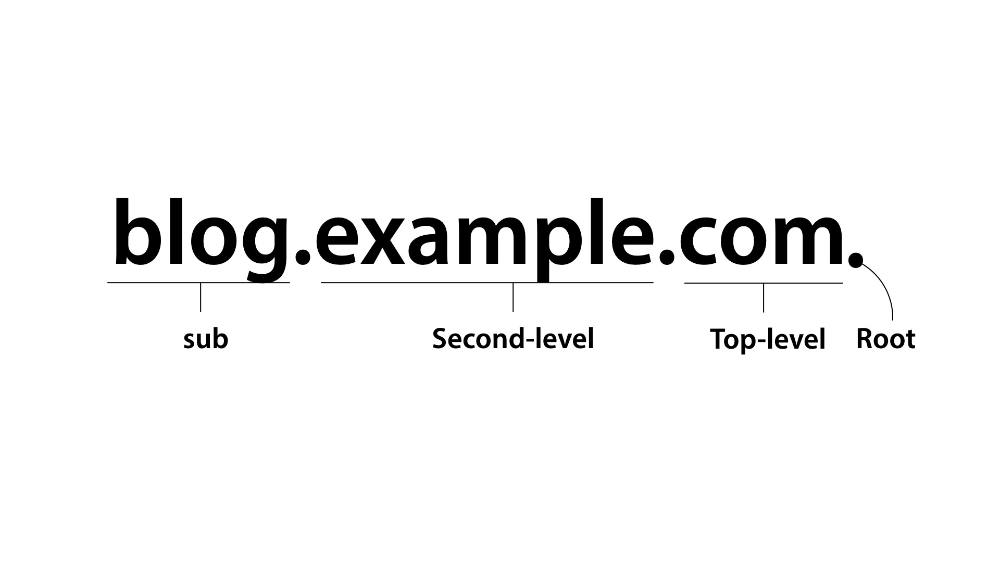

# ._.) 도메인 네임이란 무엇일까?
### 도메인 네임이란 IP주소를 알아보기 쉽도록 문자로 만든 인터넷 상의 주소이다.

## 🖥 도메인 네임의 기본 구조

* 오른쪽에서 왼쪽으로 읽으며, Root - TLD - SLD - SUB(도메인 이름) 순이다.
* www는 도메인 네임에 포함되지 않는 '호스트명'이다.
* SLD는 생략될 수 있기 때문에, 그 유무에 따라 2단계와 3단계 도메인 구조로 나뉜다.
  

## 🖥 도메인 네임이란?
* 앞서 말했다시피 도메인 네임은 IP주소를 알아보기 쉽게 만든 문자로 이루어진 주소이다.
* 넓은 의미로는 네트워크 상에서 컴퓨터를 식별하는 호스트명을 가리킨다.
* 좁은 의미로는 도메인 레지스트리에 등록된 이름을 의미한다.
* 이를 통틀어서 '웹주소'라고 부르는 경우도 있다.

### _🖐🏻 잠깐! 여기서 도메인 레지스트리란? - Domain Registry_
* 등록된 도메인명의 데이터베이스를 유지 관리하는 기관
* 같은 도메인명이 이중 등록되지 않도록 데이터베이스를 관리한다.
* 또한, 레지스트리는 등록된 도메인명이 인터넷 상에서 접속될 수 있도록 최상위 도메인(TLD)의 도메인 네임 서버(DNS)를 운용하고 있다.
  

## 🖥 도메인 네임의 구성 요소

우측부터 Root, TLD, SLD, SUB(도메인 이름)으로 구성되어 있다.

### __1. Root__
가장 최상위에 위치해있다.

실제로 주소엔 `.` 이 있으나, 생략된 형태로 사용해도 무방하다.

### __2. TLD (Top-Level Domain, 최상위 도메인)__
도메인 레벨 중에 가장 높은 단계에 있는 도메인으로, 도메인의 목적, 종류, 국가를 나타낸다.

`.com` , `.org` , `.net` 등이 일반적이며, `.kr`, `.us`, `.jp` 등 특정 국가를 나타내기도 한다.

### __3. SLD (Second-Level Domain, 차상위 도메인)__
‘www.google.co.kr’ 처럼 SLD가 존재하는 경우도 있고, ‘www.naver.com’ 처럼 SLD가 존재하지 않고 TLD에서 바로 도메인 이름으로 건너뛰는 경우도 있다

`co` : 영리 목적의 단체, 기업체

`go` : 정부 기관

등 도메인의 성격을 나타낸다.

추가로, `com`은 commercial을 의미하므로 굳이 [co.com](http://co.com) 같은 형태로 쓸 필요가 없으며, [go.com](http://go.com) 같은 경우 의미상 모순을 이루게 된다.

### __4. SUB (도메인 이름)__
임의로 지정할 수 있는 사이트의 이름.

→ google, naver, daum 등이 도메인 이름 부분

### __5. www__
world wide web의 약자로, 도메인 네임에 포함되지 않는 ‘호스트명’이다.

SLD은 쓸 수도, 생략할 수도 있기 때문에 도메인 구조를 단계로 나눴을 때,

‘www.google.co.kr’ 처럼 3단계 구조일수도 있고

‘www.naver.com’ 처럼 2단계 구조가 될 수도 있다.
   

***
## 참고
* [brogod.log - 도메인 네임은 무엇인가요?](https://velog.io/@m-vault/%EB%8F%84%EB%A9%94%EC%9D%B8-%EB%84%A4%EC%9E%84%EC%9D%80-%EB%AC%B4%EC%97%87%EC%9D%B8%EA%B0%80%EC%9A%94)
* [gabia.라이브러리 - 레지스트리, 레지스트라, 리셀러](https://library.gabia.com/contents/4918/)
* [Developer MI-NE - Domain Name과 DNS이란?](https://minemanemo.tistory.com/80)
