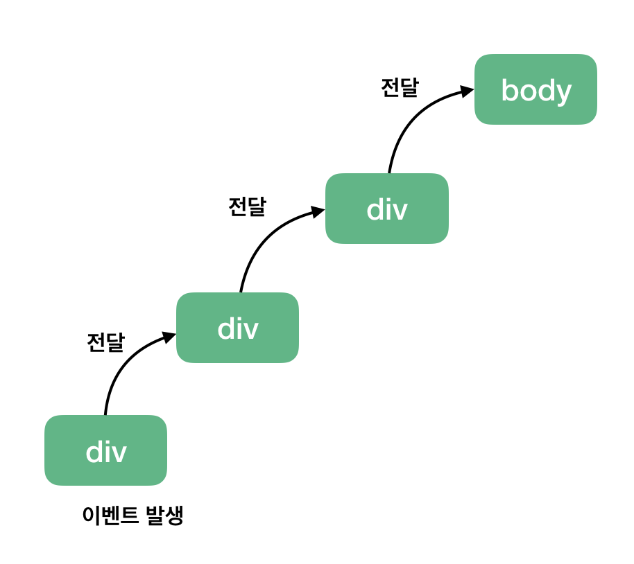

# ._.) 이벤트 버블링에 대해 알아보자!
### 만약 부모 요소와 자식 요소에 둘 다 같은 종류의 이벤트가 할당 되어있을 때, 이벤트를 동작시키면 어떤 이벤트가 먼저 실행될까?
<br/>

## 🖥 이벤트 버블링(Event Bubbling)
이벤트 버블링이란 한 요소에 이벤트가 발생하면 이 요소에 할당된 핸들러가 동작하고, 이어서 부모 요소의 핸들러가 동작하고 최상단의 부모 요소를 만날 때까지 반복되면서 핸들러가 동작하는 현상을 말한다.

<p align="center">
  
</p>

3개의 요소가 `FORM > DIV > P` 형태로 중첩된 구조를 살펴보자.

요소 각각에 핸들러가 할당되어 있다.


```html
<style>
  body * {
    margin: 10px;
    border: 1px solid blue;
  }
</style>

<form onclick="alert('form')">FORM
  <div onclick="alert('div')">DIV
    <p onclick="alert('p')">P</p>
  </div>
</form>
```

<p align="center">
  
</p>

가장 안쪽의 `<p>`를 클릭하면 순서대로 다음과 같은 일이 벌어진다.

1. `<p>`에 할당된 `onclick` 핸들러가 동작한다.
2. 바깥의 `<div>`에 할당된 핸들러가 동작한다.
3. 그 바깥의 `<form>`에 할당된 핸들러가 동작한다.
4. `document` 객체를 만날 때까지, 각 요소에 할당된 `onclick` 핸들러가 동작한다.

<p align="center">
  
</p>

이런 동작 방식 때문에 `<p>` 요소를 클릭하면 `p` → `div` → `form` 순서로 3개의 얼럿 창이 뜨게 된다.

이런 흐름을 `'이벤트 버블링’`이라고 부른다.

이벤트가 제일 깊은 곳에 있는 요소에서 시작해 부모 요소를 거슬러 올라가며 발생하는 모양이 마치 물속 거품(bubble)과 닮았기 때문
<br/>

### 📍 거의 모든 이벤트는 버블링 된다.
* 키워드는 ‘거의’ 이다.

* `focus` 이벤트와 같이 버블링 되지 않는 이벤트도 있다.

* 버블링 되지 않는 이벤트의 종류에 대해선 조금 후에 알아보자.

* 몇몇 이벤트를 제외하곤 대부분의 이벤트는 버블링 된다.
<br/><br/>

## ⌨️ event.target
부모 요소의 핸들러는 이벤트가 정확히 어디서 발생했는지 등에 대한 자세한 정보를 얻을 수 있다.

__이벤트가 발생한 가장 안쪽의 요소는 타깃(target) 요소라고 불리고,__ `event.target`을 사용해 접근할 수 있다.

`event.target`과 `this`(`=event.currentTarget`)는 다음과 같은 차이점이 있다.

* `event.target`은 실제 이벤트가 시작된 ‘타깃’ 요소이다. 버블링이 진행되어도 변하지 않는다.
* `this`는 ‘현재’ 요소로, 현재 실행 중인 핸들러가 할당된 요소를 참조한다.
<br/><br/>

## ⌨️ 버블링 중단하기
* 핸들러에게 이벤트를 완전히 처리하고 난 후 버블링을 중단하도록 명령할 수도 있다.

* 이벤트 객체의 메서드인 `event.stopPropagation()`를 사용하면 된다.

* 아래 예시에서 <button>을 클릭해도 body.onclick은 동작하지 않는다.

```html
<body onclick="alert(`버블링은 여기까지 도달하지 못합니다.`)">
  <button onclick="event.stopPropagation()">클릭해 주세요.</button>
</body>
```
<br/><br/>
  
## 🖥 이벤트 캡처링(Event Capturing)
실제 코드에서 자주　쓰이진 않지만, 종종 유용한 경우가 있으므로 알아보자.

<p align="center">
  
</p>

이벤트엔 버블링 이외에도 ‘캡처링(capturing)’ 이라는 흐름이 존재한다. 

표준 [DOM 이벤트](https://www.w3.org/TR/DOM-Level-3-Events/)에서 정의한 이벤트 흐름엔 3가지 단계가 있다.

1. 캡처링 단계 – 이벤트가 하위 요소로 전파되는 단계
2. 타깃 단계 – 이벤트가 실제 타깃 요소에 전달되는 단계
3. 버블링 단계 – 이벤트가 상위 요소로 전파되는 단계

테이블 안의 `<td>`를 클릭하면 어떻게 이벤트가 흐르는지 아래 그림을 보고 이해해보자.

<p align="center">
  
</p>

캡처링 단계에서 이벤트를 잡아내려면 addEventListener의 capture 옵션을 true로 설정해야 한다.

```
elem.addEventListener(..., {capture: true})
// 아니면, 아래 같이 {capture: true} 대신, true를 써줘도 됩니다.
elem.addEventListener(..., true)
```
  
`capture` 옵션은 두 가지 값을 가질 수 있다.

* `false`이면(default 값) 핸들러는 버블링 단계에서 동작한다.
* `true`이면 핸들러는 캡처링 단계에서 동작한다.
  
아래 예시를 통해 캡처링과 버블링에 대해 살펴보자!
```html
<style>
  body * {
    margin: 10px;
    border: 1px solid blue;
  }
</style>

<form>FORM
  <div>DIV
    <p>P</p>
  </div>
</form>

<script>
  for(let elem of document.querySelectorAll('*')) {
    elem.addEventListener("click", e => alert(`캡쳐링: ${elem.tagName}`), true);
    elem.addEventListener("click", e => alert(`버블링: ${elem.tagName}`));
  }
</script>
```
  
<p align="center">
  
</p>
  
이 예시는 문서 내 요소 '전체’에 핸들러를 할당해서 어떤 핸들러가 동작하는지를 보여준다.

`<p>`를 클릭하면 다음과 같은 순서로 이벤트가 전달된다.

1. `HTML` → `BODY` → `FORM` → `DIV` (캡처링 단계, 첫 번째 리스너)
2. `P` (타깃 단계, 캡쳐링과 버블링 둘 다에 리스너를 설정했기 때문에 두 번 호출됨)
3. `DIV` → `FORM` → `BODY` → `HTML` (버블링 단계, 두 번째 리스너)
<br/><br/>
  
## ._.) 요약
이벤트가 발생하면 이벤트가 발생한 가장 안쪽 요소가 '타깃 요소(`event.target`)'가 됩니다.

* 이벤트는 document에서 시작해 DOM 트리를 따라 `event.target`까지 내려갑니다. 이벤트는 트리를 따라 내려가면서 `addEventListener(..., true)`로 할당한 핸들러를 동작시킵니다. `addEventListener(..., true)`의 `true`는 `{capture: true}`의 축약형입니다.

* 이후 타깃 요소에 설정된 핸들러가 호출됩니다.

* 이후엔 이벤트가 `event.target`부터 시작해서 다시 최상위 노드까지 전달되면서 각 요소에 `on<event>`로 할당한 핸들러와 `addEventListener`로 할당한 핸들러를 동작시킵니다. `addEventListener`로 할당한 핸들러 중, 세 번째 인수가 없거나 `false`, `{capture: false}`인 핸들러만 호출됩니다.
  
각 핸들러는 아래와 같은 `event` 객체의 프로퍼티에 접근할 수 있습니다.

* `event.target` – 이벤트가 발생한 가장 안쪽의 요소
  
* `event.currentTarget` (= `this`) – 이벤트를 핸들링 하는 현재 요소 (핸들러가 실제 할당된 요소)

* `event.eventPhase` – 현재 이벤트 흐름 단계(캡처링=1, 타깃=2, 버블링=3)
  
  
핸들러에서 `event.stopPropagation()`을 사용해 이벤트 버블링을 멈출 수 있습니다. 다만, 이 방법은 추천하지 않습니다. 지금은 상위 요소에서 이벤트가 어떻게 쓰일지 확실치 않더라도, 추후에 버블링이 필요한 경우가 생기기 때문입니다.

캡처링 단계는 거의 쓰이지 않고, 주로 버블링 단계의 이벤트만 다뤄집니다. 이렇게 된 데는 논리적 배경이 있습니다.

현실에서 사고가 발생하면 지역 경찰이 먼저 사고를 조사합니다. 그 지역에 대해 가장 잘 아는 기관은 지역 경찰이기 때문입니다. 추가 조사가 필요하다면 그 이후에 상위 기관이 사건을 넘겨받습니다.

이벤트 핸들러도 이와 같은 논리로 만들어졌습니다. 특정 요소에 할당된 핸들러는 그 요소에 대한 자세한 사항과 무슨 일을 해야 할지 가장 잘 알고 있습니다. <td>에 할당된 핸들러는 <td>에 대한 모든 것을 알고 있기 때문에 <td>를 다루는데 가장 적합합니다. 따라서 <td>를 다룰 기회를 이 요소에 할당된 핸들러에게 가장 먼저 주는 것입니다.
<br/><br/><br/>

***
## 참고
* [JavaScript.info - 버블링과 캡처링](https://ko.javascript.info/bubbling-and-capturing)
* [이벤트 버블링과 캡처링에 대한 정리](https://velog.io/@tlatjdgh3778/%EC%9D%B4%EB%B2%A4%ED%8A%B8-%EB%B2%84%EB%B8%94%EB%A7%81%EA%B3%BC-%EC%BA%A1%EC%B2%98%EB%A7%81%EC%97%90-%EB%8C%80%ED%95%9C-%EC%A0%95%EB%A6%AC)
* [[JavaScript] 이벤트 버블링, 캡쳐링, 위임](https://velog.io/@soulee__/JavaScript-%EC%9D%B4%EB%B2%A4%ED%8A%B8-%EB%B2%84%EB%B8%94%EB%A7%81-%EC%BA%A1%EC%B3%90-%EC%9C%84%EC%9E%84)
* [JavaScript - 이벤트 버블링과 이벤트 캡처링](https://jongminfire.dev/java-script-%EC%9D%B4%EB%B2%A4%ED%8A%B8-%EB%B2%84%EB%B8%94%EB%A7%81%EA%B3%BC-%EC%9D%B4%EB%B2%A4%ED%8A%B8-%EC%BA%A1%EC%B2%98%EB%A7%81)
* [이벤트 버블링(bubbling)과 캡처링(capturing) :: 마이구미](https://mygumi.tistory.com/315)
