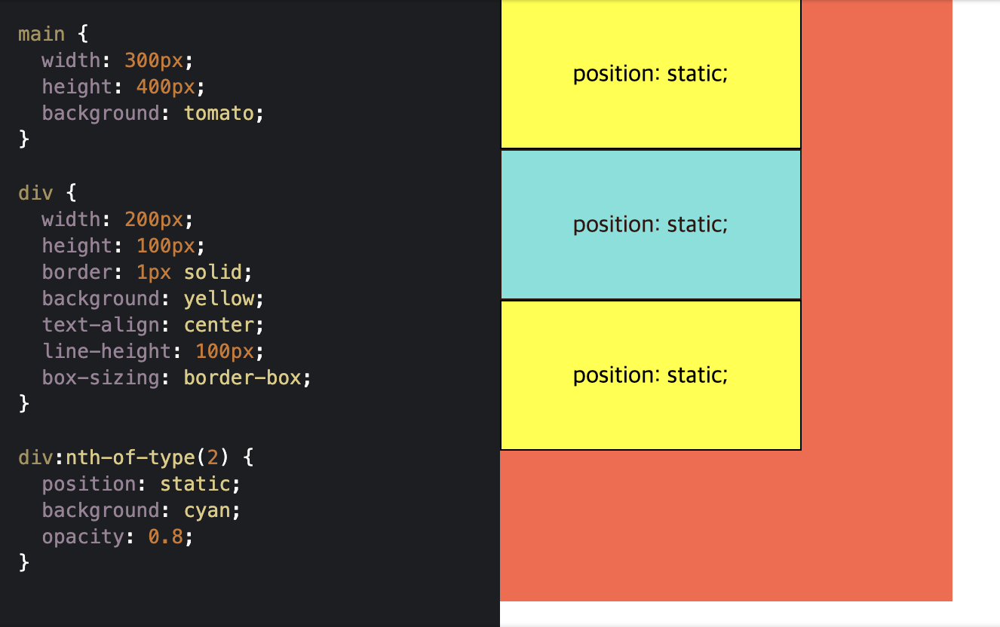
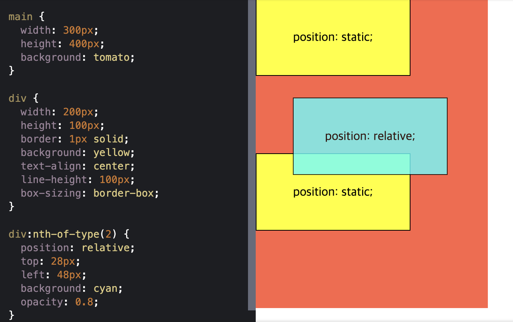
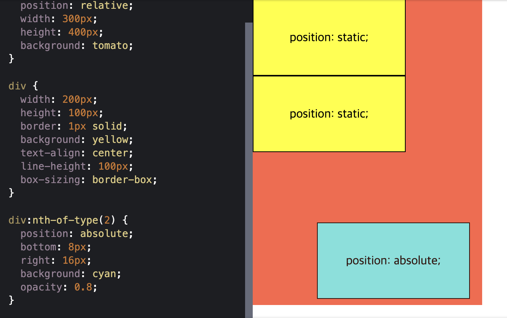
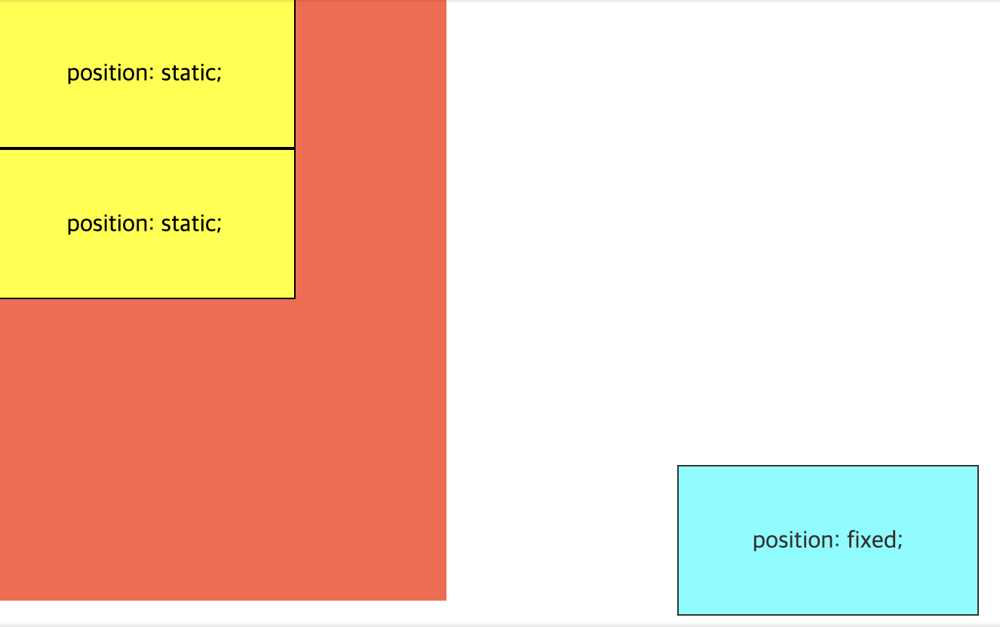
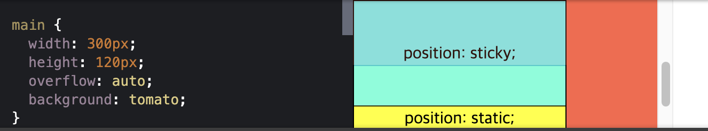

# ._.) position이란 무엇일까?
### position 속성을 이용해 요소를 자유롭게 배치해보자.
<br/>

## 🖥 position 속성이란?
* HTML 문서에서 요소가 배치되는 방식을 결정짓는 속성

* `top`, `left`, `bottom`, `right` 속성과 함께 사용된다.

* __`static`, `relative`, `absolute`, `fixed`, `sticky`__ 등이 있다.
<br/><br/>

## ⌨️ (1) position : static
* HTML 문서 상에서 원래 있어야하는 위치에 배치된다.

* position 속성을 별도로 지정해주지 않으면 기본값인 static이 적용된다.

* 예를 들어, 다음과 같이 `<main>` 요소 아래에 3개의 `<div>` 요소가 있다면 맨 위에 첫 번째 요소, 중간에 두 번째 요소, 제일 아래에 세 번째 요소가 나란히 순서대로 배치된다.

```
<main>
  <div>첫 번째 요소</div>
  <div>두 번째 요소</div>
  <div>세 번째 요소</div>
</main>
```

<p align="center">

</p>
<br/><br/>

## ⌨️ (2) position : relative
* 요소를 원래 위치에서 벗어나도록 배치한다.

* 요소를 원래 위치를 기준으로 상대적(relative)으로 배치

* `top`, `bottom`, `left`, `right`의 네 속성이 있다.

* 요소가 원래 위치에 있을 때의 상하좌우로 부터 얼마나 떨어지게 할지를 지정

* 예를 들어, 두 번째 `<div>` 요소의 `position` 속성을 `relative`로 변경하고, 요소의 원래 위치로 부터 위에서 28px, 왼쪽에서 48px 떨어지도록 `top`과 `left` 속성을 설정하면 아래처럼 된다.

<p align="center">

</p>
<br/><br/>
  
## ⌨️ (3) position : absolute
absolute는 position 속성값 중 가장 난해하고 주의가 필요한 속성값이다.

아마도 absolute라는 영단어의 의미 때문일텐데 relative 속성의 정반대 개념이라고 많이 오해를 받는다.

하지만 실상은 absolute 속성값은 relative 속성값과 함께 사용되는 경우가 오히려 많다.
<br/>

### ._.) absolute (for parent element)라고 생각하기

* position 속성이 absolute일 때 해당 요소는 배치 기준을 자신이 아닌 상위 요소에서 찾는다.
  
DOM 트리를 따라 올라가다가 position 속성이 static이 아닌 첫 번째 상위 요소가 해당 요소의 배치 기준으로 설정된다.

만약에 해당 요소 상위에 position 속성이 static이 아닌 요소가 없다면, DOM 트리에 최상위에 있는 `<body>` 요소가 배치 기준이 된다.

대부분의 경우, 부모 요소(가장 가까운 상위 요소)를 기준으로 `top`, `left`, `bottom`, `right` 속성을 적용해야하기 때문에
어떤 요소의 `display` 속성을 `absolute`로 설정하면, 부모 요소의 `display` 속성을 `relative`로 지정해주는 것이 관례이다.

* 예제 CSS 코드에서 두 번째 `<div>` 요소의 부모인 `<main>` 요소의 `position` 속성을 `relative`로 변경해보자.

```
main {
  position: relative;
  width: 300px;
  height: 400px;
  background: tomato;
}
```
  
그 다음 두 번째 `<div>` 요소의 `position` 속성을 `absolute`로 변경하고, 부모 요소를 기준으로 하단에서 8px, 우측에서 16x 떨어지도록 `bottom`과 `right` 속성을 설정해준다.


```
div:nth-of-type(2) {
  position: absolute;
  bottom: 8px;
  right: 16px;
  background: cyan;
  opacity: 0.8;
}
```
  
이제 두 번째 요소가 `<main>` 요소의 우측 하단에 배치된 것을 확인할 수 있다.
  
<p align="center">

</p>
<br/>
  
## 📍 주의!
position: absolute인 요소는 HTML 문서 상에서 독립되어 앞뒤에 나온 요소와 더 이상 상호작용을 하지 않게 된다.

따라서 위에서 보이는 것처럼, 첫 번째 요소 아래에 바로 세 번째 요소가 배치된 것이다.
<br/><br/>
  
## ⌨️ (4) position : fixed
* 요소를 항상 같은 위치에 고정하기
  
화면을 위아래로 스크롤하더라도 브라우저 화면의 특정 부분에 고정되어 움직이지 않는 UI를 가끔 볼 수 있다.

position 속성을 fixed로 지정하면 이렇게 요소를 항상 고정된(fixed) 위치에 배치할 수 있다.
<br/>

### ._.) 어떻게 하는거야
이게 가능한 이유는 fixed 속성값의 배치 기준이 자신이나 부모 요소가 아닌 뷰포트(viewport), 즉 브라우저 전체화면이기 때문이다.
  
`top`, `left`, `bottom`, `right` 속성은 각각 브라우저 상단, 좌측, 하단, 우측으로 부터 해당 요소가 얼마나 떨어져있는지를 결정한다.

* 두번째 `<div>` 요소의 `position` 속성을 `absolute`로 변경하고, 뷰포트 기준으로 하단에서 8px, 우측에서 16x 떨어지도록 `bottom`과 `right` 속성을 설정해보자.
  

```
div:nth-of-type(2) {
  position: fixed;
  bottom: 8px;
  right: 16px;
  background: cyan;
  opacity: 0.8;
}
```
  
이제 두번째 요소가 부모인 `<main>` 요소를 벗어나 브라우저 전체화면 기준으로 우측 하단에 배치되는 것을 볼 수 있다.
  
<p align="center">

</p>
<br/>
  
## 📍 주의!
`position: fixed`인 요소도 `position: absolute`인 요소와 마찬가지로 HTML 문서 상에서 독립되어 앞뒤에 나온 요소와 더 이상 상호작용을 하지 않는다.
<br/><br/>
  
## ⌨️ (5) position : sticky
* sticky 속성은 CSS에서 비교적 최근에 추가됨

* (특이하게도) 요소가 스크롤링될 때 효과가 나타난다.

* 백문이불여일견, 예제로 go

먼저, `<div>` 요소의 부모인 `<main>` 요소의 높이를 줄이고 스크롤링이 가능해지도록 `height`외 `overflow` 속성을 설정한다.

```
main {
  width: 300px;
  height: 120px;
  overflow: auto;
  background: tomato;
}
```
  
그 다음, 두번째 `<div>` 요소의 `position` 속성을 `sticky`로 변경하고, `top` 속성을 0으로 설정한다.
  
```
div:nth-of-type(2) {
  position: sticky;
  top: 0;
  background: cyan;
  opacity: 0.8;
}
```

이제 스크롤바를 아래로 내려서 화면을 위로 올려보면, 두 번째 요소가 화면 상단에 끈적하게(sticky) 붙어서 움직이지 않는 것을 알 수 있다.

반면에 `position: static`인 세 번째 요소는 이에 구애받지 않고 화면에 따라 올라가는 것을 볼 수 있다.
<p align="center">

</p>
<br/><br/><br/>

***
## 참고
* [DaleSeo - CSS의 position 속성으로 요소 배치하기](https://www.daleseo.com/css-position/)
* [guitarlove00.log - [TIL]position, display, float 속성 정리](https://velog.io/@guitarlove00/position-display-float-%EC%86%8D%EC%84%B1-%EC%A0%95%EB%A6%AC)
* [ofcourse - position 속성](https://ofcourse.kr/css-course/position-%EC%86%8D%EC%84%B1)
  
