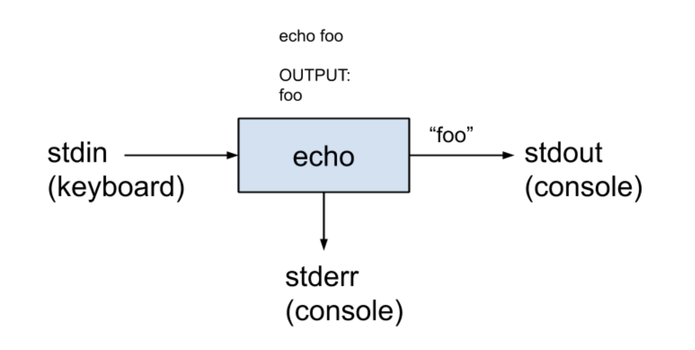
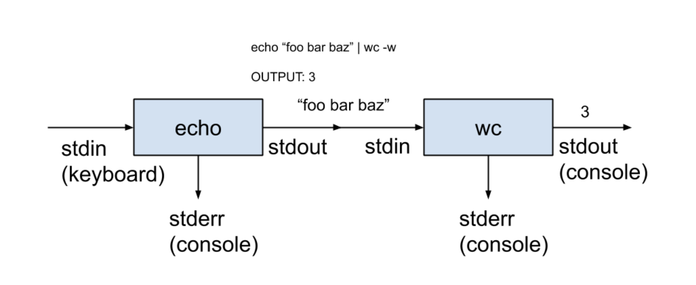

# ._.) POSIX를 배워보자.
### POSIX (Portable Operating System Interface)
<br/>

<br/><br/>

## 🖥 POSIX란 무엇일까?

* Portable Operating System Interface

* 이식 가능 운영체제 인터페이스의 약자

* 서로 다른 유닉스 운영체제의 공통 API를 정리한 애플리케이션 인터페이스 규격

* 이식성이 높은 유닉스 응용 프로그램을 개발하기 위해 만들어짐

* IEEE에서 책정함

* __핵심: 한 운영체제에서 개발한 프로그램을 다른 운영체제에서도 쉽게 돌아가도록 하는 표준.__

### _🖐🏻 잠깐! 여기서 __IEEE__ 란?_

* 전기전자기술자협회

* 전기전자공학 전문가들의 국제조직

* IEEE는 'I-Triple-E'(아이 트리플 이)라고 발음하며, 미국의 뉴욕에 위치해 있음

<br/><br/>

## 🖥 표준 스트림

* Standard Streams

특정한 프로그래밍 언어 인터페이스뿐 아니라 유닉스 및 유닉스 계열 운영 체제(어느 정도까지는 윈도에도 해당함)에서 컴퓨터 프로그램과 그 환경(일반적으로 단말기) 사이에 미리 연결된 __입출력 통로__ 를 가리킨다.

#### 표준 스트림으로 인해서
프로그래머나 프로그램에서 입출력을 사용해야 할 때, 입출력 장치를 연결하기 위한 그 어떤 추가 작업도 필요하지 않게 되었다.

#### 표준 스트림
* 표준입력(stdin)

    * 표준 입력은 프로그램으로 들어가는 데이터(보통은 문자열) 스트림이다.

    * POSIX `<unistd.h>` STDIN_FILENO

* 표준출력(stdout)

    * 표준 출력은 프로그램이 출력 데이터를 기록하는 스트림이다.

    * `<unistd.h>` STDOUT_FILENO

* 표준오류(stderr)

    * 표준 오류는 프로그램이 오류 메시지나 진단을 출력하기 위해 일반적으로 쓰이는 또다른 출력 스트림이다.

    * `<unistd.h>` STDERR_FILENO

<br/><br/>

## 🖥 표준 스트림의 사용

터미널에서 이러한 명령어를 사용했다고 가정하자.

```
echo foo
```

echo는 다음 나오는 문자열을 터미널에 출력하는 명령어이다.

그렇다면 아래 그림과 같은 동작이 일어난다.

<p align="center">

</p>

stdin으로 입력을 받아 echo에 넘겨준다.

echo에서 stderr에 데이터를 저장하고 stdout에서 데이터를 출력한다.

<br/><br/>

## 🖥 파이프

어떤 프로그램의 __출력 결과를 다른 프로그램의 입력 값__ 으로 쓰는게 __파이프__ 이다.

터미널에 아래 명령어를 쓰면

```
echo "foo bar baz" | wc -w
```

<p align="center">

</p>

이렇게 동작한다. `wc`는 문자열의 문자수를 세는 명령어이다.

`|`가 파이프를 뜻하는데 echo의 출력값을 wc에 넘겨주는 역할을 한다.

<br/><br/><br/>
*** 

## 참고
* [POSIX 기초](https://velog.io/@goban/POSIX-기초)
* [Posix 표준](https://geekconfig.com/tutorial/about-posix-standard)