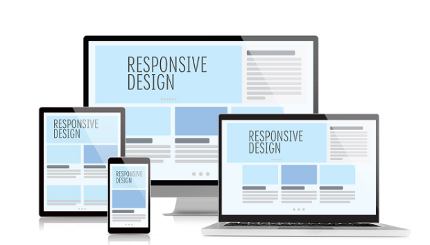

# ._.) 반응형 디자인과 미디어 쿼리를 알아보자
### 유연한 웹을 만들어야지
<br/>

## 🖥 반응형 디자인이란?
* 다양한 디바이스, 창, 화면 크기에서 원활하게 렌더링되는 웹 페이지를 제작하는 것

* 사용자가 대상에 어떤 조작을 가할 때 그것의 상태나 모습이 변화하는 디자인

* 다양한 사용자 디바이스, 창, 화면 크기 등에서 가장 최적의 배치로 보일 수 있도록 만드는 것

* 좋은 반응형 웹 디자인이란?

* 데스크탑과 모바일이 단순히 화면 크기만 다른 것이 아니라, 둘을 이용하는 소비자의 태도도 다르다는 점을 인식하고 이를 반영한 디자인

<p align="center">

</p>

## 🖥 미디어 쿼리란?
* 미디어 쿼리는 반응형 디자인의 핵심 구성 요소이다.

* 기본적인 미디어 쿼리의 구문은 다음과 같다.

```css
@media media-type and (media-feature-rule) {
  /* CSS rules go here */
}
```
<br/>

### ⌨️ 미디어 쿼리 구문의 구성 요소

  * 여기 코드가 어떤 미디어를 위한 것인지 브라우저에 알려주는 미디어 유형(예를 들어, 인쇄 또는 화면).
  
  * 괄호로 묶은 씨에스에스 규칙이 적용되기 위해 전달되어야 하는 규칙 또는 조건문 격인 미디어 표현식.
  
  * 조건문을 통과하고 미디어 유형이 올바른 경우 적용되는 씨에스에스 규칙 집합.

<br/>

### ⌨️ 지정할 수 있는 미디어 유형

  * all: 모든 장치에 적합
  
  * print: 인쇄 결과물 및 출력 미리보기 화면에 표시 중인 문서
  
  * screen: 컴퓨터, 태블릿 PC, 스마트폰 등의 화면
  
  * speech: 음성 합성 장치

```css
@media print {
    body {
        font-size: 12pt;
    }
}
```

  → 페이지가 인쇄될 경우에 본문을 12pt로 설정한다는 의미
  
<br/>

### ⌨️ 미디어 기능 규칙

__1. 너비와 높이__

`min-width`, `max-width`, `width`, `height`, `max-height` 등 미디어 기능을 활용하여 뷰포트가 특정 너비 이상 혹은 이하인 경우 CSS를 적용할 수 있다.

  ```css
  @media screen and (width: 600px) {
      body {
          color: red;
      }
  }
  ```
  → 뷰포트가 정확히 600px인 경우 body의 글씨 색상을 red로 변경

<br/>

__2. 방향성__

`orientation`으로 세로 모드인지 가로 모드인지를 검사한다.

```css
@media (orientation: landscape) {
    body {
        color: purple;
    }
}f
```
  → 디바이스가 가로모드인 경우 body의 글씨 색상을 purple로 변경

>  * 세로 모드: Portrait(포트레이트) 모드
>  * 가로 모드: Landscape(랜드스케이프) 모드


<br/>

__3. 포인팅 장치의 사용__

요소 위에 마우스가 올려진 상태, `hover` 인지 아닌지 확인할 수 있다.

```css
@media (hover: hover) {
    body {
        color: yellow;
    }
}
```
  → hover 상태인 경우 body에 있는 글씨 색상을 yellow로 변경
<br/><br/>

## 🖥 더 복잡한 미디어 쿼리

### ⌨️ 논리 곱 미디어쿼리

* `and`를 사용해 미디어 기능을 결합할 수 있다.

```css
@media screen and (min-width: 400px) and (orientation: landscape) {
    body {
        color: blue;
    }
}
```
  → 뷰포트 너비가 최소 400px 이상이고 장치가 가로 모드인 경우 body의 글씨 색상을 blue로 변경

<br/>

### ⌨️ 논리 합 미디어쿼리

* 동일하게 논리합도 적용할 수 있다.

* 쿼리들은 콤마 `,`로 분리할 수 있다.

```css
@media screen and (min-width: 400px), screen and (orientation: landscape) {
    body {
        color: blue;
    }
}
```
  → 뷰포트 너비가 최소 400px 이상이거나 장치가 가로 모드인 경우 body의 글씨 색상을 blue로 변경

<br/>

### ⌨️ 부정 논리 미디어쿼리

* `not` 연산자를 사용하여 전체 미디어 쿼리를 부정할 수도 있다.

* 이 경우 적용한 미디어쿼리의 전체 의미를 반대로 뒤집는다.

```css
@media not all and (orientation: landscape) {
    body {
        color: blue;
    }
}
```
  → 가로모드가 아닐 때 즉, 디바이스가 세로 모드일 때 body의 글씨 색상을 blue로 변경
<br/><br/><br/>

***
## 참고
* [Web 개발 학습하기 | MDN - 미디어 쿼리 초보자 안내서](https://developer.mozilla.org/ko/docs/Learn/CSS/CSS_layout/Media_queries)
* [ye2un.log - [CSS]반응형 웹과 미디어 쿼리](https://velog.io/@dksdpdms520/CSS-%EB%B0%98%EC%9D%91%ED%98%95-%EC%9B%B9%EA%B3%BC-%EB%AF%B8%EB%94%94%EC%96%B4-%EC%BF%BC%EB%A6%AC)
* [isthisit - CSS 반응형 디자인과 미디어쿼리](https://is-this-it.tistory.com/54)
