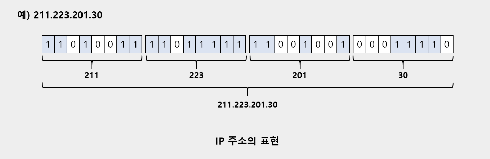
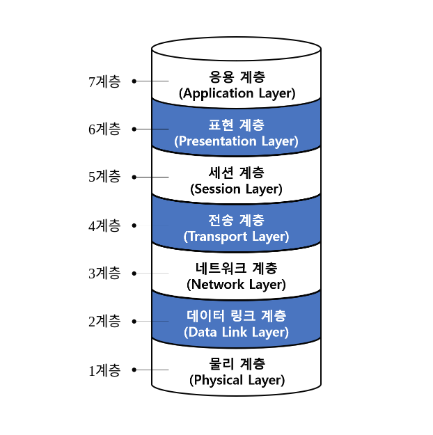

# ._.) 네트워크를 배워보자.

 

## 🖥 네트워크(Network)란 무엇일까?

* 분산되어 있는 컴퓨터들을 자원이나 정보를 공유하기 위하여 통신망으로 연결한 것을 의미

* 프로토콜을 사용하여 데이터를 교환하는 시스템의 집합을 통칭

* 전송 매체로 서로 연결된 시스템의 모음

 

### ⌨️ 네트워크 활용의 장단점
* 모든 종류의 물리적 및 논리적 자원을 공유할 수 있으므로 자원 활용이 극대화

* 병렬 처리가 가능해지고 성능이 향상

* 데이터의 중복 저장이 가능하므로 데이터 복구가 용이하고 신뢰성이 향상되지만 일관성 문제가 발생할 가능성

* 컴퓨터가 누구나 손쉽게 접근할 수 있어서 보안 문제 발생 가능성이 증가

 

### ⌨️ 네트워크 기초용어

#### __시스템__
* 내부 규칙에 따라 능동적으로 동작하는 대상

* ex) 컴퓨터, 자동차, 운영체제, 프로세스 등

#### __인터페이스__
* 시스템과 시스템을 연결하기 위한 표준화된 접근 방법

#### __전송매체__

* 시스템끼리 데이터를 전달하기 위한 물리적인 전송 수단

#### __프로토콜__

* 전송 매체를 통해 데이터를 교환하기 위한 특정 규칙

#### __인터넷__

* ARPANET에서 시작된 세계 최대 규모의 컴퓨터 통신망

* 전세계 네트워크가 유기적으로 연결되어 동작하는 통합 네트워크

#### __인트라넷__

* 인터넷의 기술을 응용하는 기업 내 전용 컴퓨터 네트워크

* 기업의 각종 정보를 표준화하여 서버를 통해 공유하는 기업 내 인터넷

 

### ⌨️ 시스템 구분

#### __노드(Node)__

* 인터넷에 연결된 시스템의 가장 일반적인 용어

#### __호스트(Host)__

* 컴퓨터 기능이 있는 시스템

#### __클라이언트(Client)__

* 서비스를 요청하는 시스템

#### __서버(Server)__

* 서비스를 제공하는 시스템

 

### ⌨️ 네트워크 주소

#### __네트워크 주소__

* 네트워크 상에 존재하는 노드를 고유하게 식별

#### __주소 종류__

* MAC 주소

    * Link 계층에서 사용

    * LAN 카드에 내장

* IP 주소

    * Network 계층에서 사용

* 포트 번호

    * 전송 계층에서 사용

    * TCP와 UDP가 독립적으로 관리(소켓 주소)

* 메일 주소

    * 메일 시스템에서 사용
  

## 🖥 TCP/IP

### ⌨️ 이더넷 어댑터

* 이더넷은 LAN 영역에서 사용하는 통신기술을 의미한다.

* 이더넷 어댑터는 PC의 LAN 카드를 의미한다.

* LAN 카드가 2개 있으면 이더넷 로컬 영역 연결 2와 같이 뜨기도 한다.

 

### ⌨️ IP

#### __개념__

* 인터넷 공간에서 자신의 PC가 사용하는 고유한 식별자이다.

* 또한 인터넷 상에서 PC에서 다른 곳에 데이터를 보낼 때 송신의 주체이기 때문에 출발지 주소에 해당한다.

* IPv4 프로토콜에서 사용 - 32비트 크기의 주소 체계

* IPv4는 0.0.0.0 부터 255.255.255.255 까지 총 2의 32승만큼 주소값을 가질 수 있으며, 32비트로 이루어져 있다.

* IPv6에서는 128 비트 주소 체계로 확장

예시

  

## 🖥 OSI 7계층

 

 

### ⌨️ 1계층: 물리계층(Physics Layer)

* 실제 장치들을 연결하기 위한 물리적인 세부 사항들을 정의하는 계층이다. 

* 구체적으로 전선을 어떻게 배치할 것인지부터 신호를 어떻게 전달하는지까지 모든 부분을 담당한다. 

* 대표적으로 신호를 증폭시켜주는 `Repaeter`가 있다. 

-Physical 계층 장비: Hub Repeater 

 

### ⌨️ 2계층: 데이터링크 계층(Data Link Layer)

* 로컬 네트워크에서 Frame을 안전하게 전송하는 것을 목적으로 한다.

* 오류제어와 흐름제어가 적용된다.

* 기본적으로 네트워크 카드를 통해서 데이터를 주고 받는데 네트워크 카드는 고유의 맥 주소를 할당 받는다. 

* 네트워크 `Switch Bridge` 등이 이러한 계층에서 동작한다. 

 ​

### ⌨️ 3계층: 네트워크 계층(Network Layer)

* 논리적인 주소(IP)를 정의하는 곳. 

* 네트워크 계층은 노드를 거칠 때마다 최적의 경로를 찾아주는 역할을 하는 계층이다. 

* 네트워크 계층은 라우팅, 패킷 포워딩 등의 기능을 수행하며 대표적으로 라우터가 네트워크 계층에서 동작한다. 

* 네트워크를 전송하는 단위는 __패킷(Packet)__ 이다. 

 

### ⌨️ 4계층: 전송 계층(Transport Layer)

* 전송 계층은 양 끝단(End)의 신뢰성있는 데이터를 주고 받도록 해주는 계층이다. 

* 시퀀스 넘버기반의 오류제어방식(3 Way handshak) 오류제어방식을 사용하고 전송 계층은 일반적으로 TCP를 사용한 연결 기반의 프로토콜을 사용한다.

* UDP
 

### ⌨️ 5계층: 세션계층(Session Layer)

* 세션계층은 양 끝단의 응용 프로세스가 통신을 관리하기 위한 방법을 제공한다. 

* 동시 송수신 방식(Duplex), 반이중 방식(Half-Duplex), 전이중 방식(Full Duplex) 의 통신을 사용한다. 

* 네트워크 상에서 통신을 할 경우 양쪽 host간에 최초 연결되고 하고 연결이 중간에 끝어지지 않도록 유지 시키는 역할. 

* 통신을 하는 두 host들 사이에 세션을 열고 닫고 관리하는 기능 담당. 

 

### ⌨️ 6계층: 표현 계층(Presentaion Layer)

* 다양한 데이터를 Format을 일관되게 상호변환하게 되하고 압축기능 및 암호화 복호화 기능 수행 

* ASCII, EBCDIC, GIF 

 

### ⌨️ 7계층: 응용 계층(Apllication Laye)

* 응용 계층은 응용 프로세스와 일대일로 관계하여 응용 서비스를 수행하는 계층이다. 

* 응용 계층에서 HTTP, FTP, Telnet 등의 프로토콜이 사용된다.

   
***

## 참고
* [[Network] 네트워크 기초 개념](https://hyuntaekhong.github.io/blog/Network/)
* [네트워크 기본 개념](https://velog.io/@tlsalsckd13/네트워크-기본-개념)
* [네트워크 기초 기본개념 정리](https://wise-itword.tistory.com/96)