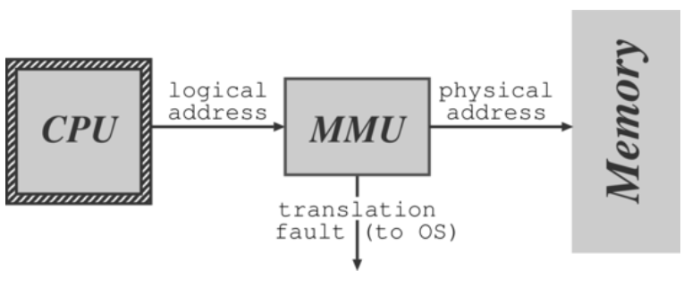
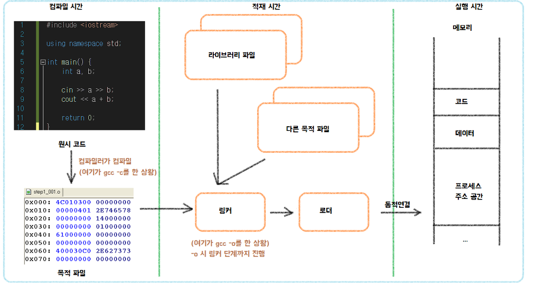
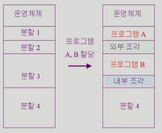
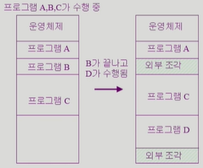

# ._.) 메모리를 관리해야지
### Memory Management
<br/>

## 🖥 메모리 관리 개념

### ⌨️ 메모리 관리자란?
> 어떤 프로그램이든 프로세스가 되어 프로세서에 적재되기 위해서는 메모리에 적재되어야 실행이 가능하다.
> 
> 따라서 메모리는 중요한 작업 공간이고 한정된 메모리를 다중 프로그래밍 환경에서 이용하기 위해서는 여러 프로세스가 함께 메모리를 사용하므로 효율적인 관리를 해야한다.
>
>  이러한 메모리 관리를 위해 메모리 관리자가 존재하고, 메모리 관리 장치(MMU, Memory Management Unit)와  aOS 관리 모듈과 함께 진행한다.

이때 몇가지 정책에 따라 메모리 관리를 진행하는데 아래 세 가지로 나뉜다.

* __적재 청책(Fetch Policy)__
  
  * 디스크에서 메모리로 프로세스를 언제 가져와야 할지를 정하는 것

* __배치 정책(Placement Policy)__

  * 디스크에서 메모리로 가져온 프로세스를 어느 위치에 저장 할 것인지 정하는 것

* __대치 정책(Replacement Policy)__
  
  * 메모리가 충분하지 않을 때 현재 메모리에 적재된 프로세스 중 제거할 프로세스를 결정하는 방법

<br/><br/>

## 🖥 논리적 주소, 물리저 주소, 메모리 매핑
메모리 주소는 크게 두가지로 나눌 수 있다.

1. 논리적 주소

논리적 주소는 가상 주소라고도 하며 프로그래머가 목적 코드가 저장된 공간과 프로그램에서 사용하는 배열, 구조체 등등이 이에 해당한다.

2. 물리적 주소

물리적 주소는 논리적 주소에 대응되는 실제 주소로 메모리 칩이나 디스크 공간에서 만든다.
이때 논리적 주소와 물리적 주소 변환은 MMU에서 관리한다.

<p align="center">

</p>

MMU는 CPU에서 논리적 주소를 받아 ___고정 분할,___ ___동적 분할,___ ___페이징,___ ___세그멘테이션___ 등등을 이용한 변환 방법을 사용하여 물리적 주소로 변환시킨다.

<p align="center">

</p>

<br/>

### ⌨️ 바인딩(Binding)
* 바인딩이란, 묶는다는 의미

* 무엇을 묶느냐 하면, 변수, 배열 등의 변수와 그에 해당하는 값을 묶는다.

* 바인딩 타임이란, 바인딩을 하는 데 소모되는 시간 
* 
<br/>

## ⌨️ 바인딩 타임(Binding Time)
1. __컴파일 시간 (Compile Time)__

변수명, 프로그램 구조 등을 확정할 때 걸리는 시간

2. __적재 시간(Load Time)__

변수를 실제 메모리로 적재할 때 소요되는 시간

3. __실행 시간(Run Time)__

프로그램을 실행하면서 변수의 값을 확정할 때 걸리는 시간

<br/>

## ⌨️ 링커와 로더

1. 링커
모든 오브젝트 파일들을 하나의 오브젝트 파일(Executable file)로 합친다.

2. 로더
Executable file 을 읽는다.

메인 메모리에 오브젝트 파일에있는 내용들을 올리고 context들을 만들고 프로그램을 수행시킬 수 있도록 만든다.

OS의 한 부분이다.

<br/>

## ⌨️ 정적 바인딩 (Static Binding)
실행 시간 전에 일어나고, 실행 중에 변하지 않는 상태로 유지되는 바인딩

```
ex) int a; // 정수 타입(Integer Type)을 이름 'a'에 정적으로 바인딩
```

<br/>

## ⌨️ 동적 바인딩 (Dynamic Binding)

실행 시간 ( Run-Time ) 중에 일어나거나 프로그램 실행 과정에서 변경되는 것

(정적 바인딩한 변수들도 실행 중에 변경 되면 동적 바인딩이다)

```
ex) int * ptr = malloc( sizeof(int) * 10 ); 
```

<br/>

## ⌨️ 할당 (Allocation)
기억장소 할당 : 변수에 메모리 공간을 바인딩( Binding )하는 과정

<br/>

## ⌨️ 정적 할당 (Static Allocation)

메모리 에 적재될 크기를 미리 아는 것

Run-Time 에 각 타입에 맞는 메모리 영역 ( Segment ) 에 할당

<br/>

## ⌨️ 동적 할당 (Dynamic Allocation)

* 외부환경에 의해 변화하여 크기를 미리 알 수 없는 것

* 명시적인 명령어에 의해 실행되는 할당

* 동적할당의 공간은 힙영역( Heap Segment)

* 포인터나 참조 변수를 통해 접근이 가능

<br/><br/>

## 🖥 메모리 할당 방법
연속 메모리 할당은 메모리에 프로세스를 적재할 때 연속적으로 적재하는 방법이다.

연속 메모리 할당에는 고정 분할 방법과 가변 분할 방법이 있다.

<br/>

## ⌨️ 고정 분할 방법
- 물리적 메모리를 몇 개의 영구적 분할로 나눈다
- 분할당 하나의 프로그램을 적재
- 내부/외부 조각이 발생
  * 외부조각 : 프로그램의 크기보다 분할의 크기가 작은 경우,
                 아무 프로그램에도 배정되지 않은 빈 공간이지만 프로그램이 올라갈 수 없는 작은 분할
  * 내부조각 : 프로그램 크기보다 분할의 크기가 큰 경우,
                 특정 프로그램에 배정되었지만 사용되지 않는 공간

<p align="center">

</p>

<br/>

## ⌨️ 가변 분할 방법
- 프로그램 크기를 고려해서 할당
- 분할의 크기, 개수가 동적으로 변함
- 기술적 관리 기법 필요
  * 외부조각 발생 : B가 끝나서 비어있는 공간이 발생했지만 프로그램 D가 해당 빈 공간 보다 커서 사용할 수 없음
<p align="center">

</p>
<br/><br/><br/>

***

## 참고
* [메모리 관리(Memory Management) 개념 및 설명](https://www.crocus.co.kr/1376)
* [바인딩(Binding), 바인딩 타임(Binding Time)](https://tomyself148.tistory.com/25)
* [[OS] 운영체제 9. Memory Management 2 : 메모리 할당(연속 할당, 불연속 할당)](https://developyo.tistory.com/211)
