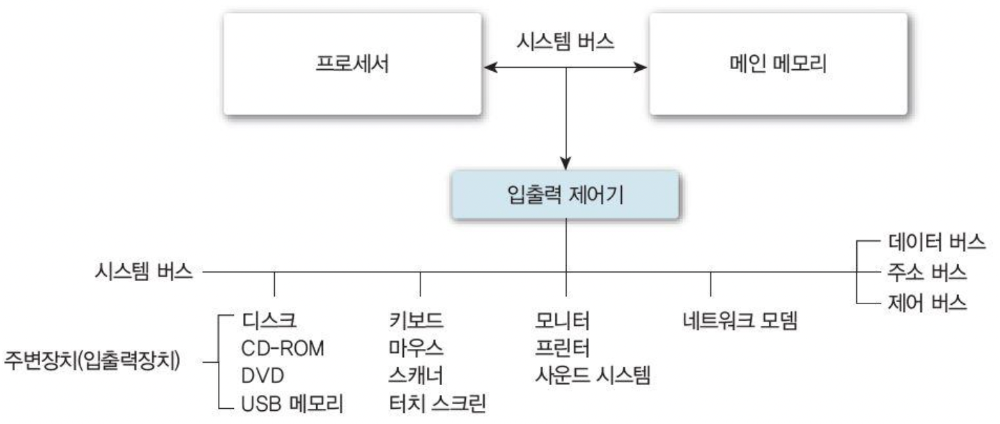
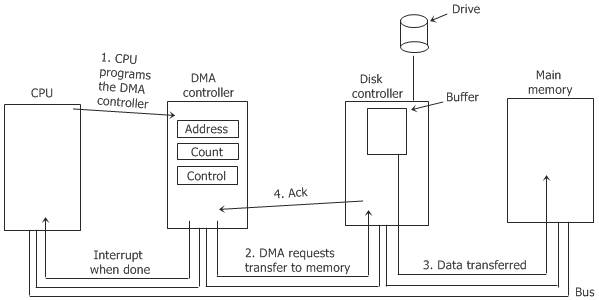
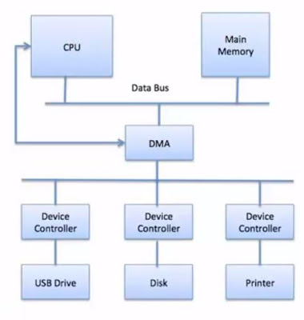

# ._.) 입출력을 관리해보자.

 

## 🖥 입출력 시스템

 

 

컴퓨터의 주요한 두가지 작업은 연산 작업과 입출력 작업이다.

많은 경우에 연산 작업보다는 입출력 작업이 중요한데, 예를 들어 우리가 인터넷 서핑을 하거나 문서작업을 하는 경우 대부분은 컴퓨터 내의 저장된 파일을 열거나 작성하는 경우가 많기 때문이다.

마우스, 키보드, 모니터와 같은 다양한 장치들이 컴퓨터와 잘 동작하게 하려면 둘 사이에 공통된 인터페이스가 존재해야한다.

이 __컴퓨터와 하드웨어 장치 사이의 공통된 인터페이스 역할__ 을 수행하는 것이 __입출력 관리__ 의 핵심이다.

이런 인터페이스의 표준화는 입출력 관리에서 아주 중요하다.

__운영체제 커널__ 이 이렇게 다양한 입출력 장치들의 차이를 가려주기 위해서 __장치 구동기 모듈__ 을 사용한다.

__장치 구동기__ 는 모든 하드웨어를 일관된 인터페이스로 표현해 주며 이런 인터페이스를 그보다 상위층인 커널의 입출력 서브시스템에 제공해준다.

  

## 🖥 입출력 하드웨어의 구성

하드웨어 장치는 케이블을 통하거나, 무선으로 신호를 보내어 컴퓨터와 통신한다.

이때 포트를 통해 컴퓨터에 접속하는데 하드웨어 장치의 또 다른 구성요소는 __제어기__ 이다.

* __제어기__ : 포트나 입출력 장치를 제어하는 전자회로의 집합체이며 많은 입출력 장치는 제어기를 내장하고 있다.

모든 제어기는 레지스터를 가진다.

컴퓨터의 프로세스는 제어기 레지스터에 bit pattern을 쓰거나 읽음으로써 입출력을 실행한다.

  

## 🖥 입출력 하드웨어 동작

 

### ⌨️ 폴링

* 컴퓨터는 장치가 사용 중인지를 알기위해 주기적으로 `busy bit`을 검사함

* 이 과정을 __폴링__이라 함

 

### _🖐🏻 잠깐! 여기서 __busy bit__ 란?_

* __busy bit__ 는 장치 제어기의 레지스터에 존재함

* 현재 장치가 사용가능한 상태인지 다른 작업을 처리하는 중이어서 사용이 불가능한 상태인지를 나타내는 bit

    * __1__ : 제어기가 바쁜 경우 (제어기 작업중)
    * __0__ : 제어기가 준비 중인 경우

 

폴링 자체는 컴퓨터 자원이 많이 소요되지 않지만 장치가 준비하는 시간이 길어질 경우 매우 비효율적인 단점이 있다.

이런 경우 제어기가 자신의 상태가 바뀔 때 컴퓨터에 통보해주는 방식으로 비효율을 막을 수 있다.

이때 발생시키는 신호를 __인터럽트__ 라고 한다.

 

### ⌨️ 인터럽트

__인터럽트__ 는 CPU가 프로그램을 실행하고 있을 때 입출력 하드웨어 등의 장치나 예외상황이 발생하여 처리가 필요할 경우에 CPU에게 알려 처리할 수 있도록 하는 것을 말한다.

CPU는 __인터럽트 요청 라인__ 이라는 선을 가지는데, CPU는 매번 명령어를 끝내고 다음 명령어를 수행하기 전에 이 선을 검사한다.

만약 입출력 장치의 준비가 완료되어서 인터럽트 요청 라인에 신호를 보내면, CPU는 인터럽트를 확인하고 인터럽트 핸들러를 실행한다.

* 인터럽트 핸들러 : 입출력 장치를 서비스함으로써 인터럽트를 처리한다.

CPU는 인터럽트 발생시 직전 작업 상태를 저장해두고 인터럽트를 처리한다.

인터럽트 처리가 완료된 이후에는 인터럽트가 발생하기 전의 상태로 복구시켜 중단되었던 작업을 재개한다.

 

### ⌨️ 작업 순서

* 사용자가 키보드를 사용해 입력하면 키보드 컨트롤러가 인터럽트를 발생, CPU에게 알림

* CPU는 현재 수행 중이던 작업의 상태를 저장, 인터럽트 요청을 처리하기위해 운영체제내에 정의된 키보드 인터럽트 처리 루틴을 찾음

* 키보드 인터럽트 처리 루틴을 실행, 완료

* 인터럽트 처리가 끝나면 인터럽트가 발생하기 직전 상태를 복구시켜 중단되었던 작업을 재개

  

## 🖥 직접 메모리 접근 (Direct Memory Access)

 

 

CPU를 사용하여 디스크와 같은 대용량 입출력 장치의 데이터를 읽으면 CPU 사용량이 매우 높아져 컴퓨터 성능이 심각하게 저하되는 문제가 있다.

CPU가 매번 바이트 전송을 제어하는 것은 엄청난 낭비이다.

* __PIO__ : CPU가 1바이트씩 옮기는 입출력 방식

많은 컴퓨터들의 CPU의 낭비를 막기 위해서 __PIO__ 를 __DMA(Direct Memory Access) 제어기__ 라고 불리는 __특수 프로세서에게 위임__ 하여 CPU의 일을 줄여준다.

 

 

컴퓨터는 메모리에 __DMA 명령 블록__ 을 쓴다.

#### 명령블록 내용
* 전송할 데이터가 있는 곳의 포인터
* 전송할 장소에 대한 포인터
* 전송될 바이트 수

CPU는 DMA 명령 블록의 주소를 DMA에게 알려주고 자신의 다른 일을 처리한다.

__DMA는 CPU의 도움없이 자신이 직접 버스를 통해 DMA 명령 블록에 접근하여 입출력을 실행한다.__

 

## ⌨️ 작업 순서
* CPU가 입출력 요청을 보냄

* DMA 제어기의 레지스터에 주소와 전송 길이가 저장

* DMA 제어기는 한 블록의 입출력 동작을 수행, 그동안 CPU는 다른 작업을 함

* 입출력 동작 완료시 DMA제어기는 CPU에게 완료했다는 인터럽트를 보냄

   
*** 

## 참고

* [운영체제 | 입출력 시스템이란 무엇인가?](https://frontalnh.github.io/2018/04/03/%EC%9A%B4%EC%98%81%EC%B2%B4%EC%A0%9C-%EC%9E%85%EC%B6%9C%EB%A0%A5-%EC%8B%9C%EC%8A%A4%ED%85%9C/)
* [OS - 입출력 관리](https://velog.io/@yonii/OS-%EC%9E%85%EC%B6%9C%EB%A0%A5-%EA%B4%80%EB%A6%AC)
* [[Back-end] 입출력(I/O) 관리](https://velog.io/@ragi/Back-end-%EC%9E%85%EC%B6%9C%EB%A0%A5IO-%EA%B4%80%EB%A6%AC)

