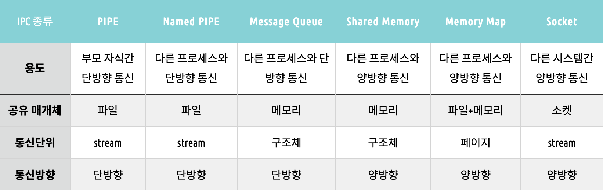
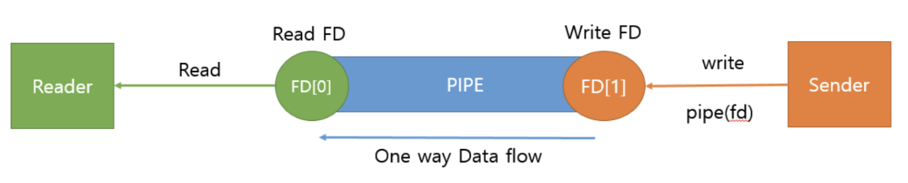
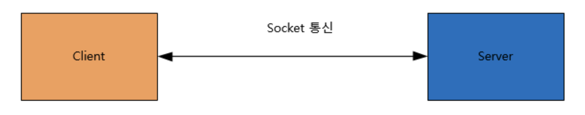

# ._.) 프로세스간 통신을 알아보자.
### IPC, Inter Process Communication, 프로세스간 통신

 

> ### IPC의 종류
> 1) PIPE
> 2) Named PIPE
> 3) Message Queue
> 4) Shared Memory
> 5) Memory Map
> 6) socket

 

## 🖥 요약

  

## 🖥 PIPE

- 익명의 PIPE를 통해서 동일한 PPID를 가진 프로세스들 간에 단방향 통신을 지원

- FIFO 구조

- 생성된 PIPE에 대하여 Write 또는 Read만 가능

- 부모 자식 프로세스간 통신 할때 사용

- 쌍방 통신을 위해서는 Write용 PIPE하나 Read PIPE하나 씩 만들어야 한다.

- read()와 write()가 기본적으로 block 모드로 작동하기 때문으로 프로세스가 read대기중이라면
read가 끝나기 전에는 write를 할수가 없게 된다.
  

## 🖥 Named PIPE

- 이름을 가진 PIPE를 통해서 프로세스들 간에 단방향 통신을 지원

- 서로 다른 프로세스들이 PIPE의 이름만 알면 통신이 가능하다.

- FIFO 구조

- 생성된 PIPE에 대하여 Write 또는 Read만 가능

- 연관이 전혀 없는 프로세스간에 통신을 할때

- 쌍방 통신을 위해서는 Write용 PIPE하나 Read PIPE하나 씩 만들어야 한다.

- read()와 write()가 기본적으로 block 모드로 작동하기 때문으로 프로세스가 read대기중이라면　read가 끝나기 전에는 write를 할수가 없게 된다.

  

## 🖥 Message Queue

- 메모리를 사용한 PIPE이다.

- 구조체 기반으로 통신을 한다.

- FIFO 구조

- msgtype에 따라 다른 구조체를 가져올수 있다.

- 프로세스간 다양한 통신을 할 때 사용 할수 있다.

- 커널에서 제공하는 Message queue 이기 때문에 EnQueue 하는데 제한이 존재 한다.

  

## 🖥 Shared Memory

- 시스템 상의 공유 메모리를 통해 통신한다.

- 일정한 크기의 메모리를 프로세스간에 공유하는 구조

- 공유 메모리는 커널에서 관리 된다.

- 프로세스간 Read, Write를 모두 필요로 할때

- 프로세스간의 상요할려면 메모리 크키가 동일 해야 한다.

  

## 🖥 Memory Map

- 파일을 프로세스의 메모리에 일정 부분 맵핑시켜 사용한다.

- 파일로 대용량 데이터를 공유 할 때 사용한다.

- FILE IO가 느릴때 사용하면좋다.

- 대부분 운영 체제에서는 프로세스를 실행할 때 실행 파일의 각 세그먼트를 메모리에 사상하기 위해 메모리 맵 파일을 이용한다.

- write시기는  프로세스의 페이지가 메모리에에서 내려갈 때만 Write된다. 이렇게 때문에 메모리와 file Sync가 안맞을수 도있다.

- IA-32 기반 시스템에서 하나의 프로세스에서 PAE 기술을 사용하지 않고 사용 가능한 최대 크기는 4GB로 제한된다.

- 메모리 맵 파일은 파일의 크기를 바꿀 수는 없으며 메모리 맵 파일을 사용하기 이전, 또는 이후에만 파일의 크기를 바꿀 수 있다.
  

## 🖥 Socket

- 네트워크 소켓통신을 시용한 데이터 공유

- 네트워크 소켓을 이용하여 Client - Server 구조로 데이터 통신

- 원격에서 프로세스간 데이터를 공유 할 때 사용

- 네크워크 프로그래밍이 가능해야 한다.

- 데이터 세그먼트 처리를 잘해야한다.
   
***

## 참고
* [[운영체제] IPC 프로세스간 통신](https://heeonii.tistory.com/13)
* [[OS]프로세스 간 통신 방법(Inter Process Communication, IPC)](https://dar0m.tistory.com/233)
* [[프로세스간 통신] IPC(inter process communication) 종류](https://doitnow-man.tistory.com/110)
* [OS는 할껀데 핵심만 합니다. 7편 IPC( 프로세스 간 통신)](https://velog.io/@chappi/OS는-할껀데-핵심만-합니다.-7편-IPC-프로세스-간-통신)

